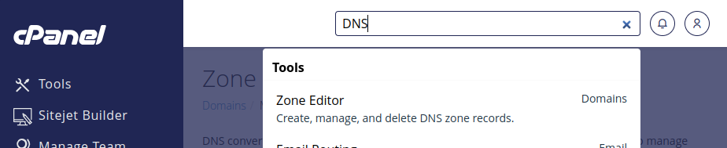

## Ref: [Next.js 14 Deployment to VPS with GitHub Actions CI/CD](https://www.youtube.com/watch?v=fkzpywlJcMA)

### Adding domain on cpanel
At first go to yourdomain.com/cpanle or yourdomain.com:2083

Look for the DNS Zone Editor (under the "Domains" section in cPanel)



#### click `Manage`


### Nginx setup

```sh
    sudo apt install nginx
    systemctl status nginx
    sudo nano /etc/nginx/sites-available/amirathlube.com # then add configuration
    sudo nginx -t
    sudo systemctl restart nginx
```

#### configuration for `/etc/nginx/sites-available/amirathlube.com`
```text
server {
        listen 80;
        listen [::]:80;
        server_name amirathlube.com www.amirathlube.com;
        location / {
                proxy_pass http://localhost:3000;
                include proxy_params;
        }
}
```

### SSL encryption (requires setup configuration for `/etc/nginx/sites-available/amirathlube.com`)

```sh
    sudo apt install certbot python3-certbot-nginx
    sudo certbot --nginx -d amirathlube.com -d www.amirathlube.com
```

