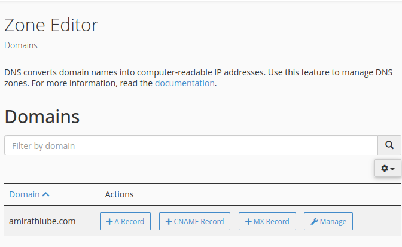
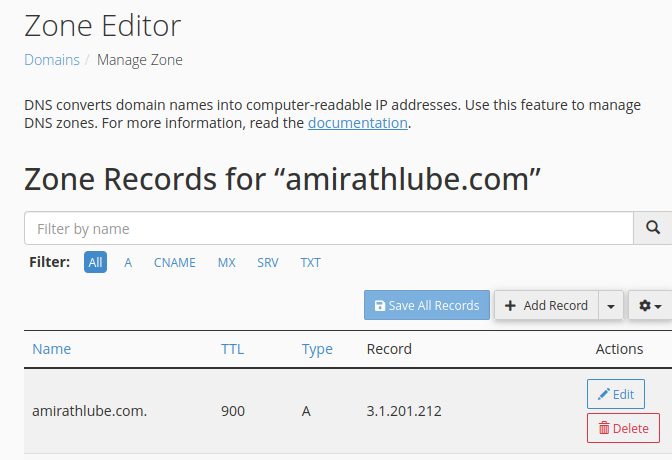

## Ref: [Next.js 14 Deployment to VPS with GitHub Actions CI/CD](https://www.youtube.com/watch?v=fkzpywlJcMA)

### Adding domain on cpanel
At first go to yourdomain.com/cpanle or yourdomain.com:2083

Look for the DNS Zone Editor (under the "Domains" section in cPanel)




#### click `Manage`


### Nginx setup

```sh
sudo apt install nginx
systemctl status nginx
sudo nano /etc/nginx/sites-available/amirathlube.com # then add configuration
sudo ln -s /etc/nginx/sites-available/amirathlube.com /etc/nginx/sites-enabled/
sudo nginx -t
sudo systemctl restart nginx
```

#### configuration for `/etc/nginx/sites-available/amirathlube.com`
```text
server {
    listen 80;
    listen [::]:80;
    server_name amirathlube.com www.amirathlube.com;
    location / {
        proxy_pass http://localhost:3000;
        include proxy_params;
    }
}
```

### SSL encryption (requires setup configuration for `/etc/nginx/sites-available/amirathlube.com`)


```sh
sudo apt install certbot python3-certbot-nginx
dig amirathlube.com #check the server is mapped in this domain
dig www.amirathlube.com #check the server is mapped in this domain
sudo certbot --nginx -d amirathlube.com -d www.amirathlube.com 
```

### cronjob for renewal
```sh
crontab -e # crontab file opens
# 0 0 1 * * sudo /usr/bin/certbot renew --quiet && sudo systemctl reload nginx (put this on the crontab file)
```

`sudo /usr/bin/certbot renew` this command ask password . so for this portion if we set it will not ask password
```sh
    sudo visudo
    yourusername ALL=(ALL) NOPASSWD: /usr/bin/certbot renew, /bin/systemctl reload nginx # this command will now not ask password later
```
