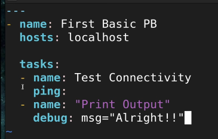

tutorial link: https://www.youtube.com/watch?v=y2TSR7p3N0M&t
ansible: it automation tool 

## dry run : test without running
## start at task: name of a task the playbook should start at. it will skip all the task before specified task
ex: ansible-playbook playbook.yaml --start-at-task "task name"

## tag: tags (option) playbook or task and tag them
```yaml
- name: install httpd
  tags: install and start
  hosts: all
  tasks:
  - yum:
     name: httpd
     state: installed
     tags: install
```
ex: ansible-playbook playbook.yaml --tags "install"
ex: ansible-playbook playbook.yaml --skip-tags "install"

ansible has 3 main properties:
`1. Inventory : we know ansible can run multiple server at once. means from my computer I can setup (for ex. docker) in multiple computer. todo that we need server info (ip, username, password) . those infor provide by inventory. 
 2. Playbook : the file's is also called playbook. (learn more for details). we can write multiple module in single playbook.
 3. Module : small programme todo task (ex: crate file, start file etc)
 
 
 ssh without password:
 step 1: ssh-keygen 
 step 2: ssh-copy-id ip_remoteserver_whre_we_want_copy then provide password. done
 
 now if we ssh those ip then it will not ask password later
 

 check ansible is working 
 ```sh
 ansible localhost -m ping
 ```
 response:
 ```json
  localhost | SUCCESS => {
    "changed": false,
    "ping": "pong"
}
 ```


 ansible config:
 ```sh
/etc/ansible/ansible.cfg
/etc/ansible/hosts
 ```

 ```text
ubuntu@ip-172-31-32-55:/etc/ansible$ cat ansible.cfg 
# Since Ansible 2.12 (core):
# To generate an example config file (a "disabled" one with all default settings, commented out):
#               $ ansible-config init --disabled > ansible.cfg
#
# Also you can now have a more complete file by including existing plugins:
# ansible-config init --disabled -t all > ansible.cfg

# For previous versions of Ansible you can check for examples in the 'stable' branches of each version
# Note that this file was always incomplete  and lagging changes to configuration settings

# for example, for 2.9: https://github.com/ansible/ansible/blob/stable-2.9/examples/ansible.cfg
 ```


 ### first ansible playbook

 ```yaml
 --- # tell that this is yaml file
 - name: playbook name
  hosts: localhost #where to action
    
  tasks:
  - name: Taks 1
    ping:
 ```

 

 ```sh
 ansible-playbook first_pb.yaml
 ansible-playbook --syntax-check first_pb.yaml #syntax check
 ```