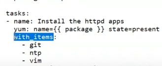

Software of software enigineering objective ->
- Immediate release 
- Reduce a cost	
	- Devlopment cost
	- Running cost
- imporoving Quality


To achive this objective (given top) the things comes

- Software Dev Model

	Migrated        Migrated	  Migrated ( Migrate becase to achive the Objective )
Waterfall --------> Agile -------> DevOps --------> DevSecOps 

- Software Dev Architecture

	Migrated        		     Migrated ( Migrate becase to achive the Objective )
Monolitic ----> Service Oriented Architecture -------> Microservice

- Sofware Dev Platform

	Migrated        Migrated	  Migrated ( Migrate becase to achive the Objective )
Physical ------> Virtual -----> Container


- Software Consumption Trend

	Laptop/Desktop -----> Mobile

the software we are consuming we are installing in a Distributed mannter (means you need a surface you need to install for consuming (use) ). Now internet is faster so we can keep it Central. (FB, YT etc)

		    Migrate
	Distributed --------> Central


### Where a Ansible comming in all growth??

Every prblems in a software development ( Which Db we use , which architecture we use etc ) there is Tools to solve it ( Mysql, Microservice etc ) 

https://devopsschool.com/path/ (choose any of items you can see the problems) 

Ansible comes into the picture in  Configuration and Development Management  Problem

#### What is Ansible

Ansible is configuration(Server(s)) management tool

It's Written in python, Maintainer Redhat
Releases
	Ansible Community =  CMD tool ---- free
	Ansible Tower     =  CMD tool + GUI --- for Enterprise (Paid)
	ANsible AWX	``= CMD tool + GUI  (not production (unstable) , test purpouse)


Servers
	Physical server
	VM server
		Private cloud - (ex: vmware)
		Public cloud - (ex: aws)
		
##### What is there in Server

Resources of server
----------------------

Hardware (virtual hardware (in vm those memory, harddisk  is logical things) ) 
	Memory
	HardDisk
	CPU
	
Software
	Packages
	File
	Memory
	Directory
	Services
	Package manager ( apt ,yum )
	bash/zsh
People
	User
	Group
Process
	Policy
	
	
#### Ansible configure those things for us


So finally we can say Ansible is CM tool that manages configuration of resources at parellel level for many servers.


Ansible made of Plugin concept
	Coreplugin (provide by Redhat)
	Custom Plugins (made by own )
	Community plugins ( made by community)

Ansible have 1000s of modules
Ansible hve 1000s of roles


##### Why ansible

Shell Scripting - this is only forlinux ( also can't work for diffrent distros ex: yum, apt )
Powershell Scripting - this is only for windows

Ansible is platform independent tool. It can configure all types of server


Save time
Reducing a cost
Improving a quality of the deployment

#### Ansible Architecture

before ansible there was some configuration management tool  ( PUppet, Chef, salt ) 
but for those theres need agent (there must be install agent's inside the servers )

but ansible doesn't need the agent ( just need to install python on server )

					                    ARS (ansible Remote server(s)) 32bit + 64 bit)
					                    ---------------------------------------------
					                    Server 1 (linux (pythin 2.7.x + ssh enabled))
Ansible Control server (ACS)   ----->	Server 2 (windows (ps 3.0 + Dotnet 4.0 + WInRM)
 (linux 64 bit only)		        	Server n
 (Rhel + Debian)
 

 
 ACS connect with the Windows ARS using http/https protocol
 ACS connect with the linux using SSH protocol
 
 
 
##### Why Ansible Calles Agentless?

BCZ to configure Server (linux + windows) the requirement tools on ARS (Linux: pythin 2.7.x + ssh enabled, Windows: ps 3.0 + Dotnet 4.0 + WInRM) are present in by default


Note: Pythond 3.x is not  a UPgrade of python 2.x
pythont 2.x code will not work 3.x vice-verca they are totally diffrent
If we write ansible module in python 3.x then the ARS must be install pythong 3.x. but by default in ARS installed python 2.x. so we have to be careful


##### Component of Ansible Control Server (ACS)

Ansible
	1000s of core modules
	100s of core plugins
	Config file

Human (human will create)
	Playbook/ Roles
	Invertory

What is Modules?
	- Each module would do one task. (copy, install, delete (written in py, ps, any lang))
  Sent by ACS run in ARS
What is Plugins
	- All Func of ansible comes from Plugins (written in py)
What is Config Files?
	- A file which control behaviour of ansible.
What is Inverntory?
	- here we can group the ARS. The ip address of ARS is here
What is playbook/Roles?
	- Is a programm which contains modules.
	
where I can find ansible moduels ?
/root/.ansible/plugins/modules , or you can see the path `ansible --version` 

Plugins
/root/.ansible/plugins

configuration
/etc/ansible/ansible.cfg


#### Strategy to do task using Ansible

Before doing any task (here in ansible) first you need to write psudocode then search on specific section on goolge.

ex: 
Setup webserver in RHEL
step 1:	 Install Httpd package
step 2: Copy a index.html to var/www/html
step 3: start service


 
#### How to connect from ACS to ARS?

ACS                              ARS
- Authentication                IP + Username + Password 
                                    ( -u        -k)
                                IP + Username + Key
                                    ( -u        --key-file)

- Authorization                 Sudo - Without a password (-b)
                                SUdo - With a password    (-b -K)
                                SUdo - Diffrent User+ password (-b -K --become--user)


	
 
ansible --help

we will see three groups given below

ansible
	optional argument
	connection options             - Authentication
	privilege escalation options   - Authorization
 
 
#### -i Inventory ( List of ip address )
    - Can be on command line `-i`
    - can be in file(.ini)
    - can be script
	- can be directory
 It has group
    - ALL
    - No GROUP
    - CUSTOM GROUP

.ini file demo
    [app]
    12.34.34.3
    [web]
    23.3.4.5

 It has Group of group
 It has behavior Parameter
 It has variables also

##### in command line
ansible all -i 18.23.42.33, -m yum -a"name=httpd state=installed" -u user --keyfile=a.pem
ansible all -i 18.23.42.33,18.23.42.35 -m yum -a"name=httpd state=installed"
ansible all -i 18.23.42.33 -m yum -a"name=httpd state=installed"
ansible all -i .ini-file-location -m yum -a"name=httpd state=installed"

After hitting this cmd `ansible all -i 18.23.42.33, -m yum -a"name=httpd state=installed" -u user --keyfile=a.pem -b` it will ask the fingerprints then we have to enter yes/y , then it will execute

but if the server number is 1000+ it's difficult to type `yes` . so we have to change the behavior in ansible configuration file `/etc/ansible/ansible.cfg

`host_key_checking = False`

now we have to change permission 600 
`chmod 600 a.pem`

if we want to show more error
command(which occurs error) -v
command(which occurs error) -vv
command(which occurs error) -vvv , and so one


#### parellal config
this will find /etc/ansible/ansible.cfg 
forks=5 (how many will concurrently)


#### playbook/ roles
    it's a yaml file
    wichich contains 
        - Multiple Play
What is Play?
    Is a specificaion of
        - Hosts (localhost or group Name or Group of Group Name)
        - Task(s) (collection of modues with their own param)

writing yaml

start with `----` end with `...`

How to write playbook using yaml ( see the doc)

#### Rules of running playbook
- Check Syntax (--syntax-check)
- Dry Run (-C)
- Run

command :
```sh
ansible-playbook -h
ansible-playbook --syntax-check -i inverntory.ini play1.yaml -u user --key-file=a.pem -b
ansible-playbook -C -i inverntory.ini play1.yaml -u user --key-file=a.pem -b

ansible-playbook run -i inverntory.ini play1.yaml -u user --key-file=a.pem -b

```


##### ansible behavioral parameter (see in ansible doc)

```sh
#inventory file
[web]
12.34.34.33 ansible_connection=ssh ansible_port=28 ansible_user=user ansible_password=121 #(ssh)
12.34.34.31 ansible_connection=winrm ansible_port=28 ansible_user=user ansible_password=121 #(http/https)
12.34.34.34 ansible_connection=paramiko #(ansible agent)
12.34.34.35

#To resolve those repetion task
[web:vars]
ansible_user=user # so now [web] group host will be use this var

#All of those may not have same username not have pem file , not have -b
# may be python version is not same. etc etc. so for this we cannot run by a common command . we achive it by ansible behavioral parameter
```
 
 
 
#### What about if we have multiple playbook

 - Multiple Playbook
 - Multiple Tasks File
 Ex:
 ```yaml
	- hosts: all
	  tasks:
	  	- name: test
		  yum: task1
		- name: Include task list in play
		  include: task.yaml
 ```
 
 #### Ansible variable
  ```yaml
	- hosts: all
	  vars:
	  	version: "test"
		message: "Hello"
		pkg: "httpd"
	  tasks:
	  	- name: test
		  yum: {{ pkg }}
		- name: Include task list in play
		  include: task.yaml
		- debug: #this is module to show something in console
		  msg: {{ message }} {{ pkg }} is installed
 ```

others way to have seprate file for var

```yaml
	# my_varialbe.yaml
	version: "1.23"
	pkg: "httpd"
```

```yaml
	
	- hosts: all
	  vars:
	  	version: "test"
		message: "Hello"
		pkg: "httpd"
	   vars_files:
	   		- my_varialbe.yaml
	  tasks:
	  	- name: test
		  yum: {{ pkg }}
		- name: Include task list in play
		  include: task.yaml
		- debug: #this is module to show something in console
		  msg: {{ message }} {{ pkg }} is installed
```

variable using prompt

```yaml
	
	- hosts: all
	  vars:
	  	version: "test"
		message: "Hello"
		pkg: "httpd"
	   vars_files:
	   		- my_varialbe.yaml
	   vars_prompt: # See more on doc
	   		- name: "version"
			  prompt: "please input prompt: " # ask to input value from user in console
	  tasks:
	  	- name: test
		  yum: {{ pkg }}
		- name: Include task list in play
		  include: task.yaml
		- debug: #this is module to show something in console
		  msg: {{ message }} {{ pkg }} is installed
```

Declare the var through the task level
 ```yaml
	
	- hosts: all
	  vars:
	  	version: "test"
		message: "Hello"
		pkg: "httpd"
	   vars_files:
	   		- my_varialbe.yaml
	  tasks:
	  	- name: test
		  yum: {{ pkg }}
		- name: Include vars
		  include_vars: m_var.yaml
		- debug: #this is module to show something in console
		  msg: {{ message }} {{ pkg }} is installed
```
 
Register variable ( set variable during runtime ) #need to show documentation
Also try to learn the precedence of variables

#### Environment variable
Learn diffrent way to declare variable in ansible.

[web]
12.3.4.2
12.3.4.3
12.3.4.4

[web:vars]  #Group of group
name="hi brother" #this variable can be access in the playbook

we should seprate this (up) variable from inventory.ini file. it's not good practice to store it here. 

we will keep it Environment directory
let's say
for host -> host_vars 
for grp -> group_var  

if we keep structure like this ansile automatically read those during runtime.
whre we will keep the variable in those files

env in command line 
```sh
ansible-playbook play1.yaml -i inverntory -e name=abc
```

##### fact variable (system variable)
- System vars which is set to ansible_XXXXXX (os name, architecture)
- ANsible uses `factor` ro get system information ( ansible ask factor to get they system information. factor is a tool). `factor` sofware encoded in a module called `setup`

```sh
ansible localhost -m setup (it will show us the all the system info) | grep something
```

Gathering Facts is a default task (while runnin ansible sccript we can see it). we also can disable it.

we can also set our own facts (see details on google)


#### Playbook Conditioning
we can set run specific task for if the os is RedHat


And will be applide here


#### Playbook Iteration

`with_items` helps to iterate



we should search more way to looping

#### Playbook Running External script


#### Playbook templates
we use this for dynamic behavior

template using `jinj2` 
- file has to be in .j2
- template module (use template module to use this .j2 file)


so we can use it for modification ( ex? change some value nginx.conf . so we have to make nginx.conf.j2 source and destination is nginx.conf)

#### Playbook handlers
- it's just task (special task).
- it execute only and only
	- You call it using notify
	- Calling tasks is having changed true. 


#### Exception Hanlding using Block
See "error handling in playbook" this is a good documentation on it (ansible)


#### Roles
It's a directory structure 
 
 - It's way to manage a complexit of env
 - SO many variables for playbook
 - So many tasks for playbook
 - SO many templates
 - So many handlers
 - So many files and script
 - Share your ansible code with others

command
```sh
ansible-galaxy init role_name
```

 
 
 


 #### Vault

 Keeping the sensetive data (probably variable) here

 ```sh
ansible-vault -h # for details
ansible-value encrypt inventory # this is direcotory . ask password
ansible-playbook -i inventory site.yaml --ask-vault-pass
 ```

 #### Development ansible module

 

 In any language we can write ansible module but the requirement is it must have runtime in the ARS .
 The best practice is keep the custom module is in roles ( library )
 
 

 ## more ref : [More ansible ref DevOps School](https://github.com/devopsschool-training-notes/Ansible-astrazeneca-June-2020/tree/master)
 
 
 
 			


				


