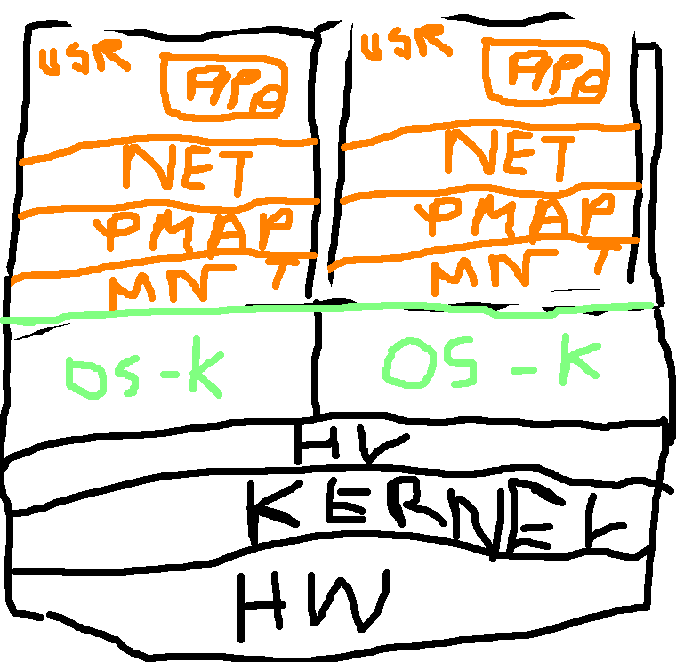
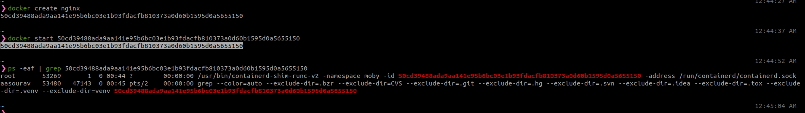
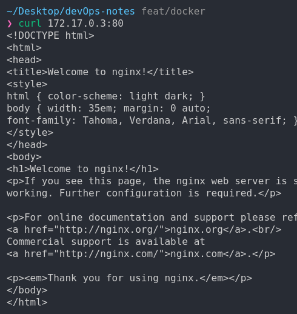

### What is container ?

before talk about container. 
what are the components in system which required to run any app
what are the components in system which required to access any app

System -> OS -> 
                Kernal
                  Namespace
                    PID ---------> 1
                        initiated one PMAP(process map)
                        every process comes from process 0 . it's looks like tree
                        
                        It's looks like family. it's also called process map (PMAP)
                        When we initialize a kernel we get one PMAP (process tree)
                    MNT
                        initialize one mount
                        MNT basicall a mount. MNT = Boot file system (BOOTFS) + Root file system (ROOTFS) + User file system (USEFS) + App file system (APPFS)

                        what is file system?

                        BOOTFS ---------> 1
                            When we run any operating system BOOTFS is loaded
                            BOOTFS = PID + Network ( those are loaded)
                        ROOTFS ---------> 1
                            those file system we can see (cd /(this is the root)). but boot file system we cannot see
                        USERFS  -----------> multiple
                            Where user file is located (home/username)
                        APPFS -----------> conditional
                            After installing application where it's file stored is called application file system
                        
                        Network -----> 1
                        USR ------> Multiple User 

                CGroups
                    
                    Allocating CPU , RAM to Process ID  ( if we see htop/top then we can see the ram , cpu allocation alongside the process id )
                     . That's whey we need CGroup for running an application
                Security <br/>
                    Capability (access of user)
                Storage <br/>
                Networking <br/>
                

Now look at the relation

Applications need Application file system, application filesystem will be root file system so it's need root fs now root fs cannot run without boot fs,  application runs in user space , for user space user need user filesystem (for isololation) 
```md
Applicatoin -> App fs -> root fs -> boot fs
            -> User space -> user fs
```


Each OS when boot up we got 1 PMAP , 1 Network, One/Multiple User space

Now to run an application we need 
```md
    1 OS ( OS has Kernel) -> ( Kernel has NS (One MNT (BOOTFS, ROOTFS, USERFS, APPFS), One PMAP, One Network (require to access app), One User (for apps isolcation)))
```

What is PC?
```md
    Personale 
        Mine for Human
    Computing
        OS
        RAM
        CPU
```

Where we running app now a days?
    Datacenters (But architecture based on PC)

OS for PC not for Running Data center

```md
    One Net
    One Pmap
    One MNT
    Multiple users
```

If use this as a server only 20% resource can be initialized.

You can Ask me to run App in diffrent port. but we know we run multiple apps (replica) for load balancing. so if those app runs in diffrent port that load balancing will be impossible.


to resolve this everyone migrate to Virtual Machine (VM)




This resolve problem but still some resource is wasted ( For every application we need Full OS for each )

Since we learn to run an application we need 


Those Comes from Kernel. Now if we can see where kernel is located  we can See On hardware OS there is A kernel and also have in vm's OS 

Somehow if we can be able to use those from Harware kernel then we don't need vm.


There is a tool that stays on top of Os Kernel. Using kernels library (PMAP, NET, USR, MNT, CGroups etc) this tool provide user with MNT, NET, USR, CGroups, Security , Storage. 


```md
So what is container ?

Container is  User(Isolated) Space with (MNT (ROOTFS + USER FS + APPFS (Not BootFS .we don't need it)), PMAP, NET) that comes from Docker.

Note: this MNT(ROOTFS + User FS + APPFS) is a docker image :) 

When we create a container , create a usernamespace mounted with image(ROOTFS + UserFS + APP FS)

In book language: Container is lightweight app run time independent env powered by docker

Docker Takes this Capability from Kernel NS for Compute CPU - CGroups
For Access - Capability (this decided User should be root user or not root ) 
```


### Let's Proof the Container.

```sh
❯ ps
    PID TTY          TIME CMD
  36664 pts/1    00:00:00 zsh
  36726 pts/1    00:00:00 zsh
  36731 pts/1    00:00:00 gitstatusd-linu
  43440 pts/1    00:00:00 ps

~                                                                   12:18:38 AM
❯ ps -eaf | grep 36664
aasourav   36664   36636  0 Jan14 pts/1    00:00:01 /usr/bin/zsh
....

and finally if we go through it's parent we will find the last (1) name `systemd` which is kernel.  

everyhting is a process. We are isolated users process. no one can touch me it's only decide by kernel who can touch me.

```



Here we can see every container (special user) is in the process. Did you see it's parent is 1 which is `systemd` is called kernel. When I stop this container then it's will get remove.


Container is  User(Isolated) Space with (MNT (ROOTFS + USER FS + APPFS (Not BootFS .we don't need it)), PMAP, NET) that comes from Docker.

MNT -> 
``sh
# RootFS
docker start containerId/name
docker exect -it continer/id /bin/bash
ls # you seen that it's root file system

# UserFS
cd
pwd # you will see your user filesystem

# Appfs (Where application file stores)
# Ex
which ls
/bin/ls # see the application stores there

# What kind of root fs
apt # you hit then you can see

```

NET ->
```sh
docker inspect containerid/name
....
 "Networks": {
                "bridge": {
                    "IPAMConfig": null,
                    "Links": null,
                    "Aliases": null,
                    "MacAddress": "02:42:ac:11:00:03",
                    "DriverOpts": null,
                    "NetworkID": "61fe17094a706106c545aa16c4f3660bf2151fac140e2f5485aedac04327f1bb",
                    "EndpointID": "13dcd0bfaabaa50c0d5c26222215f080fdcec62c8765296d59f850b53d8b4abf",
                    "Gateway": "172.17.0.1",
                    "IPAddress": "172.17.0.3",
                    "IPPrefixLen": 16,
                    "IPv6Gateway": "",
                    "GlobalIPv6Address": "",
                    "GlobalIPv6PrefixLen": 0,
                    "DNSNames": null
                }
            }
....

# Here we can see IPAddress if we curl 172.17.0.3:80 then we can get output

```



PMAP ->

```sh
docker exec 50 ps -eaf 
# then we can see it's start with 0 , so each container has own process map

```

MNT ->
```sh
❯ docker exec 50 df -kh       
Filesystem      Size  Used Avail Use% Mounted on
overlay         110G   61G   44G  58% /
tmpfs            64M     0   64M   0% /dev
shm              64M     0   64M   0% /dev/shm
/dev/sdb1       110G   61G   44G  58% /etc/hosts
tmpfs           5.8G     0  5.8G   0% /proc/asound
tmpfs           5.8G     0  5.8G   0% /proc/acpi
tmpfs           5.8G     0  5.8G   0% /proc/scsi
tmpfs           5.8G     0  5.8G   0% /sys/firmware
tmpfs           5.8G     0  5.8G   0% /sys/devices/virtual/powercap

# here we can see each container has own mount ( if you enter another container then you will see same mount but they are separate from each other. )
```


Note: C groups is common for all container. it's on the host level.  it's not inside the container. c groups taks is to assign CPU and Memory to the process(here container)