# Concurrency

Go routine is user-space threads.

concurrency is a composition of independent execution computations, which may or may not run in parallel.
concurrency enables parallelism

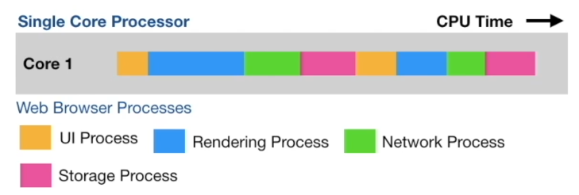

In this way, multiple processes are sharing CPU

# Parallelism

Parallelism is the ability to execute multiple computations simultaneously.

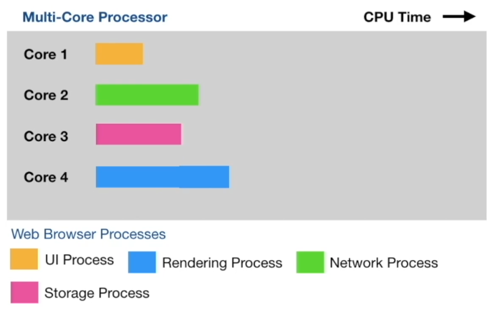

Concurrency enables parallelism (Need to know details about it.)

### Concurrency in Summary.

Why we need to think about Concurrency?

- In order to run faster, application needs to be divided into multiple independent units and run them in parallel.

## why ther awas a need to build concurrency primitives in Go?

OS => the job of os is to give fair chance for all process access to CPU, memory and other resources.
Process => An instance of a running program is called a process. Process provides environment for program to execute.
When the program executade the os creates a process and allocates memmory in the virtual address space.
the virtual address space will contain Code segments which is compiled machine code .
There is a Data region which contains global variable.  
Heap Segment used for dynamic memory allocation. stack is used for local varibles of function.

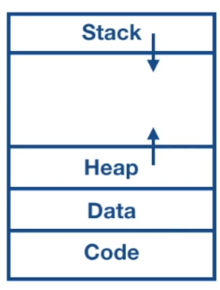

Threads => are smalles unit of execution that CPU accepts. each process has atleast 1 thread. that is main thread. a process can have multiple threads. threads share same address space. each thread has it's own stack. thread can run independent of each other. THe OS scheduler makes scheduling decisions at thread level, not process level. Threads can run concurrently, with each thread taking turn on the individual core, or they can run in parallel with each thread running at the same time on different cores.

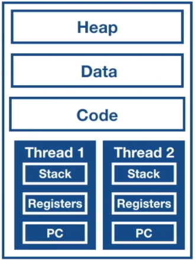

### Thread States:

When the process is created, the main thread is put into the ready queue.

It is in the runnable state.

Once the CPU is available, the thread starts to execute and each thread is given a time slice.

If that time slice expires, then the thread gets preempted and placed back onto the queue.

If the thread gets blocked due to an I/O operation like read/write on disc or network operation

or waiting for the event from other processes, then it is placed in the waiting queue until the I/O

operation is complete.

Once it is complete, it is placed back onto the ready queue.

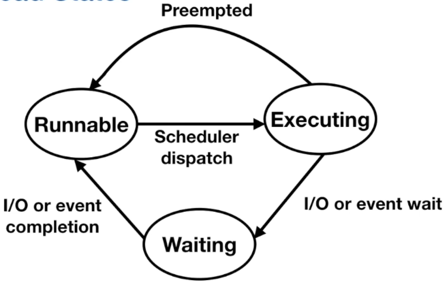

### Can we divide our application into Processes and Threads and achive concurrency? => Yes , but there are limitation.

Wy limitations?

- Context switching.

Context switches are considered expensive. CPU has to spend time copying the context of the current executing thread into memory and restoring the context of the next chosen thread And it does take thousands of CPU instructions to do context switching, and it is a wasted time as CPU is not running your application, but doing context switching.

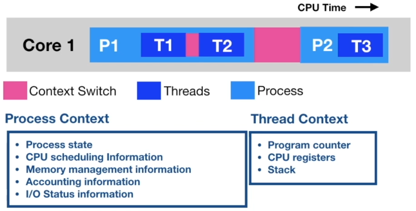

In this diagram, you might see the context switching between the threads of the same process is relatively. cheap compared to the context switching between the threads of different processes.

can we scale the number of threads per process?
not much actually. If we scale the number of threads in a process too high, then we hit C10k problem.

what is c10k problem:
the scheduler allocates a time slice for each process to execute on CPU core.

This CPU time slice is divided equally among threds.


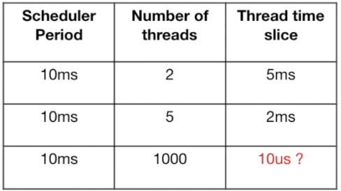

So if we define scheduler period as 10 milliseconds and we have two threads, then each thread is

going to get five milliseconds separately for execution.

If we have five threads, then each thread is going to get two milliseconds to execute.

But what if there are a thousand threads? => 10 microsec
This would be bad, as CPU will be spending more time in context switching than running the application.

So to do any meaningful job, a thread needs at least a minimum of two milliseconds.

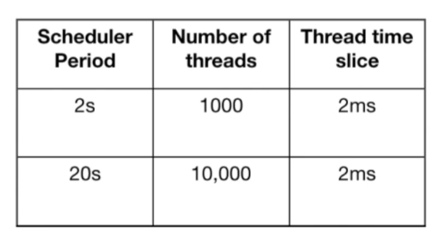

If a minimum time for the thread is two milliseconds and accordingly we said this scheduler period then

to execute a thousand threads, the scheduler will take two seconds.

If there are 10000 threads, then it will take 20 seconds to complete one cycle of the execution, each

thread will have to wait for 20 seconds for its next execution.

So the application is going to become less responsive.

### So other issue is the stack size, the operating system gives a fixed stack size for each thread,


the actual size depends on the hardware.

On my machine, it is 8MB.

So if I have a 8GB of memory, then in theory I can only create 1000 threads.

So the fixed stack size limits the number of threads that we can create to the amount of memory we have.

#### let us summarize.

We saw what is a process, a process is an instance of a running program, and it provides an environment

for the program to execute.

We saw what is a thread, a thread is the smallest unit of execution, and every process has atleast

one thread and process can have multiple threads and all threads share the same address space.

And we saw what are the limitations with threads?

Fixed stack size, fixed stack size limits, the number of threads that we can create to the amount of memory

we have.

and C10k problem, as we scale the number of threads the scheduler cycle is going to increase and the application

### WHy Concurrency is hard?

In this module, we will see why concurrency is hard and how sharing of memory between the threads can

create a lot of complexity.

If you remember from the previous module, you know that all the threads share the same address space.

They share the heap and the data region of the process.

and threads communicate between each other by sharing memory.

But this sharing of memory creates a lot of complexity with concurrently executing threads.

So if two threads are running concurrently and they try to access the same area of memory with one thread

trying to write to the memory, then there will be a data race and the outcome of the program will be

un-deterministic.

Let us consider an example with thread 1 and thread 2 are running concurrently.

and here they are trying to increment the value of a global variable i.

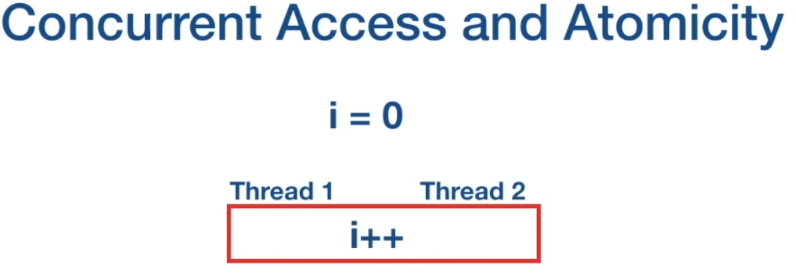

The increment operation is not atomic, at the code level

it looks as a one statement, but in the context of the machine instructions, it involves retrieving

the value of i from memory, incrementing the value of i and storing the value of i to the memory.

So what happens if the thread gets preempted between these operations?

So let us see some scenarios.

Now, let us take two sequence of execution, in the first sequence, thread 1 and thread 2 are executing


sequentially, one after another.

In second sequence, thread 1 and thread 2 are executed in interleaved fashion, where execution of one

thread is preempted by the other thread.

Let us consider the first scenario, thread 1 starts the execution, it retrieves the value of i, which

will be zero, it increments it and then stores the value of i.

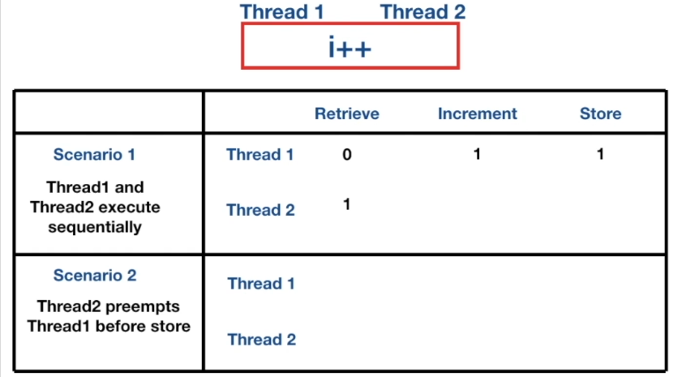

then thread 2 to come along, it retrieves the value of i, which will be one, and it increments by one and

it stores the value of i, which will be 2.

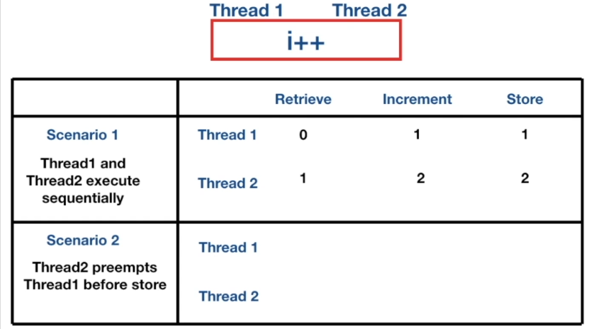

This is fine, now let us consider the second scenario.

Thread 1 starts the execution, it retrieves the value of i, which will be zero, then it increments

the value of i to one.

But before thread 1 can write the value of i to memory,

it gets preempted and thread 2 starts the execution.

it retrieves the value of i, which will be zero,

then it increments it

and it stores the value of i as 1.

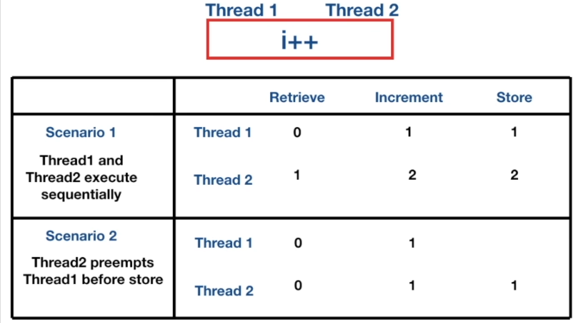

Now, thread 1 comes along and it will store the value of i as 1.

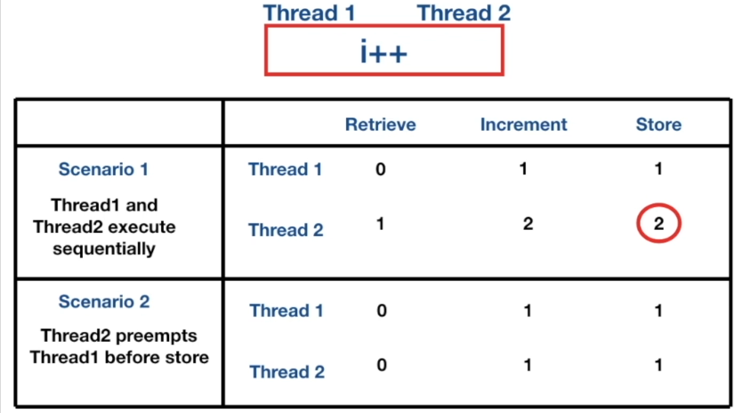

As you see, the value of i, can be 2 or it can be 1, depending on how the threads are executing.

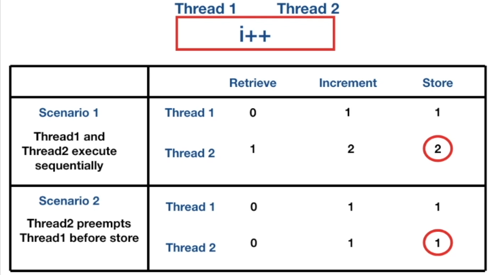

So concurrent access to memory, leads to un-deterministic outcomes.

So one way to handle this will be to use memory access synchronization tools.

We need to guard the access to the shared memory so that a thread has exclusive access at a time.

and we need to force thread 1 and thread 2 to run sequentially, to increment the value of i.

We can do this by putting a lock on the increment operation.

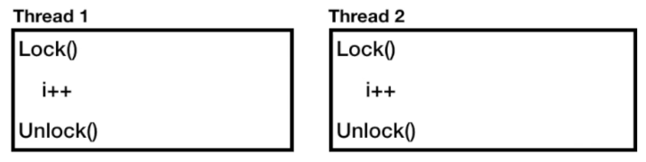

Putting a lock around a shared memory is a developer's convention, so any time a developer wants to

access the shared memory, they need to acquire the lock and when they are done, they need to release

the lock.

If the developer does not follow this convention, then we have no guarantee of exclusive access and

it can always happen that some code can always sneak in, which does not follow this convention.

and we hitting the race condition at some time.

There are other problems like locking actually reduces the parallelism.

as locks force the threads to be executed sequentially.

So the critical section where we access the shared memory becomes a bottleneck between the threads.

The other problem is, coding mistakes, in-appropriate use of locks can lead to deadlocks.

Let us see an example.

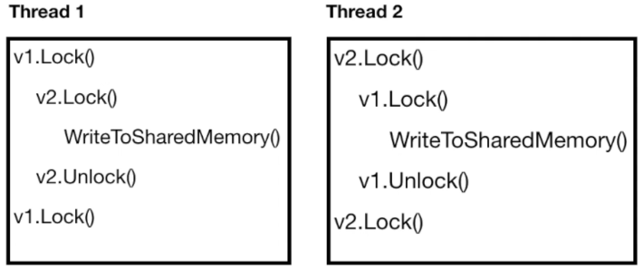

Here there are two threads executing concurrently.

Thread1 starts the execution, it takes a lock on resource v1, it gets preempted by thread2

it takes a lock resource v2

Now, thread1 comes along, it wants a lock on resource v2, but it is not available,

so it goes into the waiting state.

Now, thread2 comes along and it wants a lock on resource v1, but it is not available, so it also goes into

waiting state.

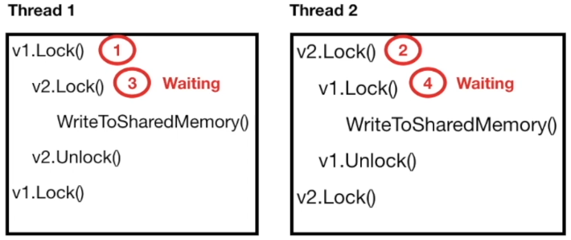

So as you see, this is a circular wait, which leads to deadlock and the application will just hang.

So we have come to the end of this module, let us summarize, so we saw why concurrency is hard.

Sharing of memory between the threads creates complexity.

and concurrent access to the shared memory can lead to race conditions and outcome can be un-deterministic.

Memory access synchronization tools actually reduces the parallelism and comes with its own limitations.

### GoRoutines

In the previous module, we had seen that, there are limitations with threads, the actual number of threads

that we can create is limited, and sharing of memory leads to a lot of complexity with concurrently

executing threads.

In this module, we will see how Go implements concurrency and how Go overcomes some of the

limitations with threads.

Concurrency in Go is based on the paper written by Tony Hoare, communicating sequential processes

or CSP.

The beauty of CSP is that it is very simple, it is based on three core ideas.

Each process is built for sequential execution.

Every process has a local state and the process operates on that local state.

If we have to transfer data from one process to another process, we do not share memory, but we communicate

the data, we send a copy of the data over to other process.

Since there is no sharing of memory, there would be no race, condition or deadlocks,

and we can scale easily, as each process can run independently.

If the computation is taking more time, we can add more processes of the same type and run the computation

faster.

So what tools Go provides for concurrency?

- Goroutines - goroutines are concurrently executing functions, 
- Channels - channels are used to communicate data between the goroutines.
- Select - Select is used to multiplex the channels, 
- Sync package - Sync package provides classical synchronization tools like the mutex, conditional variables and others.

Goroutines are user space threads, managed by Go runtime, Go runtime is part of the executable, it is built into the executable of the application.Goroutines are extremely lightweight, goroutines starts with 2KB of stack, which can grow and shrink as required.

It has a very low CPU overhead, the amount of CPU instructions required to create a goroutine is very less. This enables us to create hundreds of thousands of goroutines in the same address space. The data is communicated between the goroutines using channels, so sharing of memory can be avoided.

The context switching is much cheaper than the thread context switching as goroutines how less state to store.
Go runtime can be more selective in what data is persisted, how it is persisted and when persisting needs to occur.

Go runtime creates OS threads, goroutines runs in the context of the OS thread.This is important.

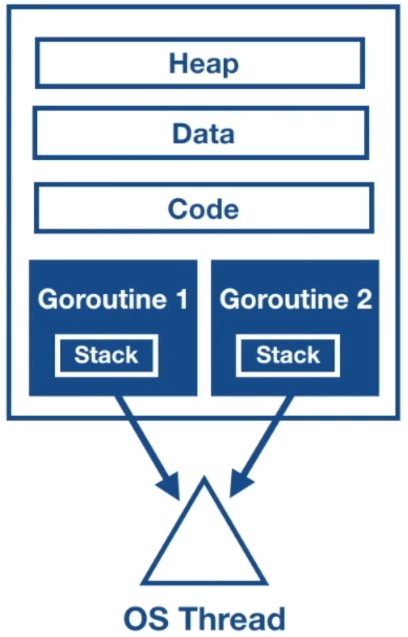

Goroutines are running in the context of the OS threads.
Many goroutines can execute in the context of the single OS thread. The operating system schedules the OS threads and the Go runtime schedules, multiple goroutines on the OS thread.


For the operating system, nothing has changed, it is still scheduling the threads, as it was. Go runtime manages the scheduling of the goroutines on the OS threads.


### Summarize GoRoutines

What are Goroutines?
Goroutines are userspace threads managed by go runtime.

We saw what are the advantages of Goroutines over OS threads.

Goroutines are extremely lightweight as compared to OS threads, they start with a very small stack size of 2KB as opposed to 8MB of stack size for the OS threads.

The context switching is very cheap as it happens in the userspace.Goroutines have a very less state to be stored.

This enables us to create hundreds of thousands of goroutines in the same address space.

## Coding exercise link:

git clone https://github.com/andcloudio/go-concurrency-exercises.git

Now see the exercise from the git:

### Solution can be found in : go-concurrency-exercise/01-exercise-solution
### go-concurrency-exercise/01-exercise/01-goroutines/01-hello

### go-concurrency-exercise/01-exercise/01-goroutines/02-client-server/
go routines in the server to handle multiple conrcurrent client connections


## WaitGroups (sunc.WaitGroup)

One of the complexity to manage in concurrency is race condition, the race condition occurs when two or more operations must be executed in the correct order to produce the desired result.

But the program has not been written so that that order is guaranteed to be maintained.

Most of the time, the race condition is introduced due to developers thinking that the program executes in the order they are coded.

In concurrent programs, that is not the case.

In this code snippet, there is no guarantee that the goroutine will be created and executed before main routine checks the value of the data.

#### Goroutines are executed asynchronously from the main routine.

The order in which the main routine and the goroutine will execute is undeterministic.

In this example, there are three possible outcomes.

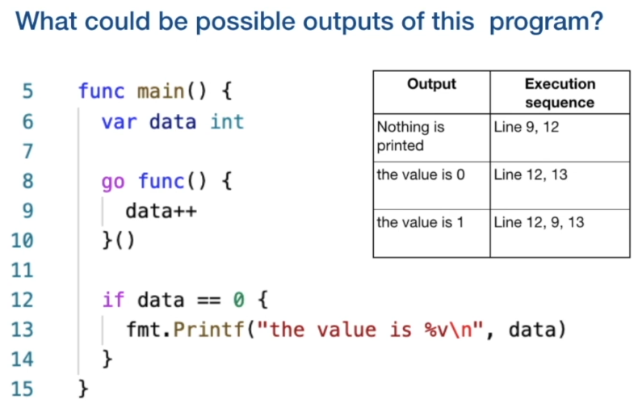

The first outcome can be nothing is printed, if the sequence of execution is, goroutine gets scheduled before main routine checks the value of the data.

So in this case, the value of the data will be 1, so nothing will be printed.

The second possible outcome could be it will present value is zero.

If goroutine does not get executed before main routine, checks the value of the data.

main routine, checks the value of the data, which will still be zero, so it prints the output as value is zero.

The third possible outcome can be, it print the value is one.

If goroutine gets scheduled between main routine, checking the value of data and printing the value of data, main routine checks the value of data, which will be zero.

So it drops into the if block.

But before executing the print statement, goroutine gets scheduled and increment the value of the data.

And then main routine, execute the print statement. Then the output will be value is one. 

Can we bring some determinism into our program?

Can we make main routine, wait for the goroutine to execute before checking the value of data?

This is where sync.waitGroup comes into play.

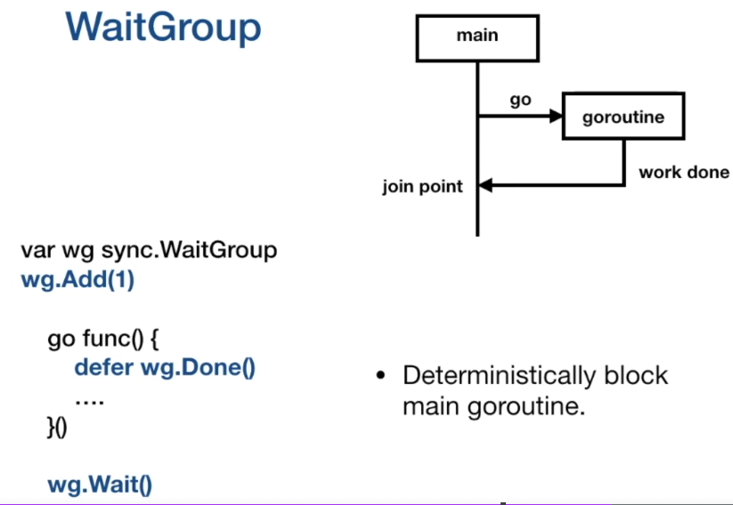

Go follows logical concurrency model called fork and join.

Go statement forks a goroutine, when a goroutine is done with its job, it joins back to the main routine.

If main does not wait for the goroutine, then it is very much possible that the program will finish before goroutine gets a chance to run.

In order to create a join point, we use sync.WaitGroup, to deterministically block the main routine.

We create a variable of type sync.WaitGroup we call the add method to indicate the number of goroutines that we are creating.

we call done method inside the goroutine closure (defer wg.Done()(in image give top)) to indicate that the goroutine is exiting.

Usually it is called with the `defer`, to make sure that it gets called on all the exit points of the function.

Wait method will block the main routine until all the goroutines have exited.

wait group is like a concurrent counter

call to add increases the counter by the integer that is passed in, call to done will decrement the counter by one, call to wait, will block until the counter becomes zero.

Here you notice (image give top) that add method is placed outside the goroutine enclosure had to call to add was placed inside the goroutine closure, then it is very much possible that the call to wait method could execute before the add method.

In that case, the main routine could return without blocking.

Therefore, we call the add method outside the goroutine enclosure to make sure that the add method gets called before wait.

#### Exercise WaitGroup.

### go-concurrency-exercise/01-exercise/01-goroutines/03-join


## GoRoutines and Clousers

Goroutines executes within the same address space they created in.

They can directly modify the variables in the enclosing lexical block.

This enables developers to write goroutines within the <b>lexical block</b> of the enclosing function as a sequential code. Go compiler and the runtime takes care of pinning the variable, moving the variable from stack to heap, to facilitate goroutines, to have access to the variable even after the enclosing function has returned.

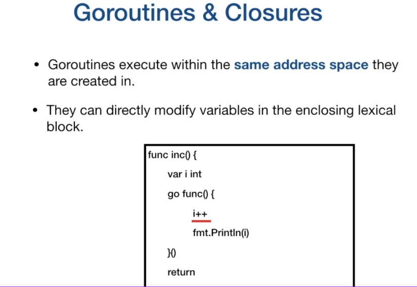

### go-concurrency-exercise -> 01-exercise -> 01-goroutines -> 05-closure

Explain the solution code:

We have an exercise here, we need to run the program and check that variable i was pinned for access from goroutine even after the closing function returns.

So let us see what we have here. We have a function, inside function we have a local variable(`var i int`) . We are spinning a goroutine(`go func()`) and we are returning from the function.

Inside the goroutine, we are accessing the local variable of the function and we are incrementing its value and we are printing the value.

In the main routine we are calling a function and we are waiting for the goroutines to execute.

let me run this program.

So what's happening here is the function has returned, but goroutine still has the access to the local variable of the function.

So usually when the function returns, the local variables goes out of scope.

But here, the runtime is clever enough to see that the reference to a local variable i is still being held by the goroutine,so it pins it, it moves it from the stack to heap, so that goroutine still has the access to the variable even after the enclosing function returns

### go-concurrency-exercise -> 01-exercise -> 01-goroutines -> 06-closure

We have been asked to predict the output of this program and we need to find the issue and fix the issue.

We have a loop, and in each iteration of the loop, we are spinning a goroutine and inside the goroutine, we are printing the value of the interator i and in the main routine, we are waiting for the goroutines to execute.

So what do you think would each goroutine will print the value of i as? do you think they are going to print it as one, two and three respectively or something else?

Let's execute this.

They are all printing the value of i as four, this is because by the time goroutine got the chance to run the value of i had already been incremented to value four.

Now, how can we fix that?

We need to pass the value of i as a parameter to the goroutine function so that goroutine operates on the input that has been passed to it.

So we need to parse the value of i as a parameter here, now let us try to execute.

Now it's going to print one, two, three, here the order depends on the order of the execution of the goroutines.

So in this exercise, what we learnt was goroutines operate on the current value of the variable at

the time of their execution.

If we want the goroutines to operate on a specific value, then we need to pass that as an input to the goroutine.

## Deep Dive Go Scheduler.

In this module and in the next couple of modules, we will have a deep dive into Go scheduler and see how Go scheduler works underneath.

Go scheduler is part of the Go runtime, Go runtime is part of the executable, it is built into the executable of the application.

Go scheduler is also known as M:N scheduler.It runs in the user space.Goroutines are scheduled on the OS threads by the Go scheduler.

So a goroutine runs in the context of the OS thread.

Go runtime creates a number of worker OS threads, equal to GOMAXPROCS environment variable value, the default value is the number of processors on the machine. So if we have 4 cores, then 4 OS threads will be created.

If you have 8 cores, then 8 OS threads will be created.

It is the responsibility of the Go scheduler to distribute runnable goroutines over multiple threads that are created.

At any time N goroutines could be scheduled on M OS threads that runs on at most GOMAXPROCS number of processors.

As of Go 1.14, the Go scheduler implements <b>Asynchronous Preemption.</b>

It used to be co-operative scheduler, but then the question came, what happens when a long running routine just hogs onto the CPU?

other goroutine would just get blocked.

So that's the reason why asynchronous pre-emption was implemented.

So in asynchronous preemption, what happens is, a goroutine is given a time slice of ten milliseconds for execution.

When that time slice is over, Go scheduler will try to preempt it, this provides other goroutines the opportunity to run even when there are long running CPU bound goroutines scheduled.

Similar to threads, goroutines also have states.

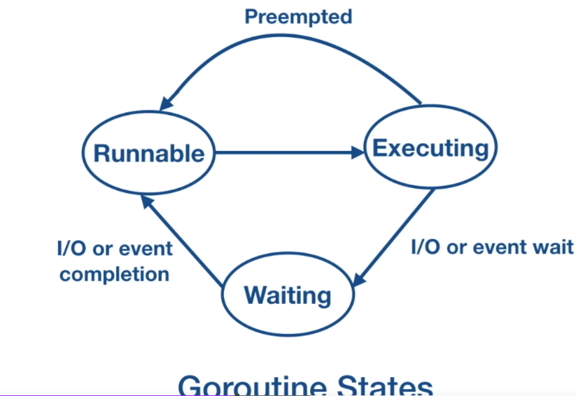

When it is created, it will be in runnable state, waiting in the run queue.

It moves to the executing state once the goroutine is scheduled on the OS thread.If the goroutine runs through its time twice, then it is preempted and placed back into the run queue.

If the goroutine gets blocked on any condition, like blocked on channel, blocked on a syscall or waiting for the mutex lock, then they are moved to waiting state.

Once the I/O operation is complete, they are moved back to the runnable state.

Now we will look into different elements involved in Go scheduling.

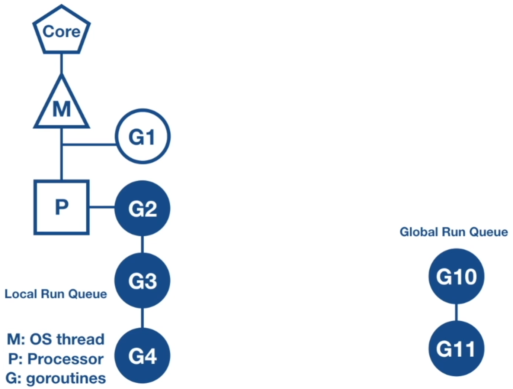

For a CPU core, Go runtime creates a OS thread, which is represented by the letter M. OS thread works pretty much like POSIX thread. Go runtime also creates a logical processor P, and associate that with the OS thread M.

The logical processor holds the context for scheduling, which can be seen as a local scheduler running on a thread.

G represents a goroutine running on the OS thread.

Each logical processor P has a local run queue where runnable goroutines are queued. Here it is depicted by the colored circles.

There is a global run queue, once the local queue is exhausted, the logical processor will pull goroutines from global run queue.

When new goroutines are created, they're added to the end of the global run queue.

Let's see a context switch.

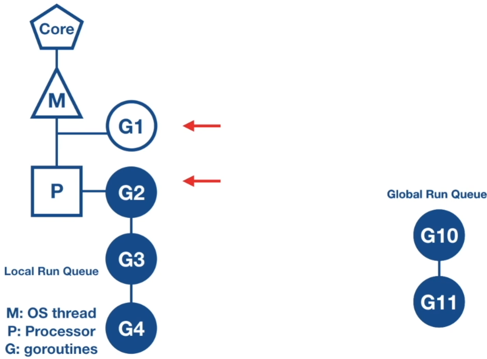

Goroutine G1 has reached a scheduling point,

then the logical processor will pop a goroutine from its local run queue in this case G2 and sets the stack and the instruction pointer for the goroutine G2 and begins running that goroutine, the previously running goroutine G1, is placed back into the local run queue.


As you see, there is no change as far as the OS is concerned.

It is still scheduling the same OS thread.

The context switching between the goroutines is managed by the logical processor.

There is a one to one mapping between OS thread and the logical processor, if there are two cores and we have set GOMAXPROC environment variable to 2, then go runtime, creates another OS thread and logical processor, and associates the OS thread with the logical processor, and goroutines can be scheduled on the second OS thread.

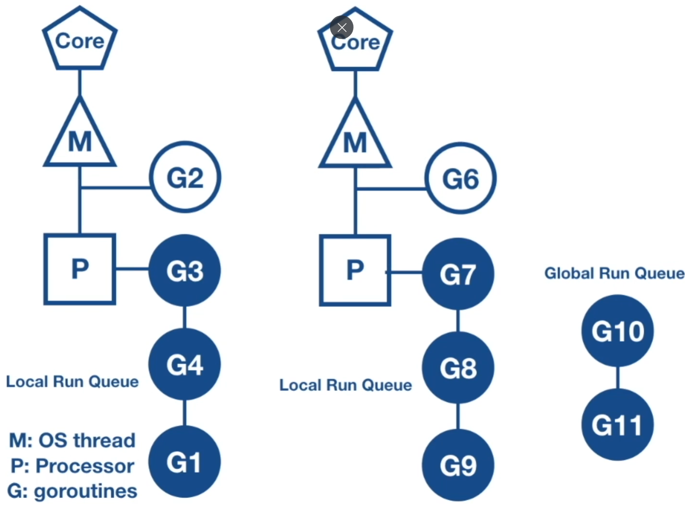


Let us summarize.

We saw how Go scheduler works.

Go runtime has a mechanism known as M:N scheduler, where N goroutines could be scheduled on M OS threads that run on at most GOMAXPROC number of processors.

As of Go 1.14 Go scheduler implement asynchronous preemption where each goroutine is given a time slice of ten milliseconds for execution.

We saw, what are the components of Go scheduler. OS thread is represented by the letter M.

P is the logical processor which manages scheduling of goroutines. G is the goroutine, which includes the scheduling information like stack and instructions pointer. Local run queue is where runnable. goroutines are queued.

When a goroutine is created, they are placed into the global run queue.

## Deep Dive Context switching.

In this module we will see context switching caused due to synchronous system call.

What happens in general when a goroutine makes a synchronous system call, like reading or writing to a file with sync flag set.

There will be a disc I/O to be performed, so synchronous system call will block for I/O operation to complete.

Due to which the OS thread can be moved out of the CPU and placed in the waiting queue for the disc I/O to complete.

So we will not be able to schedule any other goroutine on that thread.

The implication is that synchronous system call can reduce parallelism.

So how does Go scheduler handle this scenario?

Let us see.

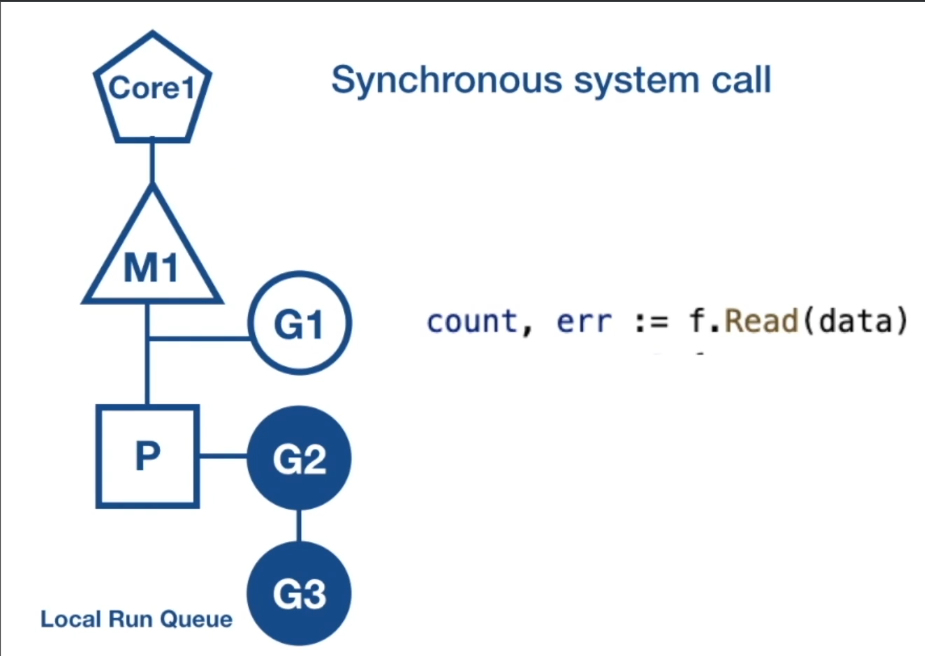

Here goroutine G1 is running on OS thread M1.

G1 is going to make synchronous system call, like reading on a file, that will make the OS thread M1 to block.

Go scheduler identifies that G1 has caused OS thread M1 to block, so it brings in a new OS thread, either from the thread pool cache or it creates a new OS thread if a thread is not available in the thread pool cache.

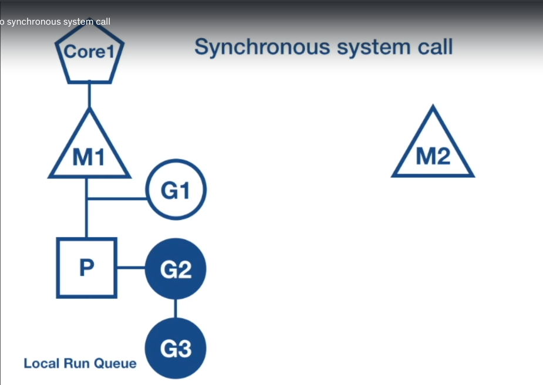

Then Go scheduler will detach the logical processor P from the OS thread M1, and moves it to the new OS thread M2.

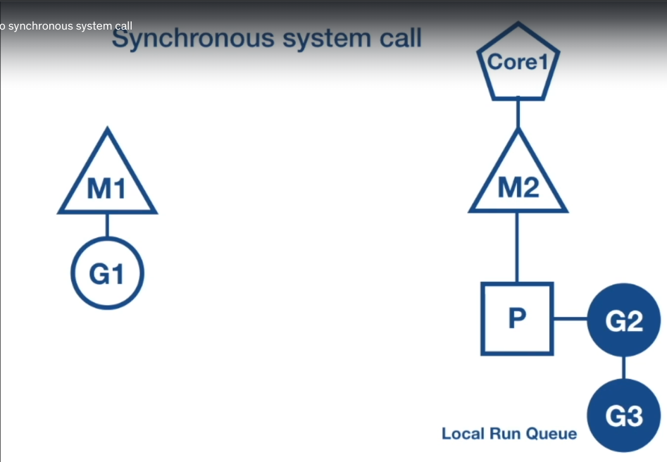

G1 is still attached to the old OS thread M1.

The logical processor P can now schedule other goroutines in its local run queue for execution on the OS thread M2.

Once the synchronous system call that was made by G1 is complete, then it is moved back to the end of the local run queue on the logical processor P.

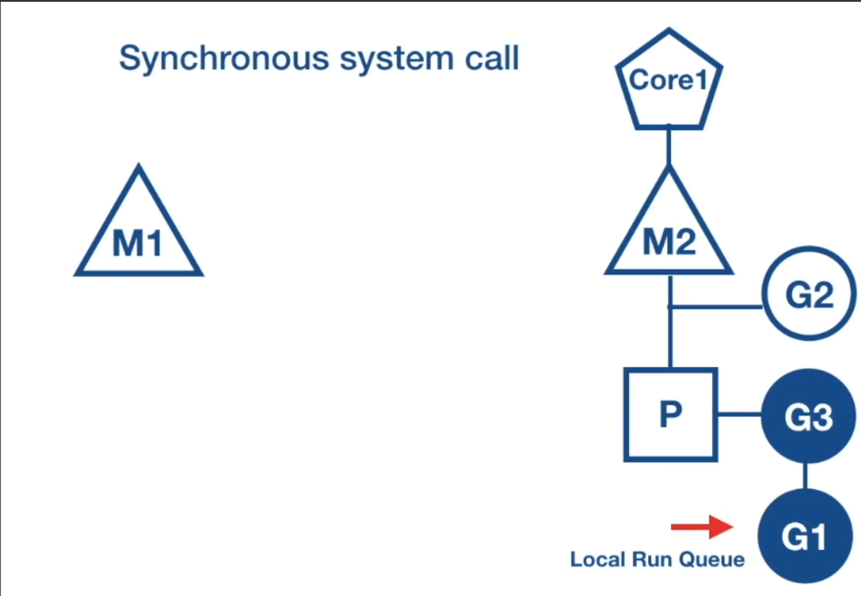

And M1 is put to sleep and placed in the thread pool cache.

So that it can be utilized in the future when the same scenario needs to happen again.

So let us summarize, we saw, how context switching works when a goroutine calls synchronous system call.

When a goroutine makes a synchronous system call, Go scheduler brings new OS thread from thread pool cache. And it moves the logical processor to the new thread. Goroutine that made the system call, will still be attached to the old thread.other goroutines in the local run queue are scheduled for execution on the new thread.

Once the system call returns, the goroutine which made the system call, is moved back to the local run queue of the logical processor and old thread is put to sleep.

## Context switching due to Asynchronous calls

In this module, we will look into context switching due to a asynchronous system calls, like the network system call or http api call.

What happens when a asynchronized system call is made?

Asynchronous system call happens when the file descriptor that is used for doing network I/O operation is set to non-blocking mode.

If the file descriptor is not ready, for example, if the socket buffer is empty and we are trying to read from it, or if the socket buffer is full and we are trying to write to it, then the read or the write operation does not block, but returns an error.

And the application will have to retry the operation again at a later point in time.

So this is good, but it does increases the application complexity.

The application will have to create any event loop and set up callbacks, or it has to maintain a table

mapping the file descriptor and the function pointer, and it has to maintain a state to keep track of how much data was read last time or how much data was written last time. And all these things, does add up to the complexity of the application.And if it is not implemented properly, then it does make the application a bit inefficient.

So how does Go handle this scenario?

Go uses <b>netpoller.</b>

There is an abstraction built in syscall package.

syscall package uses netpoller to convert asynchronous system call to blocking system call. when a goroutine makes an asynchronized system call, and file descriptor is not ready, then the Go scheduler uses netpoller OS thread to park that goroutine.

The netpoller uses the interface provided by the operating system, like epoll on Linux, kqueue on MacOS, iocp on Windows, to poll on the file descriptor.

Once the netpoller gets a notification from the operating system, it in-turn notifies the goroutine to retry the I/O operation.

In this way, the complexity of managing asynchronous system call is moved from the application to go runtime.

So the application may not have to make a call to select or poll and wait for the file descriptor to be ready, but instead it will be done by the netpoller in an efficient manner.

Let us look into an example.

Here G1 is executing on the OS thread M1.

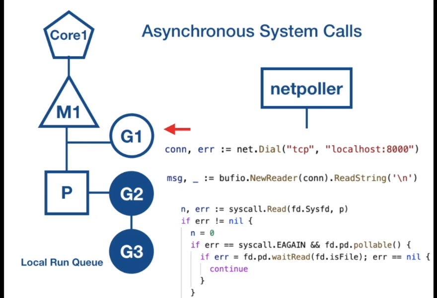

G1 opens an network connection with net.Dial

The file descriptor used for the connection is set to non-blocking mode.

When the goroutine tries to read or write to the connection, the networking code will do the operation until it receives an error.

EAGAIN

Then it calls into the netpoller, then the scheduler will move the goroutine G1 out of the OS thread M1 to the netpoller thread.

And another goroutine in the local run queue, in this case G2 gets scheduled to run on the OS thread M1.

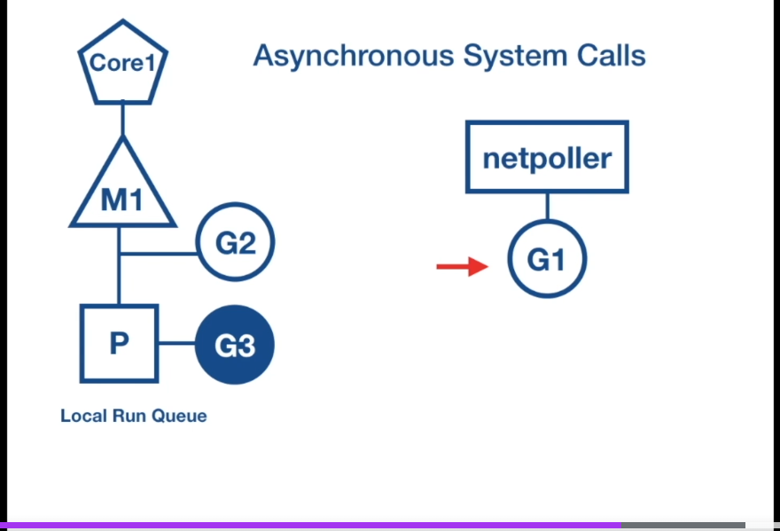

The netpoller uses the interface provided by the operating system to poll on the file descriptor.

When the netpoller receives the notification from the operating system that it can perform an I/O operation on the file descriptor, then it will look through its internal data structure.

To see if there are any goroutines that are blocked on that file descriptor.

Then it notifies that goroutine, then that goroutine can retry the I/O operation. Once the I/O operation is complete, the goroutine is moved back to the local run queue and it will be processed, by the OS thread M1 when it gets a chance to run.

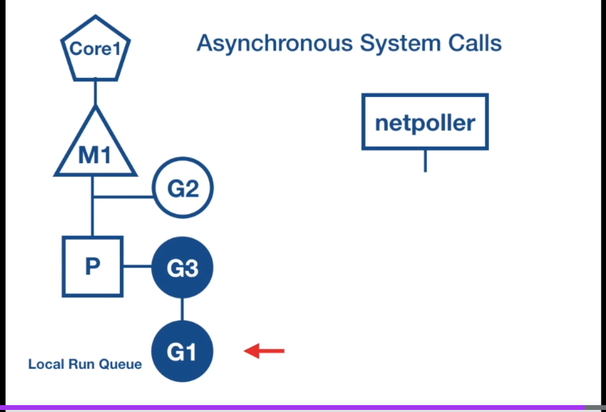

In this way to process an asynchronous system call, no extra OS thread is used, instead the netpoller OS thread is used to process the Go routines.

So let us summarize.

So in this module, we saw what happens when a goroutine makes a asynchronous system call.

Go uses netpoller to handle asynchronous system call. netpoller uses the interface provided by the operating system to poll on the file descriptor.

And it notifies the Goroutine to try the I/O operation when it is ready.

In this way, the application complexity of managing an asynchrous system call is moved to the

Go runtime, which manages it in an efficient manner.

## Work Stealing.

In this module, we will look into work stealing concept in Go scheduler.Work stealing helps to balance the goroutines across the logical processors.So that work gets better distributed and gets done more efficiently.

Let us look into an example, here we have a multithreaded go program, we have 2 OS threads and 2 logical processors, the goroutines are distributed among the logical processors.

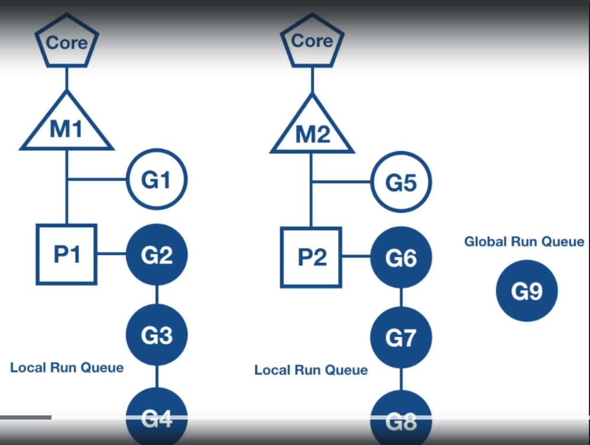

Now, what happens if one of the logical processor services all its goroutines quickly? the global run queue and local run queue of P2.

We see that P1 has no more goroutines to execute, but there are goroutines in runnable state in

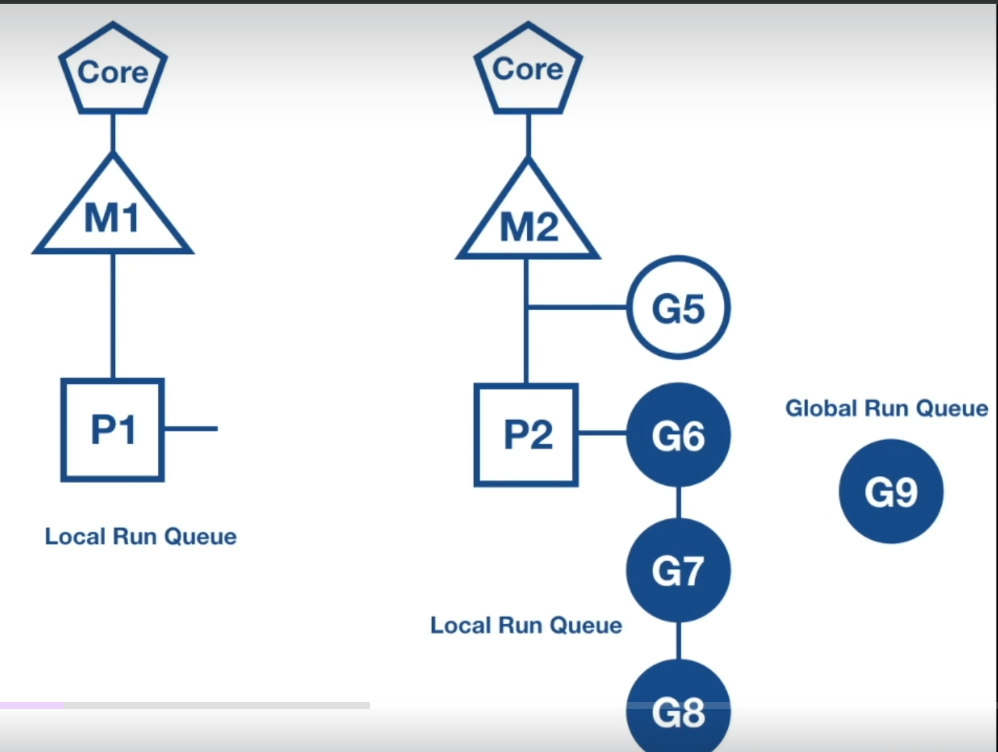

The work stealing rule says that, if there are no goroutines in the local run queue, then try to steal from other logical processors.

If not found, check the global run queue for the goroutines.

If not found, check the netpoller.

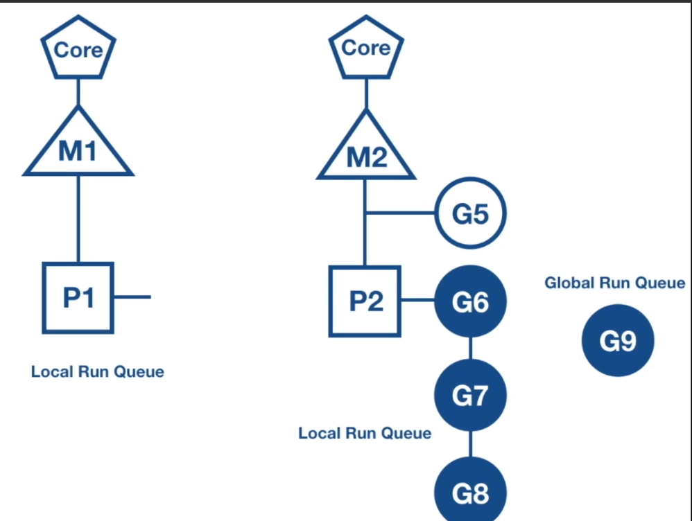

In this case, P1 does not have any runnable goroutine in its local run queue, so it randomly picks another logical processor, P2 in this case and steals half of its goroutines from its local run queue.

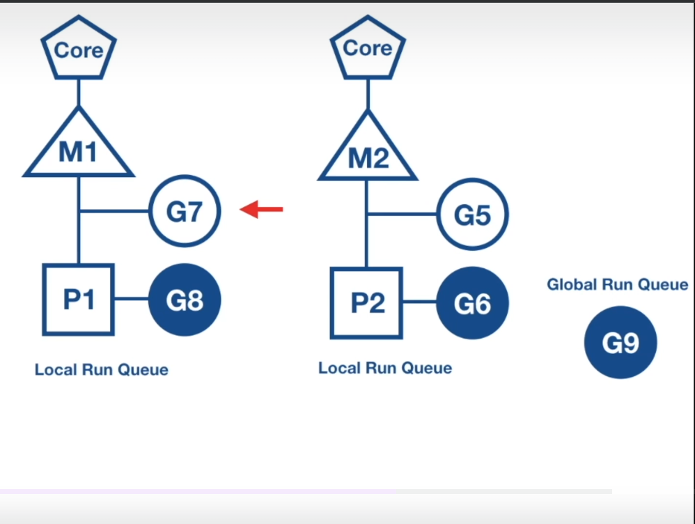

We see P1 has picked up goroutines, G7 and G8 to its own local run queue.And P1 will be able to execute those goroutines.Now we are able to better utilize the CPU cores and the work is fairly distributed between multiple logical processors.

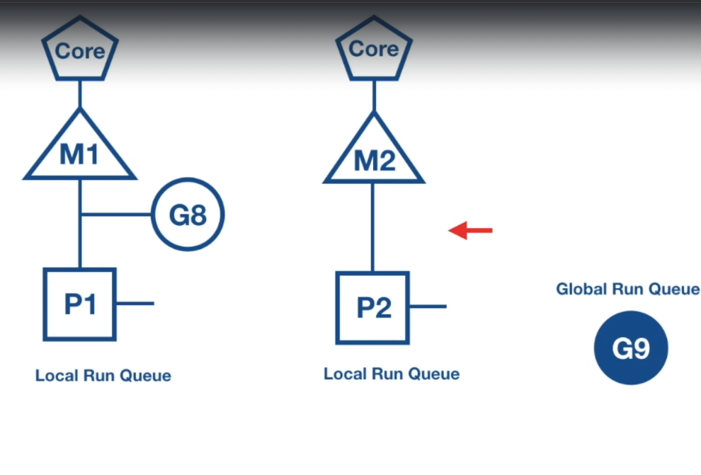

What happens when P2 finishes executing all its goroutines?

And P1 one does not have any goroutine in its local run queue.

Then, according to work stealing rule, P2 will look into the global run queue and finds goroutine G9.

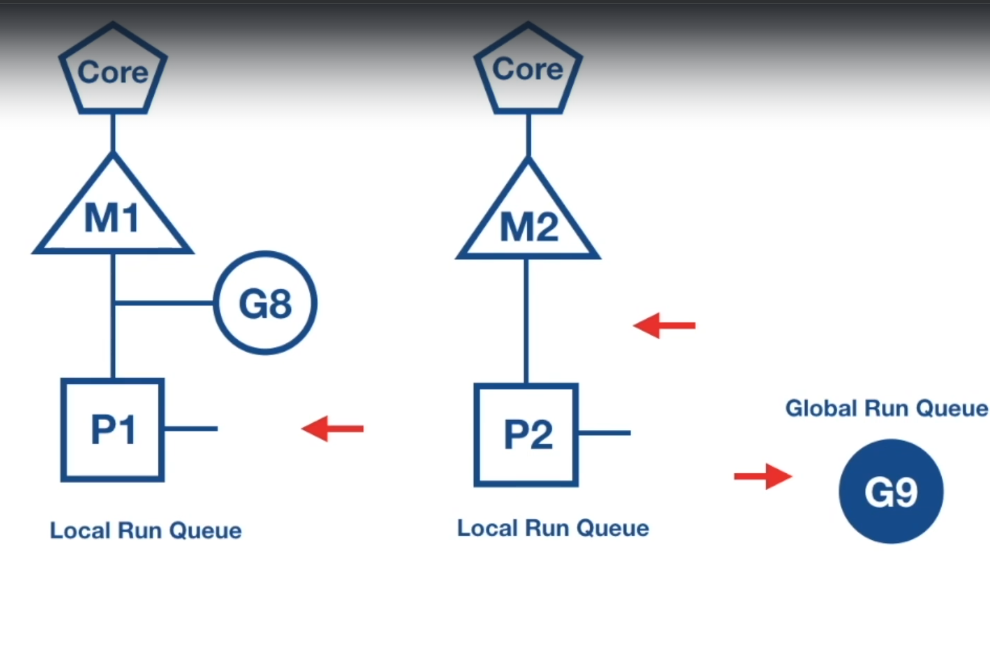

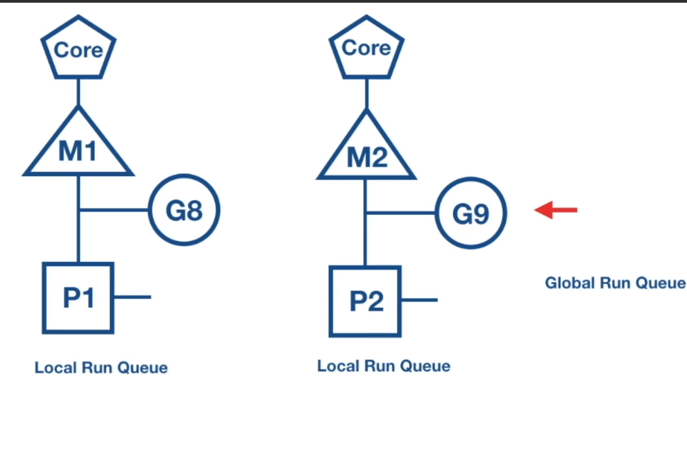

G9 get scheduled on OS thread M2.

Let us summarize

In this module, we saw how work stealing scheduler works.

If the logical processor runs out of goroutines in its local run queue, then it will steal goroutines from other logical processors or global run queue.

So, work stealing helps to balance goroutines across the logical processor and work gets better distributed and gets done more efficiently.


# to be continue
## Channels

In this module, we'll be looking into Channels.

Here we have a code snippet, where goroutine is making a computation, and we want to get the result

of that computation in our main routine without having to share the memory.

So how can we do that?

This is where channels comes into picture.

channels are used to communicate data between the goroutines.

channels can also help in synchronizing the execution of the goroutines, one goroutine can let know

another goroutine, in what stage of the computation they are in and synchronize their execution.

Channels are typed, they are used to send and receive values of a particular type.

They are thread safe, so the channel variables can be used to send and receive values concurrently

by multiple goroutines.

It is very easy to create channels and we declare a variable with chan keyword, followed by the type,

```go
var ch chan T
```

the default value of the channel is nil.

So we need to use built-in function make, to allocate memory for the channel.

```go
var ch chan T
ch = make(chan T)

//or
ch := make(chan T)
```

And the make function returns a reference for the allocated memory.

Or we can use a short variable declaration with make built-in function, which declares and allocates memory

for the channel in one statement.

Pointer operators can be used to send and receive values from the channel, and the arrow direction indicates

```go
  // <-
  // send
  ch <-v
  // receive
  v =<-ch

```

the direction of the data flow.

For send,

the arrow direction indicates that the value is being written to the channel.

And for receive, the arrow direction indicates that the value is being received from the channel and copied

to the variable.

channels are blocking, the sending goroutine is going to block until there is a corresponding receiver goroutine

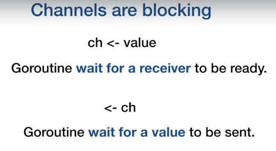

ready to receive the value.

Similarly, the receiver goroutine is going to block until there is a corresponding sender goroutine, sending

the value.

And it is the responsibility of the channel to make the goroutine, runnable again once it is ready to receive

or send value.

Closing of the channel is very useful for the sender goroutine to indicate to the receiver goroutine,

that the sender has no more values to send on the channel and the receiver can unblock and proceed with

its other computation.

Receive returns two values, the first one is a received value from the channel.

```go
 //receive returns two values
 value, ok = <-chan

```

The second is a boolean value, which indicates whether the value that is being read from the channel

is a value that is generated by a write or a default value that is being generated by a close of the

channel.

So the second return value will be true if the value is generated by write or it's going to be false,

If it is generated by close, and this is very useful to determine whether the value is from write or whether

the values from close.

## Exercise Channel -> 01-exercise/02-channel/01-channel

## Range Over the channel


Range over the channel, the receiver goroutine can use range to receive a sequence of values from the

channel. range over the channel will iterate over the values received from a channel.

The loop automatically breaks when the channel is closed.

So once the sender goroutine has sent all of its values, it will close the channel and the receiver

goroutine will break out of the range loop.

The range does not return the second boolean value.

Normally the receive returns the second boolean value, but range just returns value, as on close,

the range will automatically break out of the loop.

Unbuffered channels, the channels that we have been creating till now are unbuffered channels.

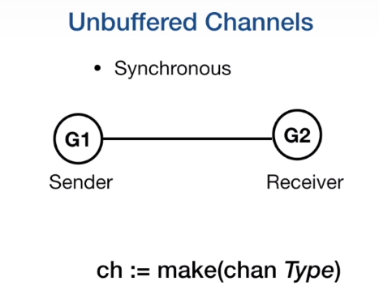

There is no buffer between the sender goroutine and the receiver goroutine.

Since there is no buffer, the sender goroutine will block until there is a receiver, to receive the

value, and the receiver goroutine will block until there is a sender, sending the value.

OK.

In buffered channels, there is a buffer between the sender and the receiver goroutine, and we can specify

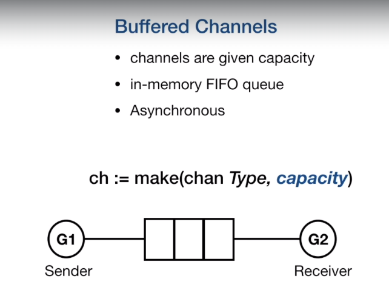

the capacity, that is the buffer size, which indicates the number of elements that can be sent without

the receiver being ready to receive the values.

The sender can keep sending the values without blocking, till the buffer gets full, when the buffer gets full, the sender

will block.

The receiver can keep receiving the values without blocking till the buffer gets empty, when the buffer

gets empty, the receiver will block.

The buffered channels are in-memory FIFO queues, so the element that is sent first, will be the element

that will be read first.

### Exercise 01-exercise/02-channel/02-channel

### Exercise 01-exercise/02-channel/03-channel

### CHannel DIrection

When using channels as functional parameters, you can specify if the channel is meant only to send or

only to receive values.

And this specificity will help us to increase the type safety of the programs, in the below example, in

is a receive only channel, note the syntax,
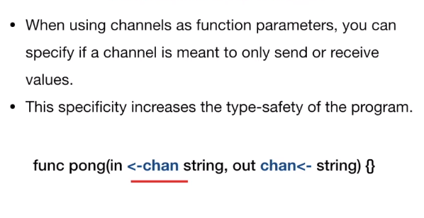

it's a pointer operator followed by the chan keyword, and out is a send only channel,

and the syntax is, chan keyword followed by the pointer operator.

In this example, the pong function can use in, only to receive values.

It cannot use this channel to send values.

If it tries to send values on this channel, the compiler is going to report an error.

OK, so in this way, we can control what operations that function can do with the channels that are

passed as parameters.

### Channel direction exercise. 01-exercise/02-channel/04-channel

## Channel ownership


Now we will look into the things that we should be aware when working with channels, and this will

help us in troubleshooting.

Default values, when a channel is declared, its default value is nil.

So we should allocate memory by using the built-in function make.

If that does not happen and we try to send or receive on that channel, then it's going to block forever.

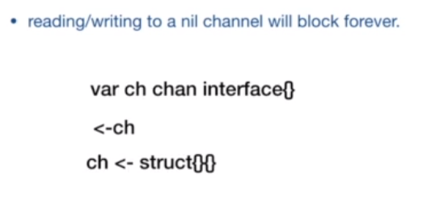

Similarly, closing on the new channel will panic, so we should always make sure that the channels

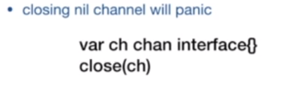

are initialized with the built-in function make.

How we use the channels is important to avoid deadlocks and panics.

We can follow some of the Go idioms.

The best practice is that the goroutine that creates the channel will be the goroutine that will write to the

channel and is also responsible for closing the channel.

The goroutine that creates writes and closes the channel is the owner of the channel and the goroutine that

utilizes the channel will only read from the channel.

So establishing the ownership of the channel will help us to avoid deadlocks and panics, and it will

help in avoiding scenarios like deadlocking by writing to nil channel, closing a nil channel, writing

to a closed and closing channel more than once, which can all lead to panic.

### Exercise Channel ownership 01-exercise/02-channel/04-channel

## Deep dive channel

In this module and in the next couple of modules, we will try to understand the mechanics behind channels,

how channels work and how to send and receive works underneath.

We use built-in function make to create channels.

Here we are creating a buffered channel with three elements.

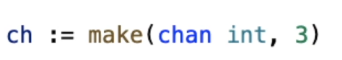

Internally, the channels are represented by the hchan structure.

Now let us look into different fields in the hchan struct.

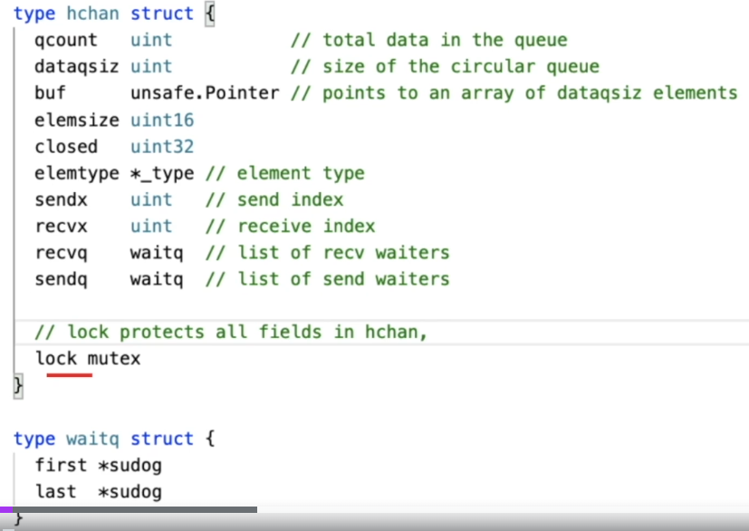

It has a mutex lock field, any goroutine doing any channel operation must first acquire the lock on the

channel.

buf is a circular ring buffer where the actual data is stored.

And this is used only for the buffered channels, data queue size, is the size of the buffer.

qcount indicates a total data elements in the queue.

sendx and recvx indicates the current index of the buffer from where it can send data, or receive

data.

recvq and sendq are the waiting queues which are used to store blocked goroutines, the goroutines

that were blocked while they were trying to send data, or while they were trying to receive data from

the channel.

waitq, is the linked list of goroutines, the elements in the linked list is represented by the sudog struct.

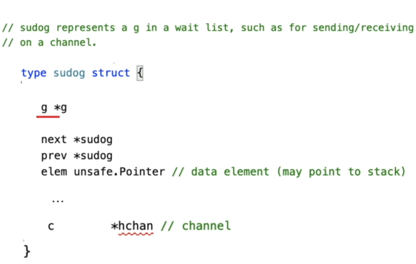

In the sudog struct, we have the field g, which is a reference to the goroutine, and elem field is

pointer to memory, which contains the value to be sent, or to which the received value will be written

to.

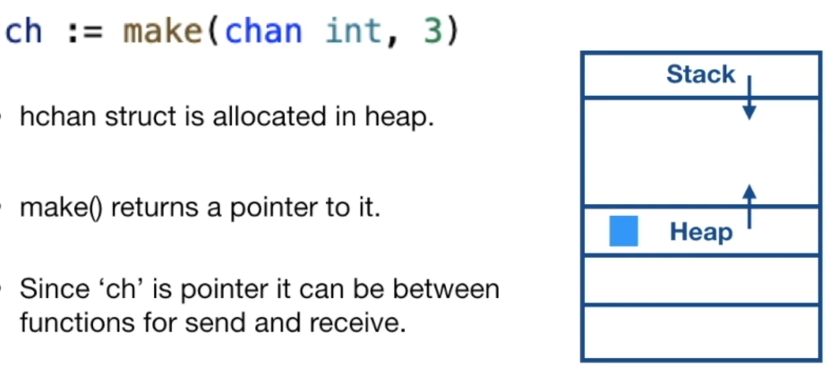

When we create a channel with built-in function make, hchan struct is allocated in the heap,

and make returns a reference to the allocated memory.

And since ch is a pointer, it can be sent between the functions which can perform, send or receive

operation on the channel.

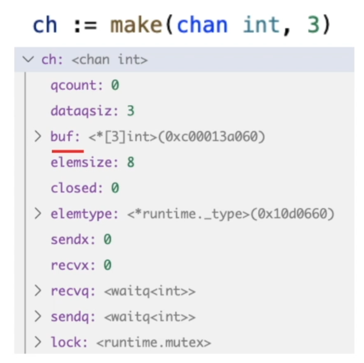

This is a runtime values of hchan struct.

buf is been allocated a ring buffer

and dataq size is set to 3, this value comes from the parameter that has been passed to the make

function.

And current qcount is zero, as no data has been enqueued yet.

So in this module, we looked into how channels are represented.


## How send and Receive buffered channel

Let us now look into what happens when we do send or receive on a buffered channel.

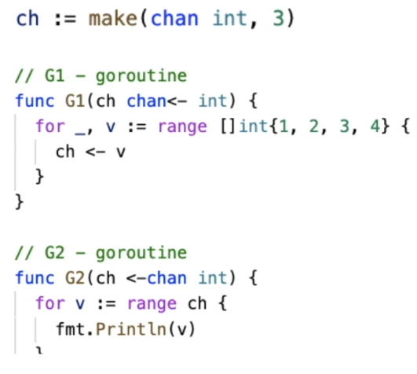

In this code snippet, we have 2 goroutines

goroutine G1 is sending a sequence of values into the channel, and goroutine G2 is receiving the sequence

of values by ranging over the channel.

Now, when we create a channel, this will be the representation.

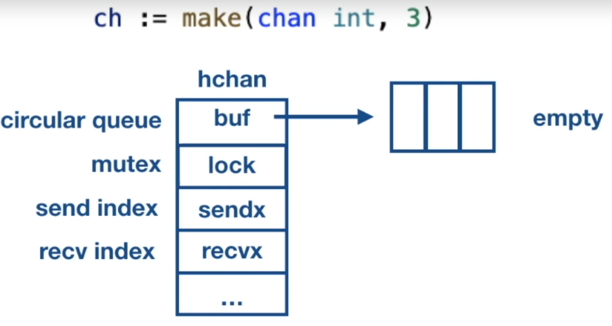

There is a circular queue with size three, which is currently empty.

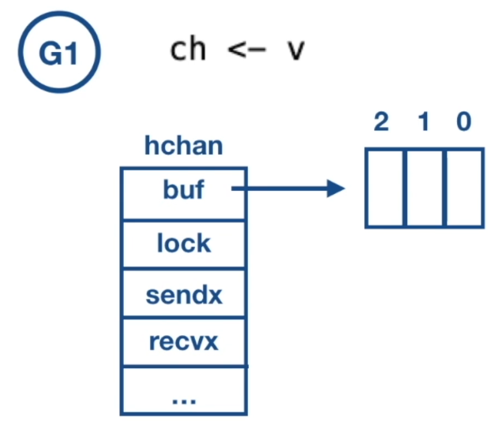

Let us now consider the scenario when the G1 executes first, G1 is trying to send a value on

the channel, which has empty buffer.

First, the goroutine has to acquire the lock on the hchan struct.
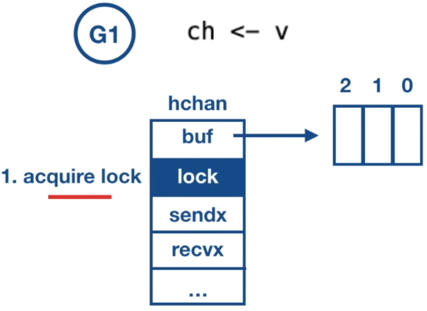

Then it enqueues the element into the circular ring buffer.

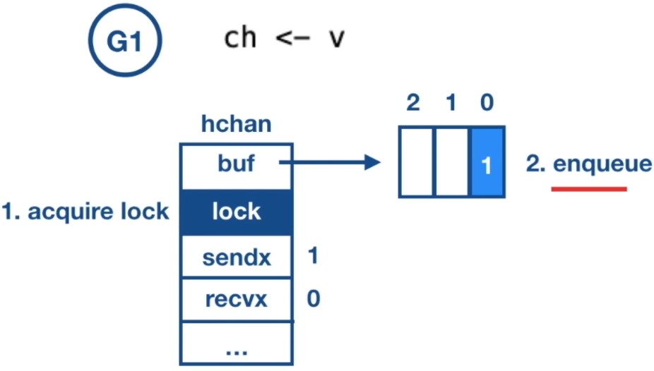

Note that this is a memory copy.

The element is copied into the buffer.

OK.

Then it increments the value of the sendx to 1.

Then it releases the lock on the channel and proceed with its other computation.
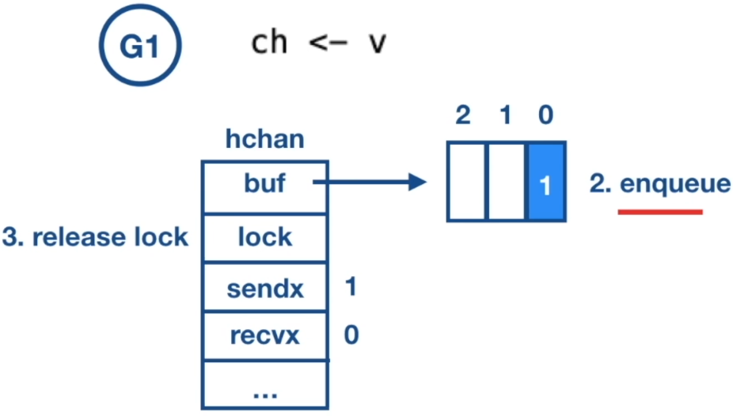


Now G2 comes along and tries to receive the value from the channel.
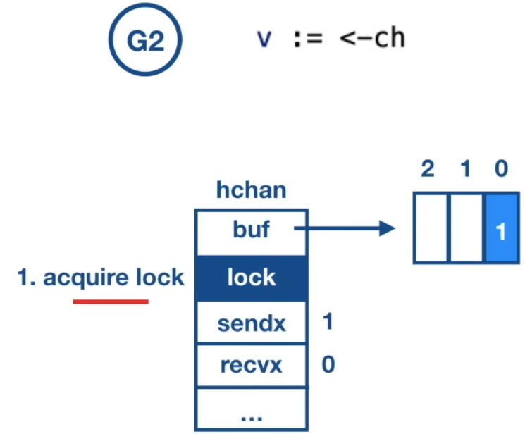

First, it has to acquire the lock on the hchan struct,

then it dequeues the element from the buffer queue and copies the value to its variable, v.

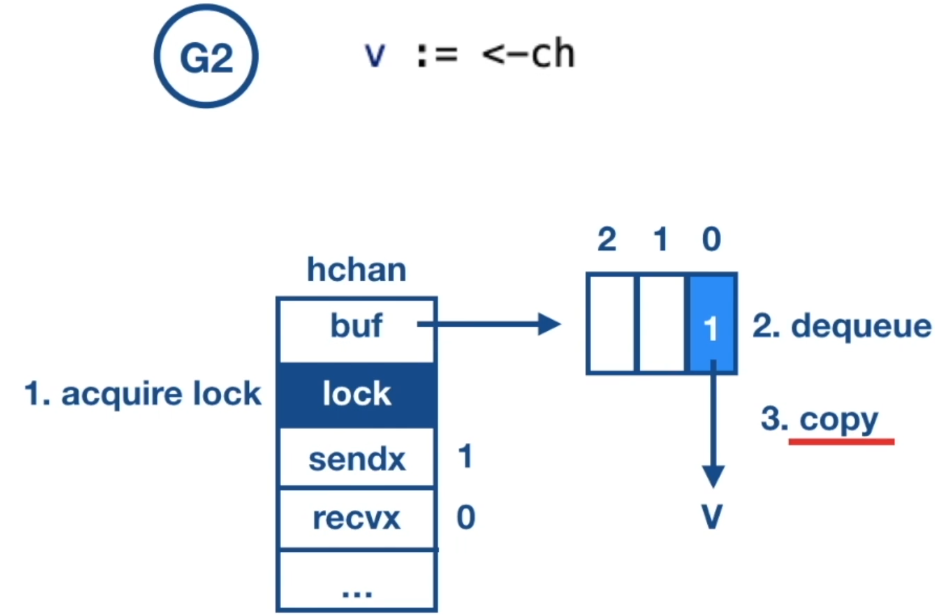

And it increments the receive index by one and releases the lock on the channel struct and proceeds

with its other computation.

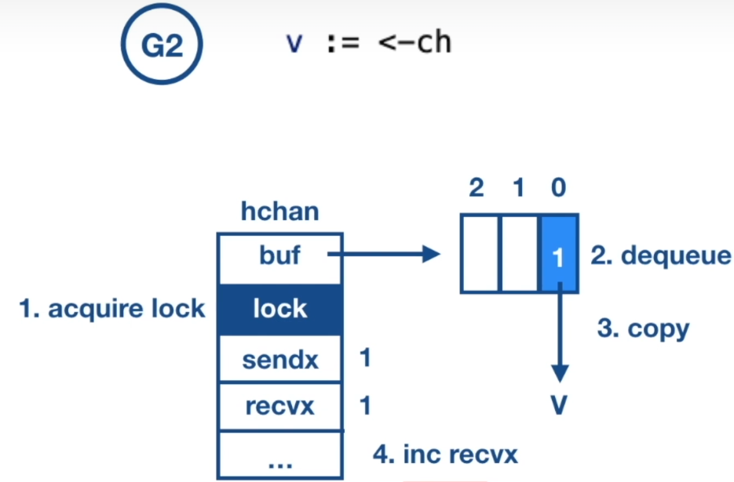

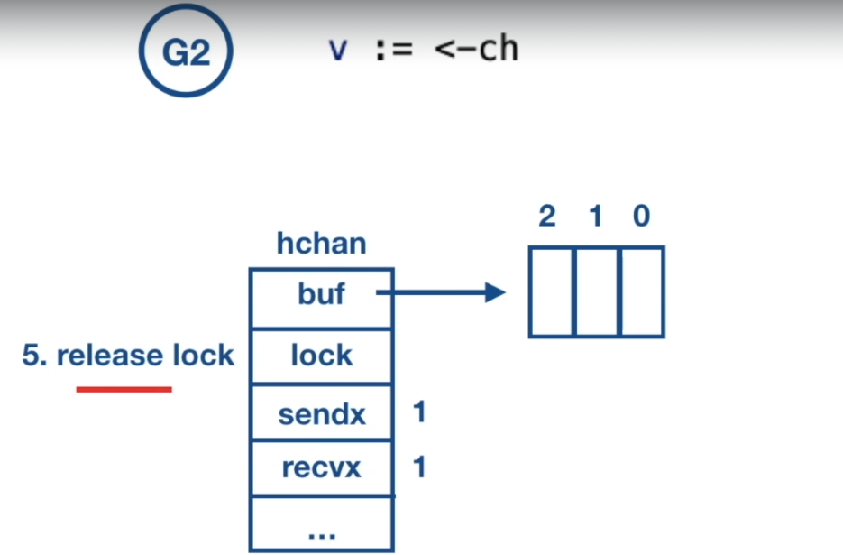

This is a simple send and receive an a buffered channel.

The points to note are, there is no memory sharing between the goroutines.

The goroutines copy elements to and from hchan struct and hchan struct is protected by the

mutex lock.


So this is where the Go's tag line comes from.

Do not communicate by sharing memory, but instead share memory by communicating.


So in this module we saw a simple send and receive on a buffered channel and the next module will look into

what happens when the buffer is full.


## Buffer full Scenerio

Now, let us consider the Buffalo scenario.

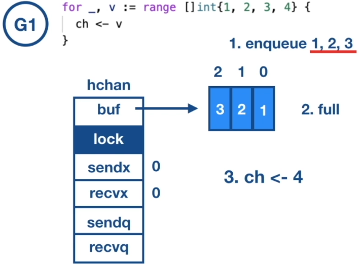

Do you want an accused the values 1 2 3 before goods full and even wants to send value for?

Now, since the buffer is full, what will happen, it will get blocked and it needs to wait for the

receiver, right?

Now, how does that happen?

Do you run grid Sisulu district and development will hold reference to the Guertin, do you want?

And the value to be sent will be saved in the elem field.

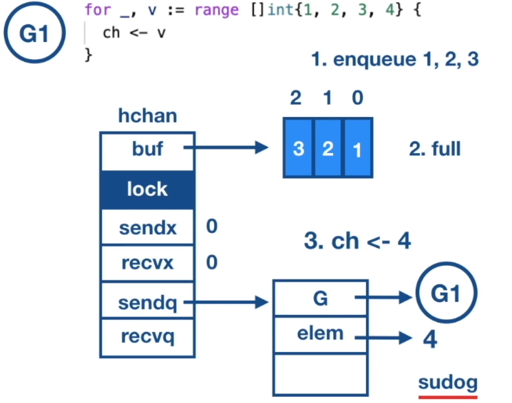

This structure is enqueed into the `sendq` list.

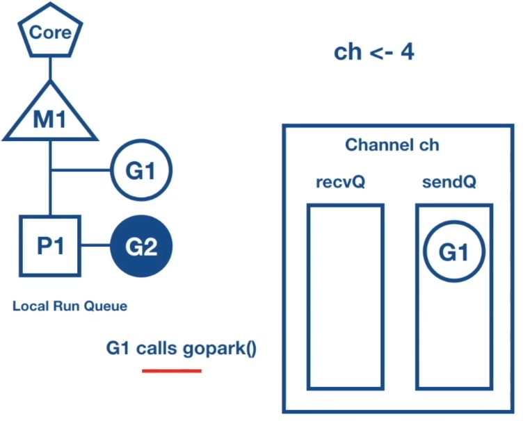

Then G-1 calls home to the school with call to go back.

The school will move driven out of the execution on the other street and other routine in the local

then queue gets scheduled to run on the Western.


Now D2 comes along and it tries to receive the value from the tenant.

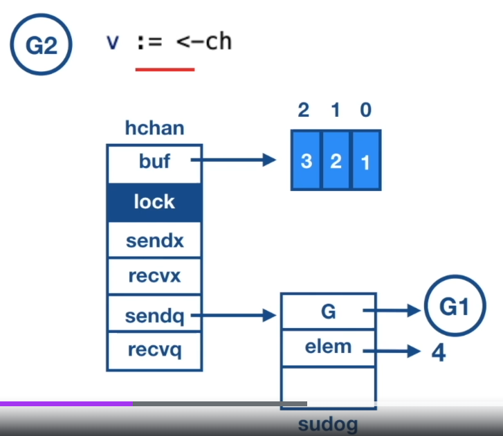

It first, a quasi look.

deques the element from the Q.

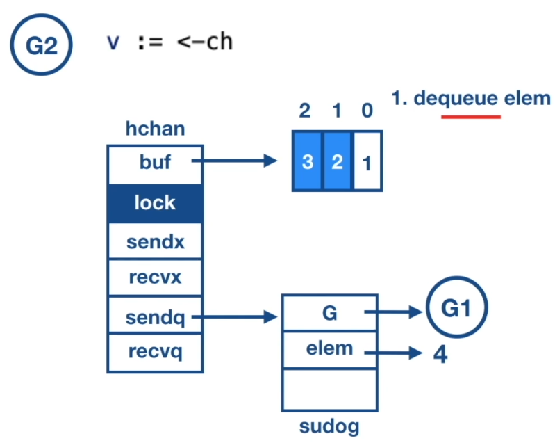

And copies the value indeed variable.

And what's the rating given on the sinking and includes the value saved in the infield?

That is a value fall into the Buffett.

This is important.

It is G2, which will include the value to the buffer on wind driven was blocked.

And this is done for optimization, as do you want later, and you not have to do any channel operation

again.

Once Inc is done due to suits the state of Florida and given turinabol.

And this is done by G2 calling guru dysfunction.

What do you want?

Then Dewan is moved to the runnable state and gets added to the local and.

And the event will be scheduled to run on Wall Street when it gets turned.

To summarize, we saw what happens in the case when the giant buffer is full and Goldin tries to send

a value.

This in the world, in its blood, this pact on the thank you, the data is saved in the field of the

self-destruct.

And the receiver comes along it because the value from the buffer and the data from the infield into

the buffer and pumps the in in the same queue and puts it into the animal state.

So this one is about what happens when the buffer is full and the next model.

We will see what happens when we try to receive on empty.