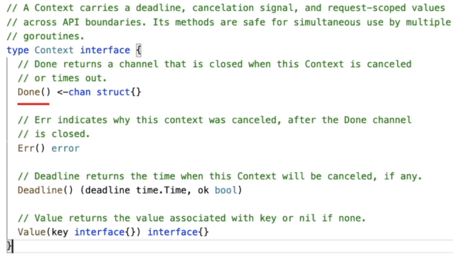
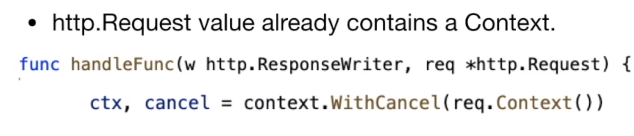
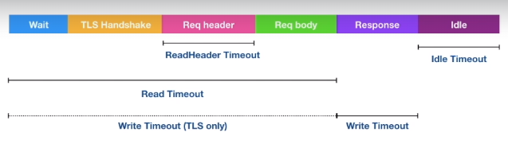
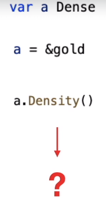
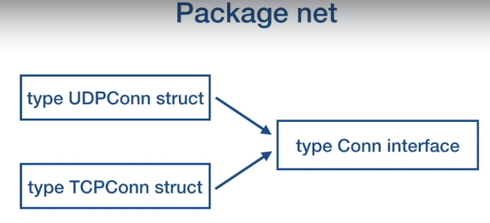

# Concurrency

Go routine is user-space threads.

concurrency is a composition of independent execution computations, which may or may not run in parallel.
concurrency enables parallelism


In this way, multiple processes are sharing CPU

# Parallelism

Parallelism is the ability to execute multiple computations simultaneously.


Concurrency enables parallelism (Need to know details about it.)

### Concurrency in Summary.

Why we need to think about Concurrency?

- In order to run faster, application needs to be divided into multiple independent units and run them in parallel.

## why ther awas a need to build concurrency primitives in Go?

OS => the job of os is to give fair chance for all process access to CPU, memory and other resources.
Process => An instance of a running program is called a process. Process provides environment for program to execute.
When the program executade the os creates a process and allocates memmory in the virtual address space.
the virtual address space will contain Code segments which is compiled machine code .
There is a Data region which contains global variable.  
Heap Segment used for dynamic memory allocation. stack is used for local varibles of function.


Threads => are smalles unit of execution that CPU accepts. each process has atleast 1 thread. that is main thread. a process can have multiple threads. threads share same address space. each thread has it's own stack. thread can run independent of each other. THe OS scheduler makes scheduling decisions at thread level, not process level. Threads can run concurrently, with each thread taking turn on the individual core, or they can run in parallel with each thread running at the same time on different cores.


### Thread States:

When the process is created, the main thread is put into the ready queue.

It is in the runnable state.

Once the CPU is available, the thread starts to execute and each thread is given a time slice.

If that time slice expires, then the thread gets preempted and placed back onto the queue.

If the thread gets blocked due to an I/O operation like read/write on disc or network operation

or waiting for the event from other processes, then it is placed in the waiting queue until the I/O

operation is complete.

Once it is complete, it is placed back onto the ready queue.


### Can we divide our application into Processes and Threads and achive concurrency? => Yes , but there are limitation.

Wy limitations?

- Context switching.

Context switches are considered expensive. CPU has to spend time copying the context of the current executing thread into memory and restoring the context of the next chosen thread And it does take thousands of CPU instructions to do context switching, and it is a wasted time as CPU is not running your application, but doing context switching.


In this diagram, you might see the context switching between the threads of the same process is relatively. cheap compared to the context switching between the threads of different processes.

can we scale the number of threads per process?
not much actually. If we scale the number of threads in a process too high, then we hit C10k problem.

what is c10k problem:
the scheduler allocates a time slice for each process to execute on CPU core.

This CPU time slice is divided equally among threds.


So if we define scheduler period as 10 milliseconds and we have two threads, then each thread is

going to get five milliseconds separately for execution.

If we have five threads, then each thread is going to get two milliseconds to execute.

But what if there are a thousand threads? => 10 microsec
This would be bad, as CPU will be spending more time in context switching than running the application.

So to do any meaningful job, a thread needs at least a minimum of two milliseconds.


If a minimum time for the thread is two milliseconds and accordingly we said this scheduler period then

to execute a thousand threads, the scheduler will take two seconds.

If there are 10000 threads, then it will take 20 seconds to complete one cycle of the execution, each

thread will have to wait for 20 seconds for its next execution.

So the application is going to become less responsive.

### So other issue is the stack size, the operating system gives a fixed stack size for each thread,


the actual size depends on the hardware.

On my machine, it is 8MB.

So if I have a 8GB of memory, then in theory I can only create 1000 threads.

So the fixed stack size limits the number of threads that we can create to the amount of memory we have.

#### let us summarize.

We saw what is a process, a process is an instance of a running program, and it provides an environment

for the program to execute.

We saw what is a thread, a thread is the smallest unit of execution, and every process has atleast

one thread and process can have multiple threads and all threads share the same address space.

And we saw what are the limitations with threads?

Fixed stack size, fixed stack size limits, the number of threads that we can create to the amount of memory

we have.

and C10k problem, as we scale the number of threads the scheduler cycle is going to increase and the application

### WHy Concurrency is hard?

In this module, we will see why concurrency is hard and how sharing of memory between the threads can

create a lot of complexity.

If you remember from the previous module, you know that all the threads share the same address space.

They share the heap and the data region of the process.

and threads communicate between each other by sharing memory.

But this sharing of memory creates a lot of complexity with concurrently executing threads.

So if two threads are running concurrently and they try to access the same area of memory with one thread

trying to write to the memory, then there will be a data race and the outcome of the program will be

un-deterministic.

Let us consider an example with thread 1 and thread 2 are running concurrently.

and here they are trying to increment the value of a global variable i.


The increment operation is not atomic, at the code level

it looks as a one statement, but in the context of the machine instructions, it involves retrieving

the value of i from memory, incrementing the value of i and storing the value of i to the memory.

So what happens if the thread gets preempted between these operations?

So let us see some scenarios.

Now, let us take two sequence of execution, in the first sequence, thread 1 and thread 2 are executing


sequentially, one after another.

In second sequence, thread 1 and thread 2 are executed in interleaved fashion, where execution of one

thread is preempted by the other thread.

Let us consider the first scenario, thread 1 starts the execution, it retrieves the value of i, which

will be zero, it increments it and then stores the value of i.


then thread 2 to come along, it retrieves the value of i, which will be one, and it increments by one and

it stores the value of i, which will be 2.


This is fine, now let us consider the second scenario.

Thread 1 starts the execution, it retrieves the value of i, which will be zero, then it increments

the value of i to one.

But before thread 1 can write the value of i to memory,

it gets preempted and thread 2 starts the execution.

it retrieves the value of i, which will be zero,

then it increments it

and it stores the value of i as 1.


Now, thread 1 comes along and it will store the value of i as 1.


As you see, the value of i, can be 2 or it can be 1, depending on how the threads are executing.


So concurrent access to memory, leads to un-deterministic outcomes.

So one way to handle this will be to use memory access synchronization tools.

We need to guard the access to the shared memory so that a thread has exclusive access at a time.

and we need to force thread 1 and thread 2 to run sequentially, to increment the value of i.

We can do this by putting a lock on the increment operation.


Putting a lock around a shared memory is a developer's convention, so any time a developer wants to

access the shared memory, they need to acquire the lock and when they are done, they need to release

the lock.

If the developer does not follow this convention, then we have no guarantee of exclusive access and

it can always happen that some code can always sneak in, which does not follow this convention.

and we hitting the race condition at some time.

There are other problems like locking actually reduces the parallelism.

as locks force the threads to be executed sequentially.

So the critical section where we access the shared memory becomes a bottleneck between the threads.

The other problem is, coding mistakes, in-appropriate use of locks can lead to deadlocks.

Let us see an example.


Here there are two threads executing concurrently.

Thread1 starts the execution, it takes a lock on resource v1, it gets preempted by thread2

it takes a lock resource v2

Now, thread1 comes along, it wants a lock on resource v2, but it is not available,

so it goes into the waiting state.

Now, thread2 comes along and it wants a lock on resource v1, but it is not available, so it also goes into

waiting state.


So as you see, this is a circular wait, which leads to deadlock and the application will just hang.

So we have come to the end of this module, let us summarize, so we saw why concurrency is hard.

Sharing of memory between the threads creates complexity.

and concurrent access to the shared memory can lead to race conditions and outcome can be un-deterministic.

Memory access synchronization tools actually reduces the parallelism and comes with its own limitations.

### GoRoutines

In the previous module, we had seen that, there are limitations with threads, the actual number of threads

that we can create is limited, and sharing of memory leads to a lot of complexity with concurrently

executing threads.

In this module, we will see how Go implements concurrency and how Go overcomes some of the

limitations with threads.

Concurrency in Go is based on the paper written by Tony Hoare, communicating sequential processes

or CSP.

The beauty of CSP is that it is very simple, it is based on three core ideas.

Each process is built for sequential execution.

Every process has a local state and the process operates on that local state.

If we have to transfer data from one process to another process, we do not share memory, but we communicate

the data, we send a copy of the data over to other process.

Since there is no sharing of memory, there would be no race, condition or deadlocks,

and we can scale easily, as each process can run independently.

If the computation is taking more time, we can add more processes of the same type and run the computation

faster.

So what tools Go provides for concurrency?

- Goroutines - goroutines are concurrently executing functions,
- Channels - channels are used to communicate data between the goroutines.
- Select - Select is used to multiplex the channels,
- Sync package - Sync package provides classical synchronization tools like the mutex, conditional variables and others.

Goroutines are user space threads, managed by Go runtime, Go runtime is part of the executable, it is built into the executable of the application.Goroutines are extremely lightweight, goroutines starts with 2KB of stack, which can grow and shrink as required.

It has a very low CPU overhead, the amount of CPU instructions required to create a goroutine is very less. This enables us to create hundreds of thousands of goroutines in the same address space. The data is communicated between the goroutines using channels, so sharing of memory can be avoided.

The context switching is much cheaper than the thread context switching as goroutines how less state to store.
Go runtime can be more selective in what data is persisted, how it is persisted and when persisting needs to occur.

Go runtime creates OS threads, goroutines runs in the context of the OS thread.This is important.


Goroutines are running in the context of the OS threads.
Many goroutines can execute in the context of the single OS thread. The operating system schedules the OS threads and the Go runtime schedules, multiple goroutines on the OS thread.


For the operating system, nothing has changed, it is still scheduling the threads, as it was. Go runtime manages the scheduling of the goroutines on the OS threads.

### Summarize GoRoutines

What are Goroutines?
Goroutines are userspace threads managed by go runtime.

We saw what are the advantages of Goroutines over OS threads.

Goroutines are extremely lightweight as compared to OS threads, they start with a very small stack size of 2KB as opposed to 8MB of stack size for the OS threads.

The context switching is very cheap as it happens in the userspace.Goroutines have a very less state to be stored.

This enables us to create hundreds of thousands of goroutines in the same address space.

## Coding exercise link:

git clone https://github.com/andcloudio/go-concurrency-exercises.git

Now see the exercise from the git:

### Solution can be found in : go-concurrency-exercise/01-exercise-solution

### go-concurrency-exercise/01-exercise/01-goroutines/01-hello

### go-concurrency-exercise/01-exercise/01-goroutines/02-client-server/

go routines in the server to handle multiple conrcurrent client connections

## WaitGroups (sunc.WaitGroup)

One of the complexity to manage in concurrency is race condition, the race condition occurs when two or more operations must be executed in the correct order to produce the desired result.

But the program has not been written so that that order is guaranteed to be maintained.

Most of the time, the race condition is introduced due to developers thinking that the program executes in the order they are coded.

In concurrent programs, that is not the case.

In this code snippet, there is no guarantee that the goroutine will be created and executed before main routine checks the value of the data.

#### Goroutines are executed asynchronously from the main routine.

The order in which the main routine and the goroutine will execute is undeterministic.

In this example, there are three possible outcomes.


The first outcome can be nothing is printed, if the sequence of execution is, goroutine gets scheduled before main routine checks the value of the data.

So in this case, the value of the data will be 1, so nothing will be printed.

The second possible outcome could be it will present value is zero.

If goroutine does not get executed before main routine, checks the value of the data.

main routine, checks the value of the data, which will still be zero, so it prints the output as value is zero.

The third possible outcome can be, it print the value is one.

If goroutine gets scheduled between main routine, checking the value of data and printing the value of data, main routine checks the value of data, which will be zero.

So it drops into the if block.

But before executing the print statement, goroutine gets scheduled and increment the value of the data.

And then main routine, execute the print statement. Then the output will be value is one.

Can we bring some determinism into our program?

Can we make main routine, wait for the goroutine to execute before checking the value of data?

This is where sync.waitGroup comes into play.


Go follows logical concurrency model called fork and join.

Go statement forks a goroutine, when a goroutine is done with its job, it joins back to the main routine.

If main does not wait for the goroutine, then it is very much possible that the program will finish before goroutine gets a chance to run.

In order to create a join point, we use sync.WaitGroup, to deterministically block the main routine.

We create a variable of type sync.WaitGroup we call the add method to indicate the number of goroutines that we are creating.

we call done method inside the goroutine closure (defer wg.Done()(in image give top)) to indicate that the goroutine is exiting.

Usually it is called with the `defer`, to make sure that it gets called on all the exit points of the function.

Wait method will block the main routine until all the goroutines have exited.

wait group is like a concurrent counter

call to add increases the counter by the integer that is passed in, call to done will decrement the counter by one, call to wait, will block until the counter becomes zero.

Here you notice (image give top) that add method is placed outside the goroutine enclosure had to call to add was placed inside the goroutine closure, then it is very much possible that the call to wait method could execute before the add method.

In that case, the main routine could return without blocking.

Therefore, we call the add method outside the goroutine enclosure to make sure that the add method gets called before wait.

#### Exercise WaitGroup.

### go-concurrency-exercise/01-exercise/01-goroutines/03-join

## GoRoutines and Clousers

Goroutines executes within the same address space they created in.

They can directly modify the variables in the enclosing lexical block.

This enables developers to write goroutines within the <b>lexical block</b> of the enclosing function as a sequential code. Go compiler and the runtime takes care of pinning the variable, moving the variable from stack to heap, to facilitate goroutines, to have access to the variable even after the enclosing function has returned.


### go-concurrency-exercise -> 01-exercise -> 01-goroutines -> 05-closure

Explain the solution code:

We have an exercise here, we need to run the program and check that variable i was pinned for access from goroutine even after the closing function returns.

So let us see what we have here. We have a function, inside function we have a local variable(`var i int`) . We are spinning a goroutine(`go func()`) and we are returning from the function.

Inside the goroutine, we are accessing the local variable of the function and we are incrementing its value and we are printing the value.

In the main routine we are calling a function and we are waiting for the goroutines to execute.

let me run this program.

So what's happening here is the function has returned, but goroutine still has the access to the local variable of the function.

So usually when the function returns, the local variables goes out of scope.

But here, the runtime is clever enough to see that the reference to a local variable i is still being held by the goroutine,so it pins it, it moves it from the stack to heap, so that goroutine still has the access to the variable even after the enclosing function returns

### go-concurrency-exercise -> 01-exercise -> 01-goroutines -> 06-closure

We have been asked to predict the output of this program and we need to find the issue and fix the issue.

We have a loop, and in each iteration of the loop, we are spinning a goroutine and inside the goroutine, we are printing the value of the interator i and in the main routine, we are waiting for the goroutines to execute.

So what do you think would each goroutine will print the value of i as? do you think they are going to print it as one, two and three respectively or something else?

Let's execute this.

They are all printing the value of i as four, this is because by the time goroutine got the chance to run the value of i had already been incremented to value four.

Now, how can we fix that?

We need to pass the value of i as a parameter to the goroutine function so that goroutine operates on the input that has been passed to it.

So we need to parse the value of i as a parameter here, now let us try to execute.

Now it's going to print one, two, three, here the order depends on the order of the execution of the goroutines.

So in this exercise, what we learnt was goroutines operate on the current value of the variable at

the time of their execution.

If we want the goroutines to operate on a specific value, then we need to pass that as an input to the goroutine.

## Deep Dive Go Scheduler.

In this module and in the next couple of modules, we will have a deep dive into Go scheduler and see how Go scheduler works underneath.

Go scheduler is part of the Go runtime, Go runtime is part of the executable, it is built into the executable of the application.

Go scheduler is also known as M:N scheduler.It runs in the user space.Goroutines are scheduled on the OS threads by the Go scheduler.

So a goroutine runs in the context of the OS thread.

Go runtime creates a number of worker OS threads, equal to GOMAXPROCS environment variable value, the default value is the number of processors on the machine. So if we have 4 cores, then 4 OS threads will be created.

If you have 8 cores, then 8 OS threads will be created.

It is the responsibility of the Go scheduler to distribute runnable goroutines over multiple threads that are created.

At any time N goroutines could be scheduled on M OS threads that runs on at most GOMAXPROCS number of processors.

As of Go 1.14, the Go scheduler implements <b>Asynchronous Preemption.</b>

It used to be co-operative scheduler, but then the question came, what happens when a long running routine just hogs onto the CPU?

other goroutine would just get blocked.

So that's the reason why asynchronous pre-emption was implemented.

So in asynchronous preemption, what happens is, a goroutine is given a time slice of ten milliseconds for execution.

When that time slice is over, Go scheduler will try to preempt it, this provides other goroutines the opportunity to run even when there are long running CPU bound goroutines scheduled.

Similar to threads, goroutines also have states.


When it is created, it will be in runnable state, waiting in the run queue.

It moves to the executing state once the goroutine is scheduled on the OS thread.If the goroutine runs through its time twice, then it is preempted and placed back into the run queue.

If the goroutine gets blocked on any condition, like blocked on channel, blocked on a syscall or waiting for the mutex lock, then they are moved to waiting state.

Once the I/O operation is complete, they are moved back to the runnable state.

Now we will look into different elements involved in Go scheduling.


For a CPU core, Go runtime creates a OS thread, which is represented by the letter M. OS thread works pretty much like POSIX thread. Go runtime also creates a logical processor P, and associate that with the OS thread M.

The logical processor holds the context for scheduling, which can be seen as a local scheduler running on a thread.

G represents a goroutine running on the OS thread.

Each logical processor P has a local run queue where runnable goroutines are queued. Here it is depicted by the colored circles.

There is a global run queue, once the local queue is exhausted, the logical processor will pull goroutines from global run queue.

When new goroutines are created, they're added to the end of the global run queue.

Let's see a context switch.


Goroutine G1 has reached a scheduling point,

then the logical processor will pop a goroutine from its local run queue in this case G2 and sets the stack and the instruction pointer for the goroutine G2 and begins running that goroutine, the previously running goroutine G1, is placed back into the local run queue.


As you see, there is no change as far as the OS is concerned.

It is still scheduling the same OS thread.

The context switching between the goroutines is managed by the logical processor.

There is a one to one mapping between OS thread and the logical processor, if there are two cores and we have set GOMAXPROC environment variable to 2, then go runtime, creates another OS thread and logical processor, and associates the OS thread with the logical processor, and goroutines can be scheduled on the second OS thread.


Let us summarize.

We saw how Go scheduler works.

Go runtime has a mechanism known as M:N scheduler, where N goroutines could be scheduled on M OS threads that run on at most GOMAXPROC number of processors.

As of Go 1.14 Go scheduler implement asynchronous preemption where each goroutine is given a time slice of ten milliseconds for execution.

We saw, what are the components of Go scheduler. OS thread is represented by the letter M.

P is the logical processor which manages scheduling of goroutines. G is the goroutine, which includes the scheduling information like stack and instructions pointer. Local run queue is where runnable. goroutines are queued.

When a goroutine is created, they are placed into the global run queue.

## Deep Dive Context switching.

In this module we will see context switching caused due to synchronous system call.

What happens in general when a goroutine makes a synchronous system call, like reading or writing to a file with sync flag set.

There will be a disc I/O to be performed, so synchronous system call will block for I/O operation to complete.

Due to which the OS thread can be moved out of the CPU and placed in the waiting queue for the disc I/O to complete.

So we will not be able to schedule any other goroutine on that thread.

The implication is that synchronous system call can reduce parallelism.

So how does Go scheduler handle this scenario?

Let us see.


Here goroutine G1 is running on OS thread M1.

G1 is going to make synchronous system call, like reading on a file, that will make the OS thread M1 to block.

Go scheduler identifies that G1 has caused OS thread M1 to block, so it brings in a new OS thread, either from the thread pool cache or it creates a new OS thread if a thread is not available in the thread pool cache.


Then Go scheduler will detach the logical processor P from the OS thread M1, and moves it to the new OS thread M2.


G1 is still attached to the old OS thread M1.

The logical processor P can now schedule other goroutines in its local run queue for execution on the OS thread M2.

Once the synchronous system call that was made by G1 is complete, then it is moved back to the end of the local run queue on the logical processor P.


And M1 is put to sleep and placed in the thread pool cache.

So that it can be utilized in the future when the same scenario needs to happen again.

So let us summarize, we saw, how context switching works when a goroutine calls synchronous system call.

When a goroutine makes a synchronous system call, Go scheduler brings new OS thread from thread pool cache. And it moves the logical processor to the new thread. Goroutine that made the system call, will still be attached to the old thread.other goroutines in the local run queue are scheduled for execution on the new thread.

Once the system call returns, the goroutine which made the system call, is moved back to the local run queue of the logical processor and old thread is put to sleep.

## Context switching due to Asynchronous calls

In this module, we will look into context switching due to a asynchronous system calls, like the network system call or http api call.

What happens when a asynchronized system call is made?

Asynchronous system call happens when the file descriptor that is used for doing network I/O operation is set to non-blocking mode.

If the file descriptor is not ready, for example, if the socket buffer is empty and we are trying to read from it, or if the socket buffer is full and we are trying to write to it, then the read or the write operation does not block, but returns an error.

And the application will have to retry the operation again at a later point in time.

So this is good, but it does increases the application complexity.

The application will have to create any event loop and set up callbacks, or it has to maintain a table

mapping the file descriptor and the function pointer, and it has to maintain a state to keep track of how much data was read last time or how much data was written last time. And all these things, does add up to the complexity of the application.And if it is not implemented properly, then it does make the application a bit inefficient.

So how does Go handle this scenario?

Go uses <b>netpoller.</b>

There is an abstraction built in syscall package.

syscall package uses netpoller to convert asynchronous system call to blocking system call. when a goroutine makes an asynchronized system call, and file descriptor is not ready, then the Go scheduler uses netpoller OS thread to park that goroutine.

The netpoller uses the interface provided by the operating system, like epoll on Linux, kqueue on MacOS, iocp on Windows, to poll on the file descriptor.

Once the netpoller gets a notification from the operating system, it in-turn notifies the goroutine to retry the I/O operation.

In this way, the complexity of managing asynchronous system call is moved from the application to go runtime.

So the application may not have to make a call to select or poll and wait for the file descriptor to be ready, but instead it will be done by the netpoller in an efficient manner.

Let us look into an example.

Here G1 is executing on the OS thread M1.


G1 opens an network connection with net.Dial

The file descriptor used for the connection is set to non-blocking mode.

When the goroutine tries to read or write to the connection, the networking code will do the operation until it receives an error.

EAGAIN

Then it calls into the netpoller, then the scheduler will move the goroutine G1 out of the OS thread M1 to the netpoller thread.

And another goroutine in the local run queue, in this case G2 gets scheduled to run on the OS thread M1.


The netpoller uses the interface provided by the operating system to poll on the file descriptor.

When the netpoller receives the notification from the operating system that it can perform an I/O operation on the file descriptor, then it will look through its internal data structure.

To see if there are any goroutines that are blocked on that file descriptor.

Then it notifies that goroutine, then that goroutine can retry the I/O operation. Once the I/O operation is complete, the goroutine is moved back to the local run queue and it will be processed, by the OS thread M1 when it gets a chance to run.


In this way to process an asynchronous system call, no extra OS thread is used, instead the netpoller OS thread is used to process the Go routines.

So let us summarize.

So in this module, we saw what happens when a goroutine makes a asynchronous system call.

Go uses netpoller to handle asynchronous system call. netpoller uses the interface provided by the operating system to poll on the file descriptor.

And it notifies the Goroutine to try the I/O operation when it is ready.

In this way, the application complexity of managing an asynchrous system call is moved to the

Go runtime, which manages it in an efficient manner.

## Work Stealing.

In this module, we will look into work stealing concept in Go scheduler.Work stealing helps to balance the goroutines across the logical processors.So that work gets better distributed and gets done more efficiently.

Let us look into an example, here we have a multithreaded go program, we have 2 OS threads and 2 logical processors, the goroutines are distributed among the logical processors.


Now, what happens if one of the logical processor services all its goroutines quickly? the global run queue and local run queue of P2.

We see that P1 has no more goroutines to execute, but there are goroutines in runnable state in


The work stealing rule says that, if there are no goroutines in the local run queue, then try to steal from other logical processors.

If not found, check the global run queue for the goroutines.

If not found, check the netpoller.


In this case, P1 does not have any runnable goroutine in its local run queue, so it randomly picks another logical processor, P2 in this case and steals half of its goroutines from its local run queue.


We see P1 has picked up goroutines, G7 and G8 to its own local run queue.And P1 will be able to execute those goroutines.Now we are able to better utilize the CPU cores and the work is fairly distributed between multiple logical processors.


What happens when P2 finishes executing all its goroutines?

And P1 one does not have any goroutine in its local run queue.

Then, according to work stealing rule, P2 will look into the global run queue and finds goroutine G9.


G9 get scheduled on OS thread M2.

Let us summarize

In this module, we saw how work stealing scheduler works.

If the logical processor runs out of goroutines in its local run queue, then it will steal goroutines from other logical processors or global run queue.

So, work stealing helps to balance goroutines across the logical processor and work gets better distributed and gets done more efficiently.

## Channels


Here we have a code snippet, where goroutine is making a computation, and we want to get the result of that computation in our main routine without having to share the memory.

So how can we do that?

This is where channels comes into picture. channels are used to communicate data between the goroutines. channels can also help in synchronizing the execution of the goroutines, one goroutine can let know another goroutine, in what stage of the computation they are in and synchronize their execution.

Channels are typed, they are used to send and receive values of a particular type.
They are thread safe, so the channel variables can be used to send and receive values concurrently by multiple goroutines.

It is very easy to create channels and we declare a variable with chan keyword, followed by the type,

```go
var ch chan T
```

the default value of the channel is nil.
So we need to use built-in function make, to allocate memory for the channel.

```go
var ch chan T
ch = make(chan T)

//or
ch := make(chan T)
```

And the make function returns a reference for the allocated memory.

Or we can use a short variable declaration with make built-in function, which declares and allocates memory for the channel in one statement.

Pointer operators can be used to send and receive values from the channel, and the arrow direction indicates

```go
  // <-
  // send
  ch <-v
  // receive
  v = <-ch

```

the direction of the data flow.

For send, the arrow direction indicates that the value is being written to the channel.

And for receive, the arrow direction indicates that the value is being received from the channel and copied to the variable.

channels are blocking, the sending goroutine is going to block until there is a corresponding receiver goroutine ready to receive the value.


Similarly, the receiver goroutine is going to block until there is a corresponding sender goroutine, sending the value.

And it is the responsibility of the channel to make the goroutine, runnable again once it is ready to receive or send value.

Closing of the channel is very useful for the sender goroutine to indicate to the receiver goroutine, that the sender has no more values to send on the channel and the receiver can unblock and proceed with its other computation.

```go
 close(c)
```

Receive returns two values, the first one is a received value from the channel.

```go
 //receive returns two values
 value, ok = <-chan

```

The second is a boolean value, which indicates whether the value that is being read from the channel is a value that is generated by a write or a default value that is being generated by a close of the channel.

So the second return value will be true if the value is generated by write or it's going to be false, If it is generated by close, and this is very useful to determine whether the value is from write or whether the values from close.

## Exercise Channel -> 01-exercise/02-channel/01-channel

## Range Over the channel


Range over the channel, the receiver goroutine can use range to receive a sequence of values from the channel. range over the channel will iterate over the values received from a channel.

The loop automatically breaks when the channel is closed. So once the sender goroutine has sent all of its values, it will close the channel and the receiver goroutine will break out of the range loop. The range does not return the second boolean value.

Normally the receive returns the second boolean value, but range just returns value, as on close, the range will automatically break out of the loop.

Unbuffered channels:
the channels that we have been creating till now are unbuffered channels.


There is no buffer between the sender goroutine and the receiver goroutine.

Since there is no buffer, the sender goroutine will block until there is a receiver, to receive the value, and the receiver goroutine will block until there is a sender, sending the value.

In buffered channels, there is a buffer between the sender and the receiver goroutine, and we can specify the capacity, that is the buffer size, which indicates the number of elements that can be sent without the receiver being ready to receive the values.


The sender can keep sending the values without blocking, till the buffer gets full, when the buffer gets full, the sender will block.

The receiver can keep receiving the values without blocking till the buffer gets empty, when the buffer gets empty, the receiver will block.

The buffered channels are in-memory FIFO queues, so the element that is sent first, will be the element that will be read first.

### Exercise 01-exercise/02-channel/02-channel

### Exercise 01-exercise/02-channel/03-channel

### Channel Direction

When using channels as functional parameters, you can specify if the channel is meant only to send or only to receive values.

And this specificity will help us to increase the type safety of the programs, in the below example, in is a receive only channel, note the syntax, it's a pointer operator followed by the chan keyword, and out is a send only channel, and the syntax is, chan keyword followed by the pointer operator.


In this example, the pong function can use in, only to receive values. It cannot use this channel to send values. If it tries to send values on this channel, the compiler is going to report an error.so in this way, we can control what operations that function can do with the channels that are passed as parameters.

### Channel direction exercise. 01-exercise/02-channel/04-channel

## Channel ownership


Now we will look into the things that we should be aware when working with channels, and this will help us in troubleshooting.

Default values -
when a channel is declared, its default value is nil.

So we should allocate memory by using the built-in function make.

If that does not happen and we try to send or receive on that channel, then it's going to block forever.


Similarly, closing on the new channel will panic, so we should always make sure that the channels are initialized with the built-in function make.


How we use the channels is important to avoid deadlocks and panics.

We can follow some of the Go idioms.

The best practice is that the goroutine that creates the channel will be the goroutine that will write to the channel and is also responsible for closing the channel.

The goroutine that creates writes and closes the channel is the owner of the channel and the goroutine that utilizes the channel will only read from the channel.

So establishing the ownership of the channel will help us to avoid deadlocks and panics, and it will help in avoiding scenarios like deadlocking by writing to nil channel, closing a nil channel, writing to a closed and closing channel more than once, which can all lead to panic.

### Exercise Channel ownership 01-exercise/02-channel/04-channel

## Deep dive channel

In this module and in the next couple of modules, we will try to understand the mechanics behind channels, how channels work and how to send and receive works underneath.

We use built-in function make to create channels. Here we are creating a buffered channel with three elements.


Internally, the channels are represented by the `hchan` structure. Now let us look into different fields in the hchan struct.


It has a mutex lock field, any goroutine doing any channel operation must first acquire the lock on the channel.buf is a circular ring buffer where the actual data is stored.

And this is used only for the buffered channels, data queue size, is the size of the buffer. qcount indicates a total data elements in the queue. sendx and recvx indicates the current index of the buffer from where it can send data, or receive data.

recvq and sendq are the waiting queues which are used to store blocked goroutines, the goroutines that were blocked while they were trying to send data, or while they were trying to receive data from the channel. waitq, is the linked list of goroutines, the elements in the linked list is represented by the sudog struct.


In the sudog struct, we have the field g, which is a reference to the goroutine, and elem field is pointer to memory, which contains the value to be sent, or to which the received value will be written to.


When we create a channel with built-in function make, hchan struct is allocated in the heap, and make returns a reference to the allocated memory.

And since ch is a pointer, it can be sent between the functions which can perform, send or receive operation on the channel.


This is a runtime values of hchan struct. buf is been allocated a ring buffer and dataq size is set to 3, this value comes from the parameter that has been passed to the make function.

And current qcount is zero, as no data has been enqueued yet.

So in this module, we looked into how channels are represented.

## How send and Receive buffered channel

Let us now look into what happens when we do send or receive on a buffered channel.


In this code snippet, we have 2 goroutines goroutine G1 is sending a sequence of values into the channel, and goroutine G2 is receiving the sequence of values by ranging over the channel. Now, when we create a channel, this will be the representation.


There is a circular queue with size three, which is currently empty.


Let us now consider the scenario when the G1 executes first, G1 is trying to send a value on the channel, which has empty buffer.

First, the goroutine has to acquire the lock on the hchan struct.


Then it enqueues the element into the circular ring buffer.


Note that this is a memory copy. The element is copied into the buffer. Then it increments the value of the sendx to 1. Then it releases the lock on the channel and proceed with its other computation.


Now G2 comes along and tries to receive the value from the channel.


First, it has to acquire the lock on the hchan struct, then it dequeues the element from the buffer queue and copies the value to its variable, v.


And it increments the receive index by 1 and releases the lock on the channel struct and proceeds with its other computation.


This is a simple send and receive an a buffered channel. The points to note are, there is no memory sharing between the goroutines. The goroutines copy elements to and from hchan struct and hchan struct is protected by the mutex lock.

So this is where the Go's tag line comes from. Do not communicate by sharing memory, but instead share memory by communicating.


So in this module we saw a simple send and receive on a buffered channel and the next module will look into what happens when the buffer is full.

## Buffer full Scenerio

Now, let us consider the Buffalo scenario.


G1 enquees the values 1 2 3. buffer gets full and G1 wants to send value 4?

Now, since the buffer is full, what will happen, it will get blocked and it needs to wait for the receiver, right?

Now, how does that happen?

G1 creates `sudog` `G` and G element will hold the reference to the goroutine G1
And the value to be sent will be saved in the elem field.


This structure is enqueed into the `sendq` list.


Then G-1 calls on to the scehduler with call to `gopark()`.

The scheduler will move G1 out of the execution on the OS thread and other goroutine in the local run queue gets scheduled to run on the OS thread.

Now G2 comes along and it tries to receive the value from the channel.


It first, select `look`. deques the element from the Queue. And copies the value into it's variable.


And pops the waiting G1 on the same queue and includes the value saved in the elem field?

That is a value 4 into the buffer. This is important.

It is G2, which will enqueue the value to the buffer on which G1 was blocked.

And this is done for optimization, as G1 late in an have to do any channel operation

again.

Once enqueue is done G2 sets the state of goroutine G1 to runnable.

And this is done by G2 calling `goready(G1)`.


Then G1 is moved to the runnable state and gets added to the local run queue.


And G1 will be scheduled to run on os thread when it gets it chance.

To summarize,
we saw what happens in the case when the giant buffer is full and goroutine tries to send value.

This in the goroutine gets blocked, thisparked on sendq, the data is saved in the elem field of th sudog structure

when Receiver comes along, it dequeues the value from buffer

enqueues the data from elem field to the buffer

and Pops the goroutine in sendq, and puts it into runnable state.

## Buffer empty scenerio

What happens when a goroutine G2 executes first and tries to receive on an empty channel?


The buffer is empty, and G2 has called a receive on an empty channel.


So G2 creates a sudog struct for itself and enqueues it into the receive queue of the channel and the elem field is going to hold the reference to a stack variable v,


And G2 calls upon the scheduler with the call to gopark function, the scheduler will move G2 out of the OS thread and does a context switching to the next goroutine in the local run queue.


Now G1 comes along and tries to send the value on the channel. First, it checks if there are any goroutines waiting in the receive queue of the channel and it finds G2.


Now, G1 copies of the value directly into the variable of the G2 stack and this is important. G1 is directly accessing the stack of G2 and writing to the variable in the G2 stack.


This is the only scenario where one goroutine accesses the stack of another goroutine, and this is done for the performance reasons so that later G2 need not have to come and do one more channel operation and there is one fewer memory copy.

Then G1 pops G2 from the receive queue and puts it into the runnable state,


by calling the go ready functin G2


Now G2 moves back to the local run queue and it will get scheduled on the OS thread M1 when it gets a chance to run.


Now, what we saw here, we saw the buffer empty scenario.

So when goroutine calls receive on an empty buffer, the goroutine is blocked and parked to the receive queue.

The elem field in the sudog struct holds the reference to the stack variable of the receiver goroutine.

The sender goroutine comes along and sender finds the goroutine in the receive queue.

And the sender goroutine copies the data directly into the stack variable of the receiver goroutine.

And pops the receiver goroutine in the receive queue and puts it into the runnable state.

This was about what happens when the receive is called on the empty buffer.

## Send and Receive Unbuffered channels

In this module, we will look into send and receive on an unbuffered channels.

let us see send on unbuffered channel

When the sender goroutine wants to send values on the channel, if there is a corresponding receiver goroutine

waiting in the receive queue, then the sender will write the value directly into the receiver goroutine's stack variable.

The sender routine will then put the receiver goroutine back to the runnable state.

If there is no receiver goroutine in the receive queue, then the sender gets parked into the send queue.

And the data is saved in the elem field in the sudog struct, when the receiver comes along, it copies the data and puts the sender back to the runnable state.

This was about what happens when we do send on an unbuffered channel.

Now, let us see what happens when we do receive on an unbuffered channel.

the receiver goroutine wants to receive value on the channel.

If it finds a sender goroutine in the send queue, then the receiver copies the value in the elem field of the sudog struct to its variable.

Then puts the sender goroutine back to the runnable state. If there was no sender goroutine in the send queue. Then the receiver gets parked into the receive queue.

And a reference to the variable is saved in the elem field in this sudog struct, when the sender comes along,

it copies the data directly into the receiver stack variable.

And puts the receiver back to the runnable state.

So this is what happened on the receive, on the unbuffered channel.

## Final Summary for Channel

Till now we saw the internal working of the channels, what happens when a channel is created?

What happens when we do send or receive on a channel?

Let us summarize.

hchan struct represents the channel, it contains circular ring, buffer and mutex lock. The goroutines, have to acquire the mutex lock to do any channel operation.

When a goroutine gets blocked on send or receive, then they are parked in the send queue or the receive queue.

Go scheduler moves the blocked goroutine out of the OS thread.

Once the channel operation is complete, goroutines are moved back to the local run queue.

This was all about how to channel, send and receive works.

By now, you should have become very comfortable with goroutines and channels, which are the pillars of concurrency in Go.

## Select

Here is our scenario, goroutine G1 has spawned two goroutines, G2 and G3 and has given them a task to do.


Now, the question is, in what order are we going to receive the results from these two goroutines?

Are we going to receive from G2 first and then G3 or G3 first and then G2.


What if the G3 executes faster in some instances and returns the result faster and G2 executes faster in other instances and returns the results faster

So the question is, can we do the operation on the channel, whichever is ready and not worry about the order.

And this is where select comes into play. Select is like a switch statement, each case statement specifies a send or receive on some channel and it has an associated block of statements.


Each case statement is not evaluated sequentially, but all channel operations are considered simultaneously to see if any of them is ready.

And each case has an equal chance of being selected.

Select waits until some case is ready to proceed, if none of the channels are ready, the entire select statement is going to block, until some case is ready for the communication.

When one channel is ready, then it performs the channel operation and executes the associated block of statements.

If multiple channels are ready, then it's going to pick one of them at random.

`Select` is very helpful in implementing timeouts and not blocking communication.

You can specify time out on the channel operation by using select and time after function.


Select will wait until there is a event on the channel or until the timeout is reached.

The time after function will take a time duration as input, and it returns a channel.

And it starts a goroutine in the background, and sends the value on the channel after the specified time duration. In this code snippet, the select will wait for a value to arrive on the channel ch for three seconds.

If it does not arrive, then it's going to get timed out.

you know, channels are blocking, right, you can achieve non-blocking operation with select

by specifying the default case.


If none of the channel operation is ready, then the default case gets executed and the select does not wait for the channel.

It just checks if the operation is ready, if it is, it performs the operation, if not, then the default case gets executed.

So in this code snippet, if some goroutine has already sent a value on the channel ch, then it will read the value.

If there was no goroutine, which has sent a value, then it just executes the default case.

Some scenarios to consider are, the empty select statement will block forever and select on the nil channel will also block forever.


So let us summarize.

So you saw select is like a switch statement.

With each case statement specifying a channel operation.

And the select is going to block until there is any case ready for the channel operation. With select we can implement a timeout and nonblocking communication and select on nil channel will block forever.

### `Select` Exercise:

### Exercise Channel ownership 01-exercise/03-select/01-select

### Timeout Exercise:

### Exercise Channel ownership 01-exercise/03-select/02-select

### Non-blocking Exercise:

### Exercise Channel ownership 01-exercise/03-select/03-select

## sync Package

We have already seen sync wait group, we will look into other utilities in the sync package, like the mutex, condition variables, atomic and pool.

We'll start with mutex (`sync.Mutex`).

Question is when to use channels and when to use mutex?
channels are great for communication between the goroutines.

But what if we have like caches, registries and state, which are big to be sent over the channel and we want the access to these data to be concurrent safe, so that only one goroutine has an access at a time.

So this is where classical synchronization tools like the mutex comes into the picture.

So we use channels to pass data between the goroutines and distribute units of work and communicate asynchronous results, and we use mutex to protect caches, registries and states from concurrent access.

Mutex is used to guard access to the shared resource.

Mutex provides a convention for the developers to follow, anytime a developer wants to access the shared memory, they must first acquire a lock and when they are finished, they must release the lock.


And locks are exclusive, if a goroutine has acquired the lock, then other goroutines will block until the lock is available.

The region between the lock and unlock is called the critical section.

And it is common idiom to call unlock with defer, so that unlock gets executed at the end of the function.

The critical section reflects the bottleneck where only one goroutine can be either be reading or writing to a shared memory, if the goroutine is just reading and not writing to the memory, then we can use read write mutex.

`sync.RWMutex` allows multiple readers access to the critical section, simultaneously, unless the lock is being held by the writer.


The writer gets the exclusive look. And here they defer unlock runs after the return statement has read the value of the balance.

Let us summarize.

Mutex is used to guard access to the shared resource.

It is a developers convention to call lock to access the shared memory and call unlock when done.

And the critical section represents the bottleneck between the goroutines.

### Exercise Mutex:

### Exercise Channel ownership 01-exercise/03-select/03-mutex

`sync.AUtomic` :

Atomic is used to perform low level atomic operation on the memory. It is used by other synchronization utilities.

It is a Lockless operation.

Here in this example, we are using a atomic operation on the counters, we use add method to increment the value of the counter, and this add method can be called by multiple goroutines concurrently and the access to the memory will be concurrent safe. And we use the load method to read the value of the counter in a concurrent safe manner.

`runtime.GOMAXPROCS(4)`: tells go runtime to use 4 cpu cores to run our go routines. so 4 goroutines can be run in parallel


### Exercise Atomic:

### Exercise Channel ownership 01-exercise/04-sync/11-atomic

`sync.Cond` :

Conditional variable is one of the synchronization mechanisms, a conditional variable is basically a container of goroutines that are waiting for a certain condition.

The question is, how can we make a goroutine wait till some event or condition occurs, one way could be to wait in a loop for the condition to become true.


In this code snippet, we have a shared resource, a map that is being shared between the goroutines.

And the consumer goroutine, needs to wait for the shared map to be populated before processing it.

So first we will acquire a lock.

We check for the condition whether the shared map is populated by checking the length of the map.

If it is not populated, then we release the lock, sleep for an arbitrary duration of time and again acquire a lock.

And check for the condition again. This is quite inefficient, right?

What we need is we need some way to make the goroutine suspend while waiting, and some way to signal the suspended goroutine that, that particular event has occurred.

Can we use channels?

We can use channels to block the goroutine on receive and sender goroutine to indicate the occurrence of the event.

But what if there are multiple goroutines waiting on multiple conditions?

That's where conditional variables comes into the picture.

```go
  var c *sync.Cond
```

Conditional variables are of type sync.Cond, we use the constructor method, NewCond() to create a conditional variable, and it takes a sync locker interface as input, which is usually a sync mutex.


And this is what allows the conditional variable to facilitate the coordination between the goroutines in a concurrent. safe way.

sync.Cond package contains three methods.


wait, signal and broadcast.

wait method, suspends the execution of the calling thread, and it automatically releases the lock before suspending the goroutine. Wait does not return unless it is woken up by a broadcast or a signal.


Once it is woken up, it acquires the lock again.

And on resume, the caller should check for the condition again, as it is very much possible that another goroutine could get scheduled between the signal and the resumption of wait and change the state of the condition.

So this is why we check for the condition in a for loop here.


Signal, signal wakes up one goroutine that was waiting on a condition. The signal finds a goroutine that was waiting the longest and notifies that goroutine. And it is allowed, but not required for the caller to hold the lock during this call.


Broadcast, broadcast wakes up all the goroutine that were waiting on the condition, and again, it is allowed, but it is not required for the caller to hold the lock during this call.

Let us look into an example, we have a goroutine G2 which needs to wait for the shared resource to be populated before proceeding with its processing.


We create a conditional variable with the constructor NewCond, passing it the mutex as the input. Here we have our shared resource, this is our goroutine and we take the lock for the entire duration of our processing. We check for the condition, whether they shared resources populated, if not, we make a call to the wait. Wait implicitly releases the lock and suspends our goroutine.

Now the producer goroutine comes along.


It acquires a lock, populates the shared resource, and sends a signal to the consumer goroutine and then it releases the lock.

On receiving the signal, the consumer goroutine is put back to the runnable state and wait acquires the lock again, the wait returns, we check for the condition again, and then we proceed with our processing and we release the lock.

So this is how the wait and signal mechanism works.

If there are multiple goroutines, waiting on a condition, then we use broadcast.


The broadcast will send a signal to all the goroutines that were waiting on the condition. So in this way, we are able to coordinate the execution of the goroutines, when they need to wait on an occurrence of a condition or an event.

Let us summarize, so we saw that conditional variable are used to synchronize the execution of the goroutines, and there are three methods, wait suspends the execution of the goroutine. Signal wakes up one goroutine that was waiting on the condition. Broadcast, wakes up all the goroutines that were waiting on that condition.

### Exercise Cond:

### Exercise Channel ownership 01-exercise/04-sync/21-cond

### Exercise Channel ownership 01-exercise/04-sync/22-cond

`sync.Once`

sync once is used to run one time initialization functions, the Do method accepts the initialization function as its argument. sync once ensures that only one call to Do ever calls the function, that is passed in, even when called from different goroutines.

And this is pretty useful in the creation of a singleton object or calling initialization functions, which multiple goroutines depends on, but we want the initialization function to run only once.

### Exercise Channel ownership 01-exercise/04-sync/31-once

`sync.Pool`

Pool is commonly used to constrain the creation of expensive resources like the database connections, network connections and memory.

We will maintain a pool of fixed number of instances of the resource and those resources from the pool will be reused rather than creating new instances each time whenever the caller requires them.


The caller, calls the get method, whenever it wants access to the resource. And this method will first check, whether there is any available instance within the pool.

If yes, then it returns that instance to the caller.

If not, then a new instance is created which is returned to the caller.

When finished with the usage, the caller, calls the put method, which places the instance back to the pool, which can be reused by other processes.


In this way, you can place a constraint on the creation of expensive resources.

### Exercise Channel ownership 01-exercise/04-sync/41-pool

## Race detector

Go's concurrency mechanisms makes it easy to write clean concurrent code.

But they do not prevent us from making mistakes, so the code that we write needs to be tested for any race condition.

Go provides race detector tool, for finding race conditions in Go code. Race detector is integrated with other Go tools.


The binary built needs to be race enabled, to run a race tool.

In the binary, the compiler inserts code to record all memory access.

And the runtime library watches for the unsynchronized access to the shared memory, when the racy behavior is detected, a warning is printed.

And we need to note that the race enabled binary can be 10 times slower and consume 10 times more memory.

So we cannot use a such in production, but integration test and the load test are good candidates for testing with binary with race enabled.

### Exercise Channel ownership 01-exercise/05-race

### Exercise Channel ownership 01-exercise/07-exercise-web-crawler Sequenctial

### Exercise Channel ownership 01-exercise/07-exercise-web-crawler Concurrent

## Concurrency Patterns

## Pipeline

Go's concurrency primitives makes it easy to construct streaming pipelines.


That enables us to make an efficient use of the I/O and the multiple CPU cores available on the machine, to run our computation faster. Pipelines are often used to process streams or batches of data.

Pipeline is a series of stages that are connected by the channels, where each stage is represented by a goroutine.

A goroutine takes the data from an in-bound channel, performs an operation on it and sends the data on the out-bound channel, that can be used by the next stage.


By using pipelines, we can separate the concerns of each stage, and process individual stages concurrently.

Stages could consume and return the same type.

For example, a square stage can take, receive only channel of type int and return receive only channel of type int as output.


This enables the composability of the pipeline.

For example, a generator stage can return a receiver only channel of type int, which a square stage can take as input, and we can compose the output of the square stage as input to another square stage.


Here is an example of a image processing pipeline.

This pipeline takes a list of images as input and generates thumbnail images that is then stored on the disk or transferred to a storage bucket in the cloud.


This pipeline has three stages. In stage one, we are running goroutine G1, which is generating a list of images to be processed.

It passes those image paths to the stage 2, via the channel 1.

In stage 2, we are running goroutine G2, it receives the paths of images on channel 1 and processes those images and generates thumbnail images, and outputs the thumbnail image information to the channel 2

In stage 3, we are running goroutine G3, that is receiving the thumbnail image information on channel 2, and it stores the thumbnail images on the disk or transfers those images to a storage bucket in the cloud.

So what we see here is, we have separated the concerns into different stages,

G1 is only concerned about getting the list of images to processes. G2 is only concerned about image processing.

G3 is only concerned about storing the images. and all these stages can run in parallel, utilizing the multiple cores available on the machine.

If there are too many images to be processed, then we can scale up the number of goroutines in stage 2 to process the images faster.


Let us summarize,

In this module, we saw what are pipelines used for. Pipelines are used to process streams or batches of data. Pipelines enables us to make an efficient use of the I/O and multiple CPU cores to run our computation faster. Pipeline is a series of stages connected by channels, and each stage is represented by a goroutine.

### Exercise Channel ownership 01-exercise/02-pipeline/01-pipeline

## Fan-out, Fan-in

Sometimes a stage in our pipeline can become more computationally intensive and it can take some time to produce output.

For example, in this pipeline, G2 is a computationally intensive stage.


It takes time for G2 to output values on the channel, channel 2.

As a result, the goroutines, G3 and G4 can become blocked while waiting for our expensive stage G2 to send values.

So the question is, can we break a computationally intensive stage into multiple instances of the goroutines that can run in parallel to speed up the processing?

That's where the concept of fan out and fan in comes into the picture.

The term fan out is used when we start multiple goroutines to handle the input from the channel.

Multiple goroutines read data from the same channel.

By fanning out, we can distribute the work amongst a group of worker goroutine to parallelize the CPU usage and the I/O usage.


The term fan-in is used to describe the process of combining the multiple results into one channel.

In this diagram, the goroutines G2a, G2b and G2c are reading the data from the same channel, Channel 1 and output, the computational result on the individual channels, channel 2a, 2b and 2c.


Merge goroutines Ma, Mb and Mc will collect that output from multiple channels and write them to a single channel Channel 2, in this way, by parallelizing the computationally intensive stage, we can speed up the computation and the pipeline is going to run faster.

Let us summarize,
in fan-out, we start multiple goroutines to read data from a single channel, which enablesus to distribute the work amongst a group of goroutines to parallelize the CPU usage, and I/Ousage.

This helps the computationally intensive stage to run faster and in-turn the pipeline is going to run faster.

We saw what is fan-in, fan-in is a process of combining multiple results into one channel.

We create a merge goroutines to read data from multiple input channels and send the data to a single output channel.

### Exercise Channel ownership 01-exercise/02-pipeline/02-pipeline

## Cancelling GoRoutines

## Pattern in our Pipelines

There is a pattern in our pipeline functions that we have been coding till now.

The upstream stages closes their outbound channel when they have sent all their values downstream.


The downstream stages keep receiving values from the inbound channel until the channel is closed.

This pattern allows each receiving stage to be written as range loop.

All the goroutines will exit, once all the values have been sent successfully downstream.


For example, in the merge function that we coded in our last exercise, we waited for all the goroutines to terminate and then we closed our merged out channel.

That enabled the main goroutine to exit from the range loop.

But in real pipelines, stages do not always receive all the inbound values.

The receiver may only need a subset of values to make progress.

Or a stage could exit early because an inbound value represented an error.

In either case, the receiver should not have to wait for all the remaining values to arrive.

And we want the earlier stage to stop producing the values that the later stage don't need.


If the main goroutine, just receives one value and abandons the inbound channel from merge, then the goroutines in the merge stage will get blocked on the channel send operation, in-turn, the goroutines in the square and the generator stage will also get blocked on their channels send operation.

This leads to goroutine leak.

The question is, how can we signal a goroutine to abandon what they are doing and terminate?

We can send a cancellation signal to the goroutines, by passing a read-only channel to the goroutine and then closing the channel, which will send a broadcast signal to all the goroutines.

On receiving the signal on the done channel, the goroutines needs to abandon their work and terminate.

We use select to make the send and receive operation on the channel preempted by multiplexing with receive on done channel.


So the goroutines that are blocked on the channel send operation, if they receive a signal on the done channel, then they will unblock and return from the goroutine function.

### Exercise Channel ownership 01-exercise/02-pipeline/03-pipeline

### Exercise Channel ownership 01-exercise/02-pipeline/04-image-processing-sequential (sequetial & pipeline version)

## Context Package:


In Go servers, each incoming request is handled in its own goroutine.

The request handler often starts additional goroutines to access the back end, such as the databases and RPC services.

The set of routines working on a request typically needs access to request specific values, such as the identity of the end user, authorization tokens and the request deadline.

When a request is cancelled by the end user or if the request is timed out, then we want all the goroutines working on that request to exit quickly, so that the system can reclaim any resources they were using.

So we need a way to propagate the request scoped data, down the call graph to all the goroutines, and we need a way to propagate cancellation signals down the call graph to all the goroutines.

This is where the context package comes into play.

Context package serves two primary purposes.

It provides an API for cancelling branches of the call graph and it provides a databag for transporting request scoped data through the call graph.

Here is an example which shows how the context propagation could happen through the call graph.


The main routine creates a root context, it derives a cancellable context from the root context and passes that to function 1 and function 2. function 1 derives a new context from the cancellable context and sets a time out of one second and passes that to function 3.

Function 3 is supposed to complete its computation before one second or respect the timeout and return when the context is cancelled.

The context at function 2, is not affected by this time out, it is still just a cancellable context as the context is passed by value.

This allows the composability of the context and individual call graph can have its own properties without affecting the context of the parent call graph.

The core of the context package is a context type.



The done method returns a channel that is closed when the context is cancelled or timed out. The error method returns an error, indicating why the context was cancelled. The deadline method can be used to check if a context will be cancelled after a certain time.

The value method returns the value associated with the key in the context.

A context is safe for simultaneous use by multiple goroutines.

We can pass a single context to any number of goroutines and cancel the context to send a signal to all the goroutines to abandon their work and terminate.

Now, let us look into functions that are provided by the context package to create a new context. Background and TODO.


Background returns and empty context, it is the root of any context tree.

It is never cancelled and has no value and has no deadline.

It is typically used by the main function, and it acts as a top level context for the incoming request.

Now, let us look into todo function, todo also returns an empty context, but its intended purpose is to serve as a placeholder.

It is used when we don't know which context to utilize or if we expect our code to be provided with the context, but the upstream code has not yet furnished one, then we use todo context as a placeholder.

Let us summarize,

in this module, we saw what is context package used for. Context package is used to send requests scoped values and cancellation signals across the API boundaries to all the goroutines involved in handling a request.

Context package provides functions to create context.

Background returns an empty context, which is used as the root of the context tree.

TODO also returns an empty context, but its intended purpose is to be a placeholder until the upstream code is finalized.

## Context Package for cancellation

Context as such is immutable, to add behavior, we need to derive new context value from the existing ones.

Context package provides functions to add cancellation behavior.

We have functions like with cancel, with timeout and with deadline.


These functions generate new instance of the context and add options relative to the behavior of these functions.

The derived context is passed to the child goroutine, to facilitate their cancellation.

withcancel() function takes parent context as the input, we could pass the output of the background function as input to withcancel function.


withcancel function is going to return a copy of the parent context with a new done channel and a cancel function. cancel function is used to close the context's done channel.

Closing the done channel indicates to an operation to abandon its work and return.

Cancelling the context releases the resources that are associated with the context.

It is very important that we call the cancel function as soon as the operation running, the context is complete.

If we don't call the cancel function, then there will be a memory leak, the resources associated with the context won't be released until the current context is cancelled or the parent context is cancelled.

Cancel() function does not wait for the operation to stop. It just closes the done channel and returns.

Cancel function, can be called from multiple goroutines simultaneously after the first call, the subsequent call to the cancel function do not do anything, they just return.

Here is an example of using withcancel function, in the parent goroutine, we are creating a root context using the background function, we are passing that as an input to the withcancel function. withcancel function is creating a cancellable context.


We are passing that cancellable context to the generator function, the generator function is creating a child goroutine.

when we want to cancel the goroutine, we call the cancel function, cancel function is going to close the done channel in the context.

In the child goroutine, we use select to multiplex any channel operation with the receive on the context done channel.

On receiving the done signal, on the context then channel, the child goroutine is going to abandon its work and return with an error.

The context error method returns non-nil, if the context was cancelled.

#### Now, let us look into the with deadline function.

We can set a deadline to an operation using the with deadline function.

With deadline function, takes the parent context and clock time as the input.

And it returns a new context which closes its channel when the machines clock time advances past the given deadline.


In this example, we are setting a deadline, five milliseconds past the current time and we are passing that deadline as the input to the with deadline function.

With deadline function is returning a context whose done channel is going to get closed five milliseconds from the current time.


We are seeing a code snippet from the source code, which shows the internal implementation of the with deadline function.

with deadline function is creating a cancel context with the parent context that is passed in as the input.

And it is using time after function to spin a goroutine, which cancels the context after the duration of time has elapsed.

So with deadline function is using the cancel context and time after function to close the done channel on deadline expiry.

Now, let us come back to the user program, a child goroutine can use the deadline method in the context to know if the deadline is set for the context.


The deadline method returns a boolean as a second return value, whose value is going to be true if the deadline is set else it's going to be false.

If the deadline is set, the child goroutine can evaluate if sufficient time is available to complete its job.

If not, then it can just return with an error deadline exceeded.

child goroutine can use select to multiplex any channel operation with receive on the done channel on receiving the signal on the done channel, the child goroutine is going to return with a context error.

#### Now, let us look into with timeout function,

We can set a timeout on an operation using with timeout function.


With timeout function takes the parent context and the time duration as the input.

WithTimeout returns, a new context whose done channel gets closed after the given time duration.

withTimeout is useful for setting deadline on the request to the backend service.

We are seeing a code snippet from the Go source code, context.go file

It shows the internal implementation of withTimeout function.

We see that with timeout is actually a wrapper over with deadline, withTimeout returns, with deadline which adds the time duration that is passed in as the input to the current time and sets a deadline.

The difference in using with timeout or with deadline in our program is, with timeout, the countdown begins the moment the context is created.

But in with deadline, we are setting the explicit time which provides us more control over when the timer is going to expire.

Now, let us summarize in this module,

we saw how the context package can be used for the cancellation of an operation.

Context package provides functions to derive new context values from the existing ones to add cancellation behavior.

WithCancel function is used to create a cancellable context, which is then propagated forward.

cancel function that is returned is used to close the done channel.

On receiving the close signal, the goroutine is supposed to abandon its operation and return.

We can set a deadline to an operation using withDeadline function, withDeadline function, creates a new context whose done channel gets closed when the machines clock time advances past the given deadline.

Context deadline method can be used by the goroutine to know if the deadline is associated with the context.

We can use the with timeout function to set time out on an operation.

WithTimeout, function returns a new context, who done channel is closed after the given time duration.

## Context Pakcage as Data bag

In this module, we will look into how context package can be used as a data bag.

Context package can be used to transport request scoped data, down the call graph, we use the function withValue() to associate request scoped values with the context.

WithValue(), function takes a parent context and a key value pair as the input.

And it returns a copy of the parent context in which the value is associated with the key.

The provided key must be comparable, we should define our own user defined data type for the keys.

In this example, in the parent goroutine, we are defining a user defined data type, user ID type.


We are creating a context withValue by associating the key, user ID key with value "Jane".

And this context is passed to the child goroutine.

In the child goroutine, we access the data associated with the context using the value method.

We pass the key as the input and it returns an interface, we need to do type assertion to the user defined data type to get the value.

Now, the variable user ID contains the value Jane.

Let us summarize,

the context package can be used as a data bag to carry request scoped data.

WithValue() is used to associate the request scope data with the context.

ctx.Value() method is used to extract the value, given a key from the context.

### Exercise WithCancel 01-exercise/03-context/01-withcancel

### Exercise WithDeadline 01-exercise/03-context/02-withdeatline

### Exercise WithTimeout 01-exercise/03-context/03-Timeout

### Exercise WithValue 01-exercise/03-context/04-Value

## GO's Idioms for context package

In this module, we will look into Go idioms for using the context package. Any incoming request to a server should create a context.

The time to create the context is always as early as possible in the processing of a request or a task. We can create a top-level context with background function, in the main routine. The http request value already contains the context, in this case, we can use the context contained in the http request and it is a go idiom to use the variable name as ctx for all context values.



The outgoing calls to a server should accept a context, the higher level calls needs to tell the lower level calls how long they are willing to wait.

In this example, we are sitting a time out of 100 millisecond and associating with the context with the http request and passing that request to http default client Do method.


If we don't get the response from the server for the http request within the timeout, then http default client Do method, respect the cancellation signal on the timer expiry and returned with the error message.

We need to pass a context to the function, performing any I/O operation, essentially any operation that is performing the I/O operation, should accept the context value as its first parameter and respect any timeout or the deadline configured by the caller.

The context aware API's in the standard library takes context as the input, and it is a Go idiom to have the first parameter as the context value.

Any change to the context value creates a new context value which is then propagated forward.

Here we have an example,


in the main routine, we are creating a cancellable context and we are passing that to the child goroutine. child goroutine adds the timeout and passes that to the function, as we make the changes to the context value, a new context value is created, which is then propagated forward, as we add or modify the context, the functions called before are not affected as the context is passed by value.

In this example, the context in the main is not affected by the timeout added in the goroutine.

When a context is cancelled, all the context derived from it are also cancelled.

If the parent context is cancelled, then all the children context derived from that parent context are also cancelled.

We need to use TODO context only if we are unsure about which context to use, this happens if a function is not responsible for creating the top level context and we need a temporary top-level context, until we figure out where the actual context is going to come from.

We need to use the context values only for request scope data, not for passing optional parameters to the functions.

We should not use the context value to pass the data to a function which becomes essential for its successful execution.

A function should be able to execute its logic even with an empty context value.

Let us summarize,

any incoming request to the server should create a context. Outgoing calls to a server should accept a context.

Any function that is performing an I/O operation should accept a context value. Any change to the context value creates a new context value which is then propagated forward.

If the parent context is cancelled, then all the derived context from it are also cancelled.

We need to use TODO context only if we are unsure about which context to use.

We need to use context values only for the request scoped data, not for passing optional parameters to the function.

## HTTP Server Timeouts with Context Package

In this module, we will look into the setting of http server timeout with context package.

When we expose a server out to the Internet, setting timeouts is important to conserve the system resources and to protect against the DDoS attacks, we could spin separate goroutines to serve each connection.

But the file descriptors are limited.

Each client connection consumes a file descriptor for the network connection.

If a malicious user starts as many connections as the number of file descriptors allowed in the system, then the server is going to run out of the file descriptors and it won't be able to accept any new connection.

As a result, we get accept error.

#### Too many open files.

There are four main timeouts, exposed by the http server, we can set a timeout for reading

the request body.

Reading the request header.

Sending the response to the client and

the idle timeout allowed between the request from the client.



The read timeout covers the time from when the connection is accepted to when the request body is fully read.

The read header timeout is the amount of time allowed to read the request headers.

The write timeout normally covers the time from the end of the request header read to the end of the response write.

If the connection is https, then the write timeout also includes the packets that are written as part of the TLS handshake.

And incidentally, this also includes the request header and the request body read.

Idle time out is the maximum amount of time to wait for the next request, when the keep alive is enabled.

We can set the connection timeouts explicitly using the server.


And we should set these time outs, when we are dealing with untrusted clients and the networks, so that a client is not allowed to hold up a connection, by being slow to write or to read.

We also need to control the amount of time it takes for our handler functions to complete.

The timeout that we saw previously provides a means for setting connection deadlines at a network connection level.But http handler functions are unaware of these timeouts. As a result, they run to the completion, consuming the resources even after the timer expires.

Let us look into an example and see what I mean. Here we have a http server, We are using postgresql to simulate a slow query.


We are starting a server on localhost port 8000, we are setting write time out of two seconds, the write timeout covers the time from the end of the request header read to the end of the response write, that is, it covers the lifespan of the serve http method, that is returned by the http handler function.


We are setting the http handler function as slow handler.

In the slow handler, we are calling slow query,where we are simulating a query to take five seconds to complete, once the query is complete, we are sending the response OK to the client.


So in this example, we are setting the write timeout as two seconds, but our handler function is taking five seconds to complete its processing.


So what do we expect the output to be?

Let us execute and check. Let me start the server.

Let me start another terminal, we use curl to connect to the server.

And we want to know the amount of time it takes to get the response.

We are waiting for the response.

The response is empty, but it took five seconds to get the response.


While the server knows that we cannot write the response after two seconds, the handler function still ran to the completion and took five seconds to return the response, when the timeout is expired we need a way to stop the handler function from further processing and end the request to free the system resources.

The question is how to efficiently timeout http handler functions.

net/http package provides a middleware function, timeout handler, which returns serve http handler that runs the input handler within the given time limit.

It takes the http handler as the first argument, a time duration, as a second argument, which is the time out for the handler function, the time duration needs to be set to a value less than the write time out value.

Here we are setting the write timeout as two seconds and the handler timeout as one second, to allow the handler function to write error response to the client in case of time expiry.

The third argument is a string, which is the message returned to the client on the timer expiry.


If the input handler runs longer than its time limit, then the handler sends 503 service unavailable error and a html error message to the client. Let us return to our exercise and use timeout handler function.

We come to the server.


Instead of http handler function, we use http timeout handler, we pass the handler function as the first argument.

We set the time out as one second.

We set the timeout message as time out. Let us execute this.

Let us start curl with option -i, this provides us information on the http error.


Now we are seeing that we are getting http response at the time out of one second, we are getting the error message 503 service unavailable and the timeout message.

But the handler still took five seconds to complete.

We need a way to propagate the timeout awareness to the handler function and to the functions down

the call graph, that is where we can use context timeouts and cancellations, to propagate the cancellation signal down the call graph.

The request type already has a context attached to it.

The request type provides a context function which returns the request context. For any incoming request the server cancels this context when the client closes the connection, or on timeout or when the serve http method returns.

We are looking at a code snippet from Go source code, from net http package, server.go file.


We are looking at the internal implementation of the serve http method, in the timeout handler.

serve http method gets called to respond to the http request, which in turn calls our handler function. This function is creating a context and setting a time out to the value that we specify in the timeout handler.

And then it is setting the context as a request context, so the done channel in the request context


will get closed on that timer expiry.

We can use the request context in our handler function to check for the close signal on the context.Done channel.

This way, we can propagate the timeout awareness to our handler function. Let us come back to our exercise and complete the program.

Let us come to the slow handler.


Let us retrieve the context from the request type.

And slow query is going to take the first argument as the context.

We use the context aware database API to execute the query, we pass the context as input, when the context's done channel is closed, the database terminates the running query and returns with an error message.

We come to the main routine, in the main routine, we're using Ping method to verify the database connection.


We could use the context aware ping method here, so that we can set a time out for the ping operation.


We create a context, with timeout.

We create a root context with background as we are in main routine, we set the time out as 10 second.

We take the returned context and the cancel function.

We defer cancel the context.

And we use the context aware ping method and we pass the context as the input.

So if the database connection verification hangs for some reason, then the ping method can return with an error, on timeout expiry.


Now we are getting the response on timeout, we are getting 503 server unavailable and the error message time out and our database query also got terminated with an error, on time timeout, thereby freeing up the resources.

Therefore, it is very important to make use of context aware APIs when doing any I/O operation.

Let us summarize

in this module we saw setting of http server timeouts with context package we saw setting of http server timeout is important to conserve the system resources and to protect against DDoS attacks.

We used timeout handler and the request context to set the time out for http handler functions, and the request context was propagated down the call graph.

Which allows the handler functions and other I/O operations to terminate their activity and return on timer expiry, thereby freeing up the system resources.

## Interface:

Let us start with an example.


Here we have a program in which we are comparing the density of metals. The metal structure has two fields, mass and volume. It has method density, which calculates the density of metals, using the formula mass divided by volume and it returns the value.

We are using the function is denser, to compare the density of two metals. It is using the method density to get the density of metals passed in as parameters.

It's going to return true, if the first metal passed as parameter has higher density than the second one else is going to return false.

We know the mass and volume of gold and silver, we want to know which one of these metals is denser. We call is denser function, passing the pointer to gold and silver as inputs. We are using pointers as density method is having a pointer receiver.

We are printing the message based on the result.

Let us execute this program to know which one of these metals is denser. It turns out gold has higher density than the silver. Now, we want to extend this program, to this program we want to add other objects like gases, so we need to define a new type gas of type struct

We could define a separate function similar to is denser, that we have for metals, but can we avoid having repetition of similar code?

Can we use the is denser, function itself?

So instead of specifying the data type, can we specify the behavior of the object?

This is where the interfaces comes into picture.

#### If something can do this, then it can be used, here is what interfaces allows us to achieve.

The concrete type in our example, metal and gas have a common behavior density.

So we can define an abstract type, dense, as an interface, which defines the behavior density with its methods signature.


In our utility function is denser, instead of the concrete type pointer the metal, we can use the interface type dense, that guarantees that the concrete types, that are passed in as input will have the method density, with the signature as defined in the interface.

So is denser, function, can use the method density from the parameters that are passed in as inputs.

When we call the is denser function, we can only pass the variables of the concrete type that possesses the methods defined in the interface dense.


But how is the interface is able to dynamically dispatch to the correct method and the receiver value in the runtime?

Type is a compile time property.


When we assign an address of gold variable to a pointer of type metal, we can call the metal density, which in-turn calls the method defined for that type metal, with the receiver value of gold.


But when we assign the address to the value of the interface type and call the density method, then how is the interface able to dynamically dispatch to the current method and the receiver value?


Let us look into how interfaces work.

Conceptually, a value of the interface type has two components,

dynamic type and dynamic value.

When we declare a variable of type interface, dynamic type and the dynamic value are set to nil.

When we assign a value, that is pointer to variable gold, the interface dynamic type is set to type descriptor that is pointer type of metal.


The interface dynamic value is assigned the reference to the metal structure, which represents the values assigned to the gold variable.


When we call a method through an interface, it uses dynamic dispatch, the compiler would have generated code to obtain the address of the method from the type descriptor.

So in the run time an indirect call can be made from that address.


The receiver argument for the call is a copy of the interfaces dynamic value.

So when we make the method call through the interface, it becomes equivalent to calling the method from the value of that type.


Similar things happen when we assign the value of gas type to the interface, dynamic type is set to pointer to gas type, dynamic value points to the value of the oxygen variable.


When we call the density method, it uses the address of the method from the type descriptor to make an indirect call to the method which uses the dynamic value as its receiver value.


The purpose of interface is, interfaces enables us to encapsulate the logic within the methods of the user defined type.

Each of the data type metal and gas has its own formula to calculate the density. So we can encapsulate that logic within its methods. And interfaces provides an abstraction for the higher level functions.

With a guarantee on the behavior of the underlying concrete type so that we can write versatile code as higher level functions are not tied to the details of a particular implementation.


## Interface Implicit

#### Implicit interfaces lead to good design

Implicit interfaces leads to good design.

Interfaces are satisfied implicitly. In Java we would declare a class as implements an interface explicitly,


but in Go there is no such explicit syntax. There is no implements keyword, rather, user defined types just need to possess the method defined in the interface to be considered an instance of the interface.

So the definition of the interface is : decoupled from its implementation.

This gives a lot of flexibility.

We don't have to lock ourselves with the abstractions at the start of the project itself, by having to define the interfaces before the implementation.

In Go, we can define the interfaces as and when the abstractions becomes apparent.

This design lets us to create new interfaces that are satisfied by the existing concrete types. We do not have to go back and tag every implementation, which sometimes may not be possible if the implementation is not under our control, like the standard libraries or any third party code.

Interface definition and the concrete type definition could appear in any package without prearrangement. So it makes it easier to abstract the dependencies, when implementing a new package where we can define an interface with the signatures that we want without having to import another package.

The convention in Go is to keep the interface simple and short.

We define the interfaces when there are two or more concrete types that must be dealt in a uniform way. We create smaller interfaces with fewer and simpler methods. Smaller interfaces are easier to satisfy when new types comes along.

A good rule of thumb for the interface design is to ask only for what is needed.

## Interface from Standard Library

In this module, we will look into using the interfaces from the standard library.


Here is an example, we are calling the function Fprintf, on the first call we are passing os.Stdout as input, which is of type os.File to print the string "hello" on the standard output.

On the second call, we are passing the reference to the variable of type bytes.Buffer as input to write the string world, onto the buffer.

Fprintf is able to take values of different type as input and is able to perform different operations printing to standard out or writing to buffer, how is this working?

Let us see.

We are looking at the implementation of Fprintf in fmt package.


Fprintf takes io.Writer interface type as the first parameter.

io package defines the writer interface, it contains the method signature for write.


os package, file type, provide an implementation for the write method, with the signature as specified in the writer interface.

In this implementation, it writes the slice of bytes passed in as input to the file handle.

bytes package, buffer type, also provides an implementation for the write method with the signature as specified in the writer interface.

In this implementation, it copies the slice of bytes passed in as input into the buffer.

We come back to the Fprintf implementation, Fprintf calls the write method on the interface value, trusting that the callers of Fprintf, can only pass the concrete types that implements the write method, with the same signature as specified in the writer interface.


So the interface definition acts as a contract, Fprintf does not need to assume any representation of the interface value, whether the value is writing to a file or to memory, it just relies on the behavior guaranteed by the io writer interface, that the write method is going to be there and it can call it, with the signature as specified in the interface definition.

In this way, we are able to use a Fprintf with any type that provides an implementation for the writer interface.

io writer interface is one of the most widely used interfaces, as it provides an abstraction of all the types to which bytes can be written, which includes files, memory buffers, network connections, http clients and many more.

Other popular interface types in the io package are,

Reader interface, a reader represents any type from which we can read bytes.

closer interface, a closer is any value that we can close, such as a file or network connection.


We can embed existing interfaces to create new interface types, we have read writer interface, which has embedded definitions of reader and writer interface.


read write closer interface has embedded definition of reader writer closer interfaces.


So for a type to satisfy, read write closer interface, it has to possess the method defined in reader interface, writer to interface and closer interface.

Other popular interface is stringer interface, which is defined in fmt package.


Stringer interface provides a way for the types to control how their values are going to be printed.

The print functions in fmt package and other packages checks if the concrete type satisfies the stringer interface.

If it does, then it can call the string method of the type to format the values before printing them.

Let us summarize,

we saw io writer interface which provides an abstraction of all the types to which bytes can be written.

we saw stringer interface, which provides a way for the types to format their values for print.

### Exercise io.Writer interface 03-exercise/01-interfaces/03-byte-counter

### Exercise Stringer interface 03-exercise/01-interfaces/04-string

## Interface Satisfaction

A type satisfies an interface, if it implements all the methods the interface defines.

For example os.File, satisfies, io.Reader, Writer, Closer and io.ReadWriter interfaces as it has implementations for read write and close methods.

bytes.Buffer on the other hand, satisfies, io.Reader, Writer and io.ReadWriter interfaces, as it has implementations for read and write methods. But it does not satisfy closer interface as it does not have close method defined.

The assignable rule for the interface value is, an expression can only be assigned to an interface only if its type satisfies the interface.

In this example, we are declaring a variable of type io.Writer,


we can assign os.Stdout as it is of type os.File, which implements the write method.

We can also assign a pointer to bytes.Buffer as it also implements the write method.

But on assigning time.second, which is of type, time duration, the compiler gives an error, time duration has missing method, write.

So we cannot assign the type to the value of the interface time if it does not implement all the methods specified in the interface definition.

An interface conceals the concrete type and value and interface wraps the concrete type and only the method defined in the interface are revealed, even if the concrete type implements other methods.

For example, os.File, has the implementation for write and close methods, so from the instance of the os.File such as os.Stdout, we can call the write and close methods.


In this example, we see that we have a utility function printer which takes a file handle of type os.File and string as input, its intended purpose is only to write the string to the file.


But it does not stop for someone to add the code, to close the file handle, this breaks the intention for which the function was created, resulting in bad code.

Can we prevent this?

If in the printer function instead of os.File.

If it were to take io.Writer the interface as input, then we can limit the method exposed to the printer function to only the write method.


If someone were to try to call the close method, the compiler will give an error, io.Writer has no field or method close.

In this way, we can conceal the concrete type and the value it holds and expose only limited functionality to where it is required.


This leads to cleaner code and we know which function can do what.

Let us summarize,

a type satisfies an interface, if it implements all the methods the interface defines.

An interface wraps the concrete type. Only the method defined by the interface are revealed, even if the underlying concrete type implements other methods.

## Type assertion

Let us consider an example, net package provides a definition for the types tcp conn and udp conn, both of them satisfy the conn interface, which defines the basic methods like read write and close.



Apart from those methods, tcp conn and udp conn have their own methods, one of them is closeWrite method for this tcp conn,


and udp conn does not have this method as this method is specific for tcp protocol.

Suppose in our application we have a function shutdownWrite, which takes net conn interface as input, this function is supposed to call the close write method to shut down the write side of the tcp connection.


The interface value conn passed as input could contain udp conn value or tcp conn value.

Since net conn interface type does not include a close write method, we cannot call close write method directly from the interface value.


But we could call close write method, from the value of net tcp conn type as net tcp conn type, implements the close write method.


So what is needed is, we need a way to extract the underlying concrete value from the interface value.

If the underlying concrete value is of type net tcp conn, then we should be able to call the closeWrite method.

But if it is of type, udp conn, then we need a way to handle that scenario as the net udp conn does not have the method close write.


This is where type assertion comes into play.

type assertion is an operation that is applied on the interface value.

It is used to extract the dynamic value from the interface value.

type assertion can be done using two syntax.


This is one of them, where X is an expression of the interface type and T is a concrete type, whose value we want to extract.

This operation checks whether X's dynamic type is identical to the concrete type T, if it is, then it's going to return the dynamic value.

If that fails, then the operation is going to panic.

To guard against panic, we can use this syntax, which returns a second return value, which is boolean, which indicates whether the specified type is contained in the interface value or not.


If type assertion is successful, then the returned value for ok will be true and the value of the variable V will be set to the dynamic value.

If the type assertion fails, then the value of ok will be false and the value of the variable, v will be set to the zero value of the type.

In this syntax, there won't be any one time panic, even if the type assertion fails.

Let us come back to our shutdown write function, let us use type assertion on the interface value conn.


We specify the concrete type, pointer to net tcp conn, within the parenthesis we receive the two returned values.

If that type assertion is successful, the return value for ok will be true and the variable V will be set to the dynamic value, that is the value of net tcp conn.

And we can call the method close write

If the type assertion fails, then the returned value for ok will be false, so we can just return without calling the method close write

Let us summarize,

type assertion is used to get the concrete value from the interface value by specifying the explicit type.

type assertion is useful to apply distinguished operation of the type.

### Exercise Type Assertion 03-exercise/01-interfaces/09-triangle

## Empty Interface

We see empty interfaces, used a lot of places in Go source code.


Empty interface type places no demand on the types that satisfies it. There are no methods to implement. so we can assign any value to the empty interface.

The functions println and errorf take empty interface as parameter, so we can pass any type in Go as input. And internally they use type switch or type assertion to distinguish the types.

Let us see an example. In this example, we are passing integer type and string type values to the describe function that takes empty interface as its parameter.


In our function describe, we have used type switch.


Type switch is used to discover the dynamic type of an interface variable. Types switch uses the syntax of type assertion with the keyword type inside the parentheses.

Type switch is like a regular switch statement, but the cases specify the types, not the values. The type is compared against the type of the value held by the given interface value.

In our first call to describe function with integer value, 42, int case in type switch, gets executed and we get the output, v is integer with value 42.

In our second call, to the describe function with string hello, string case in type switch gets executed and we get the output v is string whose length is five.


Empty interface gives lot of flexibility, but there is a downside as well.

We need to be careful when using them, as empty interface, gives no knowledge about the data that is coming in to the function.

So the benefits of the statically typed language is nullified, the compiler no longer has the ability to tell us that, we made a mistake and passed a wrong data type to the function.

We will need to use type switch or type assertion to turn arbitrary type to specific type.

In most cases, rather than using empty interface, it is almost always preferable to use specific data type or create an interface with some specific method that we need.

This will, at the very least, ensure that whatever we pass to the function has the method that we need and we do not have to use type switch or type assertion inside our code to access those methods.

# The End :/
