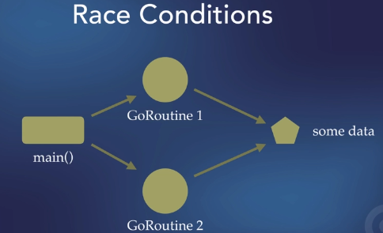

A golder rule for concurrency: If you don't need it, don't use it.

Keep your application's complexity to an absolute minimum; it's easier to write, easier to understand, and eaiser to maintain.

GO's philosophy: Don't communicate by sharing memory, share memory by communicating.

Go Extensions (for vs code):

- Go (official one)

Now For Go environment:
Shift + ctrl + p (linux)
Go: install/Update tool (it will show you all items should install for go lang)

- GO template syntax

### Installing Make (build tool)

Install it.

## Go Routines

Running things in the background, or concurrently
simple to use
It's create problems . Several ways to solve those problems.

```go
package main

import "fmt"

func main(){
	fmt.Println("Hello")
}
```

The main function itself is a go routine.

They run on lightweight threads , not a builtin hardware threads of processor. it handle by the go, they take very little memory , they run very quickly , and they're all managed as group of go routines is called go routines.

They all managed by go schedulers.

```go
package main

import "fmt"

func printSomething(s string){
	fmt.Println(s)
}

func main(){
	// fmt.Println("Hello")
	printSomething("Print this 0")
	printSomething("Print this 1")
	printSomething("Print this 2")


}

```

The code give up. It's run synchronously.

```go
package main

import "fmt"

func printSomething(s string){
	fmt.Println(s)
}

func main(){
	// fmt.Println("Hello")
	go printSomething("Print this 0")
	printSomething("Print this 1")
	printSomething("Print this 2")


}

```

Now if we run this(top). you can see first that I prefixed as `go` will not printed in console.

What happen there. This programme executed so quickly . so that it will not wait for this go routine.

How can I handle this. use sleep (worst solution)

```go
package main

import "fmt"

func printSomething(s string){
	fmt.Println(s)
}

func main(){
	// fmt.Println("Hello")
	go printSomething("Print this 0")
    time.Sleep(1 * time.Second)
	printSomething("Print this 1")
	printSomething("Print this 2")


}

```

So, what's the best solution.
Use wait group.

```go
package main

import (
	"fmt"
	"sync"
)

func printSomething(s string, wg *sync.WaitGroup){
	defer wg.Done() // this will decrement
	fmt.Println(s)
}

func main(){
	// fmt.Println("Hello")
	var wg sync.WaitGroup

	// first we have to add one entry to wait group
	// this is an int. one entry for every thing
	// you have to wait for


	words:= []string{
		"alpha",
		"beta",
		"gamma",
		"peta",
		"hexa",
	}

	wg.Add(5) // why 5 ? bcz words have 5 elements we need to wait for (print)

	for i, x := range words{
		go printSomething(fmt.Sprintf("%d: %s\n",i,x),&wg)
	}

	wg.Wait() // this wait the wait value is set to zero

	wg.Add(1) // if i did not add this the code below will be caused as error
	// the error is : sync: negative WaitGroup counter. so why I write this. wait group is easy to use. be be careful is will not go to the below zero.


	printSomething("this is the second thing to be printed ",&wg)

	// another things is you have no gaurantee which order will print . it's decide by the go.
}

```

Le'ts say you add wait value bigger than You should wait. there will occur deadlock error. so be careful.

### Writing Tests with wait groups

```go
package main

import (
	"io"
	"os"
	"strings"
	"sync"
	"testing"
)

func Test_printSomething(t *testing.T){
	stdOut := os.Stdout

	r, w, _ := os.Pipe()

	os.Stdout  = w
	var wg sync.WaitGroup
	wg.Add(1)

	go printSomething("epsilon", &wg)
	wg.Wait()

	_ = w.Close()

	res, _ := io.ReadAll(r)
	output := string(res)
	os.Stdout = stdOut

	if ! strings.Contains(output,"epsilon"){
		t.Error("expected to find epsilon, bit it's not there")
	}
}

```

## Racing Conditions, Mutexes , and Channels

`sync.Mutex` -> allows us to deal with race conditions.
it's easy to use.
Deal with shared reasources and concurrent/ parallel goroutines.
lock/ unlock
We can test for race conditions when running code, or testing it.

Race conditions occur when multiple GoRoutines try to access the same data.
Can be difficult to spot when reading code.
Go allows us to check for them when running a program , or when testing our code with go test.

### Channels

channels are means of having GoRoutines share data. They can talk to each other . This is go's philosopy of having things share memory be communicating, rather than communicating by sharing memory.

The Producer/Consumer Problem. ( we will solve this using channels)



Creating Race Condition scenerio:

```go
package main

import (
	"fmt"
	"sync"
)

var msg string
var wg sync.WaitGroup

func updateMessage(s string, wg *sync.WaitGroup){
	defer wg.Done() // this will decrement
	msg = s
}

func main(){
	msg = "hello world"
	wg.Add(2)

	go updateMessage("Hello, uni", &wg)
	go updateMessage("Hello, vercel", &wg)

	wg.Wait()
	// here we can't expect which one will print. line 20 and 21. bcz it's decide
	// by the go.

	// if we run go run -race .
	// it will show an Warning "Data Race". Data race takes place when you have
	// concurrent go routines that access the same piece of data (here msg var).
	// bcz we never sure which one is going to finish first.
	// how do we fix this.
	// we can do that by using Mutex (Mutual  Exclusivity)


	fmt.Println(msg)
}

```

### Now we will fix this:

```go
package main

import (
	"fmt"
	"sync"
)

var msg string
var wg sync.WaitGroup

func updateMessage(s string, mutex *sync.Mutex){
	defer wg.Done()

	mutex.Lock() // now we have exclusive access to this var.
	// nobody else can not change that value. until it's done with it (mutex.Unlock)
	msg = s
	mutex.Unlock()
	// these means I am accessing data safely. this is called thread safe operation
}

func main(){
	msg = "hello world"
	var mutex sync.Mutex

	wg.Add(2)

	go updateMessage("Hello, uni", &mutex)
	go updateMessage("Hello, vercel", &mutex)

	wg.Wait()
	fmt.Println(msg)
}

```

### More complex race conditions.

```go
package main

import (
	"fmt"
	"sync"
)


var wg sync.WaitGroup

type Income struct{
	Source string
	Amount int
}


func main(){
	// var for bank balance
	var bankBalance int
	var balance sync.Mutex

	// print out starting values
	fmt.Println("Initial Balance: ", bankBalance)

	// define weekly revenue
	incomes := []Income{
		{
			Source: "Main Job",
			Amount: 100,
		},
		{
			Source: "Gift",
			Amount: 10,
		},
		{
			Source: "Part time Job",
			Amount: 50,
		},
		{
			Source: "Investments",
			Amount: 70,
		},
	}

	wg.Add(len(incomes))

	// loop through 52 weeks and print out how much is made; keep a running total
	for i , income := range incomes{
		go func(i int, income Income){
			defer wg.Done()
			for week := 1 ; week <= 52 ; week++{
				balance.Lock()
				temp := bankBalance
				temp += income.Amount
				bankBalance = temp
				balance.Unlock()
				fmt.Printf("One week %d, you earned %d from %s\n", week,income.Amount, income.Source)
			}
		}(i,income)
	}

	wg.Wait()

	// print out final balance
	fmt.Printf("Final Bank balance %d\n",bankBalance)
}
```

If we run this `go run -race .` then we will not show the warning. we solved the race problem. bcz of lock and unlock.

### Now test this code:

```go
package main

import (
	"io"
	"os"
	"strings"
	"testing"
)

func Test_main(t *testing.T){
   stdOut := os.Stdout
   r, w, _ := os.Pipe()

   os.Stdout = w

   main()

   _ = w.Close()

   res , _ := io.ReadAll(r)
   output := string(res)

   os.Stdout = stdOut

    if !strings.Contains(output, "11960"){
		t.Error("Wrong balance returned")
	}
}
```

### Producer / Consumer problem solve

First read the doc what is it.

```go
package main

import (
	"fmt"
	"math/rand"
	"time"

	"github.com/fatih/color"
)

const NumberOfPizzas = 10

var pizzasMade, pizzasFailed, total int

type PizzaOrder struct {
	pizzaNumber int
	message     string
	success     bool
}

type Producer struct {
	// channel is more powerful than mutex and wait groups. bcz they allow one go routine to exchange data with another go routine. they can talk to each other.
	data chan PizzaOrder
	quit chan chan error // bcz `func (p *Producer) Close() error {`
}

func (p *Producer) Close() error {
	ch := make(chan error)
	p.quit <- ch
	return <-ch
}

func makePizza(pizzaNumber int) *PizzaOrder {
	pizzaNumber++
	if pizzaNumber <= NumberOfPizzas {
		delay := rand.Intn(5) + 1
		fmt.Println("Received an order number: ", pizzaNumber)

		rnd := rand.Intn(12) + 1
		msg := ""
		success := false

		if rnd < 5 {
			pizzasFailed++
		} else {
			pizzasMade++
		}
		total++
		fmt.Printf("Making pizza %d. It will take %d seconds..\n", pizzaNumber, delay)
		time.Sleep(time.Duration(delay) * time.Second)

		if rnd <= 2 {
			msg = fmt.Sprintf("We run out of ingredients for pizza: %d\n", pizzaNumber)
		} else if rnd <= 4 {
			msg = fmt.Sprintf("the cook quite after making pizza: %d\n", pizzaNumber)
		} else {
			msg = fmt.Sprintf("Pizza order %d is ready %d\n", pizzaNumber, rnd)
			success = true
		}
		p := PizzaOrder{
			pizzaNumber: pizzaNumber,
			message:     msg,
			success:     success,
		}
		return &p
	}

	return &PizzaOrder{
		pizzaNumber: pizzaNumber,
	}
}

func pizzaria(pizzaMaker *Producer) {
	// keep track of which pizz we are making
	i := 0
	// run forever or until we receive a quite notification

	// try to make pizzas
	for {
		// try to make a pizza
		currentPizza := makePizza(i)
		// decision
		if currentPizza != nil {
			i = currentPizza.pizzaNumber
			select { //select is only useful for channels. similiar to switch statement.
			case pizzaMaker.data <- *currentPizza:

			case quitChan := <-pizzaMaker.quit:
				// close channels
				close(pizzaMaker.data)
				close(quitChan)
				return
			}
		}

	}
}

func main() {
	// seed the random number generator
	rand.Seed(time.Now().UnixNano())

	// print out a message
	color.Cyan("The Pizzaria is open for business.")
	color.Cyan("------------------------------------")

	// create a producer
	pizzaJob := &Producer{
		data: make(chan PizzaOrder),
		quit: make(chan chan error),
	}

	// run the producer in the background (own go routine)
	go pizzaria(pizzaJob)
	//once you create a channel when you finish with it the golder rule is
	// you must close it

	// create and run consumer
	for i := range pizzaJob.data {
		if i.pizzaNumber <= NumberOfPizzas {
			if i.success {
				color.Green(i.message)
				color.Green("Order #%d is out of delivery\n", i.pizzaNumber)
			} else {
				color.Red(i.message)
				color.Red("The customer is really mad")
			}
		} else {
			color.Cyan("Done making pizzas.(Out of service)")
			err := pizzaJob.Close()
			if err != nil {
				color.Red("Error Closing channle: ", err)
			}
		}
	}

	// print out the ending message
	color.Cyan("Done for the day")
	color.Cyan("We made %d pizzas, but failed to make %d, with %d attempts in total.", pizzasMade, pizzasFailed, total)
	switch {
	case pizzasFailed > 9:
		color.Red("It was an awful day")
	case pizzasFailed >= 6:
		color.Red("It was not a very good day")
	case pizzasFailed >= 4:
		color.Yellow("It was an okey day")
	case pizzasFailed >= 2:
		color.Yellow("It was a pretty good day")
	default:
		color.Green("It was a great day.")
	}
}

```

### The Dining Philosopher Problem.

```go
package main

import (
	"fmt"
	"sync"
	"time"
)

// Philosopher is a struct which stores informatin about a philosopher
type Philosopher struct {
	name      string
	rightFork int
	leftFork  int
}

// list of all philosophers
var philosophers = []Philosopher{
	{
		name:      "Plato",
		leftFork:  4,
		rightFork: 0,
	},
	{
		name:      "Socrates",
		leftFork:  0,
		rightFork: 1,
	},
	{
		name:      "Aristotle",
		leftFork:  1,
		rightFork: 2,
	},
	{
		name:      "Pascal",
		leftFork:  2,
		rightFork: 3,
	},
	{
		name:      "Locke",
		leftFork:  3,
		rightFork: 4,
	},
}

// define vars
var hunger = 3 //how many times does a person eat?
var eatTime = 1 * time.Second
var thinkTime = 3 * time.Second

// var sleepTime = 1 * time.Second

func main() {
	// print welcome message
	fmt.Println("Dining Philosophers PRoblem")
	fmt.Println("----------------------------")
	fmt.Println("The table is empty.")
	//start the meal
	dine()

	// print out finnished message
	fmt.Println("The table is empty")

}

func dine() {
	eatTime = 0 * time.Second
	// sleepTime = 0 * time.Second
	thinkTime = 0 * time.Second
	wg := &sync.WaitGroup{}
	wg.Add(len(philosophers))

	seated := &sync.WaitGroup{}
	seated.Add(len(philosophers))

	// forks is a map of all 5 forks
	var forks = make(map[int]*sync.Mutex)

	for i := 0; i < len(philosophers); i++ {
		forks[i] = &sync.Mutex{}
	}

	// start the meal
	for i := 0; i < len(philosophers); i++ {
		// fire off a goroutine for the current philosopher
		go diningProblem(philosophers[i], wg, forks, seated)
	}
	wg.Wait() // wait untill all go routines acutally done
}

func diningProblem(philosopher Philosopher, wg *sync.WaitGroup, forks map[int]*sync.Mutex, seated *sync.WaitGroup) {
	defer wg.Done()
	// seat the philosopher at the table
	fmt.Printf("%s is seated at the table.\n", philosopher.name)
	seated.Done()
	seated.Wait()

	// eat three times
	for i := hunger; i > 0; i-- {
		// going check forks is free.
		// get a lock on both forks.
		// we can see logical data race. but this does not detect by -race argument.
		if philosopher.leftFork > philosopher.rightFork {
			forks[philosopher.rightFork].Lock()
			fmt.Printf("%s takes the right fork\n", philosopher.name)
			forks[philosopher.leftFork].Lock()
			fmt.Printf("%s takes the left fork\n", philosopher.name)
		} else {
			forks[philosopher.leftFork].Lock()
			fmt.Printf("%s takes the left fork\n", philosopher.name)
			forks[philosopher.rightFork].Lock()
			fmt.Printf("%s takes the right fork\n", philosopher.name)
		}

		fmt.Printf("%s has both forks and he is eating\n", philosopher.name)
		time.Sleep(eatTime)

		fmt.Printf("%s is thinking\n", philosopher.name)
		time.Sleep(thinkTime)

		forks[philosopher.rightFork].Unlock()
		forks[philosopher.leftFork].Unlock()

		fmt.Printf("\t%s put down the forks.\n", philosopher.name)

	}

	fmt.Println(philosopher.name, "is satisfied.")
	fmt.Println(philosopher.name, "left the table.")
}

```

### Channels:
- Means of allowing communication to and from a GoRoutine
- Channels can be buffered, or unbuffered
- Once you're done with a channel, you must close it ( otherwise we will face resource leake)
- Channels typically only accept a given type or interface.

#### Buffered/UnBuffered channel 
```go
package main

import (
	"fmt"
	"time"
)

func listenToChannel(ch chan int) {
	for {
		i := <-ch
		fmt.Println("Got: ", i)
		time.Sleep(1 * time.Second)
	}
	// simulate a lot of work
}
func main() {
	// ch := make(chan int) // unbuffered channel
	ch := make(chan int, 10) //buffered channel (learn more from google)
	go listenToChannel(ch)
	for i := 0; i <= 100; i++ {
		fmt.Println("sending", i, " to the channel..")
		ch <- i
		fmt.Println("sent ", i, " to channel")
	}
}
```

# The Sleeping Barber Problem solve using go Channel
```go
package main

import (
	"fmt"
	"math/rand"
	"time"

	"github.com/fatih/color"
)

// variables
var seatingCapacity = 10
var arrivalRate = 100
var cutDuration = 1000 * time.Millisecond
var timeOpen = 10 * time.Second

type BarberShop struct {
	ShopCapacity    int
	HairCutDuration time.Duration
	NumberOfBarbers int
	BarbersDoneChan chan bool
	ClientsChan     chan string
	Open            bool
}

func (shop *BarberShop) addBarber(barber string) {
	shop.NumberOfBarbers++
	go func() {
		isSleeping := false
		color.Yellow("%s goes to the waiting room to check for clients. ", barber)
		for {
			// if there are no clients, the barber goes to sleep
			if len(shop.ClientsChan) == 0 {
				color.Yellow("There is nothing to do, so %s takes a nap.", barber)
				isSleeping = true
			}
			client, shopOpen := <-shop.ClientsChan

			if shopOpen {
				if isSleeping {
					color.Yellow("%s wakes %s up.", client, barber)
					isSleeping = false
				}
				// cut hair
				shop.cutHair(barber, client)
			} else {
				// shop is closed, so send the barber home and close the goroutine
				shop.sendBarberHome(barber)
				return
			}
		}
	}()
}

func (shop *BarberShop) cutHair(barber, client string) {
	color.Green("%s is cutting %s's hair.", barber, client)
	time.Sleep(shop.HairCutDuration)
	color.Green("%s is finished cutting %s's hair.", barber, client)
}

func (shop *BarberShop) sendBarberHome(barber string) {
	color.Cyan("%s is going home", barber)
	shop.BarbersDoneChan <- true
}

func (shop *BarberShop) closeSHopForDay() {
	color.Cyan("Closing shop for the day.")
	close(shop.ClientsChan)
	shop.Open = false

	// wait for all the barbers done
	for a := 1; a <= shop.NumberOfBarbers; a++ {
		<-shop.BarbersDoneChan
	}
	close(shop.BarbersDoneChan)
	color.Green("---- The barber shop is now closed for the day ----")
}

func (shop *BarberShop) addClient(client string) {
	//print out message

	color.Green("%s client arrives!", client)
	if shop.Open {
		select {
		case shop.ClientsChan <- client:
			color.Yellow("%s takes a seat in the waiting room.", client)
		default:
			color.Red("The waiting room is full, so %s client leaves.", client)
		}
	} else {
		color.Red("The shop is already closed %s client leaves.", client)
	}
}

func main() {
	// seed our random number generator
	rand.Seed(time.Now().UnixNano())

	// print welcome message
	color.Yellow("The sleeping barber problem")
	color.Yellow("---------------------------")

	// create channels if we need any
	clientChan := make(chan string, seatingCapacity)
	doneChannel := make(chan bool)

	// create the barbershop
	shop := BarberShop{
		ShopCapacity:    seatingCapacity,
		HairCutDuration: cutDuration,
		NumberOfBarbers: 0,
		ClientsChan:     clientChan,
		BarbersDoneChan: doneChannel,
		Open:            true,
	}

	color.Green("The shop is open for the day.")

	// add barbers
	shop.addBarber("Frank")
	// start the barbershop
	shopClosing := make(chan bool)
	closed := make(chan bool)

	go func() {
		<-time.After(timeOpen)
		shopClosing <- true
		shop.closeSHopForDay()
		closed <- true
	}()

	// add clients
	i := 1
	go func() {
		for {
			// get a random number with avg arrival rate
			randomMilSec := rand.Int() % (2 * arrivalRate)
			select {
			case <-shopClosing:
				return
			case <-time.After(time.Microsecond * time.Duration(randomMilSec)):
				shop.addClient(fmt.Sprintf("Cleint #%d", i))
				i++
			}
		}
	}()

	// block until the bargershop is closed
	<-closed
	time.Sleep(time.Second * 5)
}

```