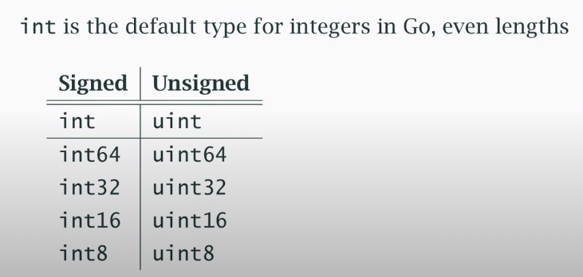
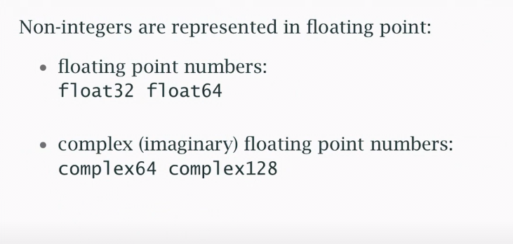
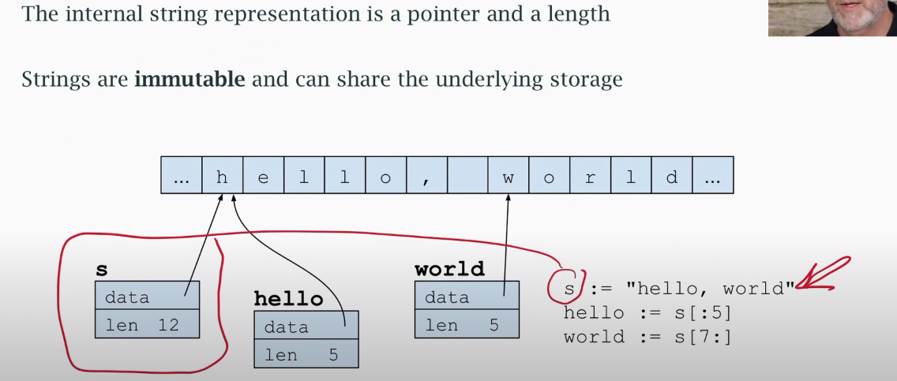
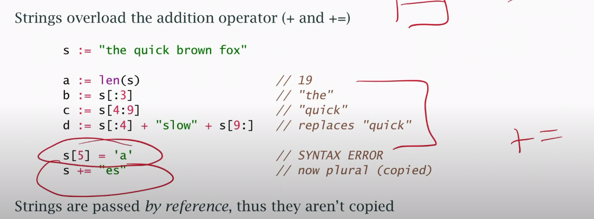

## Go Reserve Keywords




declaring a variable
-

 * var a int
 * var (b =2 
        f = 2.01
    )   
 * c := 2

 reuse the parameter:
 -
 ```go
    fmt.Printf("a:%8T %v \t b:%T %v \n", a, a, b, b) // 4T , 8T , ... tab space
	fmt.Printf("a:%T %[1]v \t b:%T %[2]v \n", a, b)
 ```


type casting 
-

```go
    a = int(b) //(float -> int )
    b = float64(a) // int -> float
```

special types:
-

```go
    bool
    // bool (boolean) has two values -> true , false
    // these values are not convertible to/from ingeters
```
```go
    error
    // a special type with one function, Error()
    // an error maybe nil or non-nil
```
```go
    pointers
    // this are physically addresses, logically opaque 
    // a pointer may be nil or non-nil
    // no pointer manipulation except through package 'unsafe'
```

what is " logically opaque " ?
-
- When something is said to be "logically opaque," it means that you can't understand or interact with its internal structure or data directly. Instead, you're expected to interact with it through well-defined interfaces or functions provided by the language or a specific package.

For example, in the snippet you provided, it mentions that these addresses are "logically opaque," which implies that you can't directly read or write to them as you would with regular memory addresses. Instead, you would only interact with them through specific functions or methods, possibly provided by the 'unsafe' package in Go, which allows for low-level manipulation of memory, but should be used with caution due to its potential for introducing bugs or security vulnerabilities.

initialization : 
-
- Go initializes all variables to "zero" by default if you don't.
- `bool` gets `false`
- `string` gets `""`
- everything else gets `nil`
    - pointers
    - slices
    - maps
    - channels
    - functions (function variables)
    - interfaces
- for aggregates types, all members get their "zero" values

constants
-
only numbers, strings, and booleans can be constants (immutable) `info-1`
```go
    const (
        a = 1
        b = 2 *10
        c = b << 3

        g unit8 = 0x07
        h unit = g & 0x03

        s = "a string"
        t = len(s)
        u = s[2:] // this will show error bcz see `info-1`
    )
```

error handeling
-
```go
    if _, err := fn_call ; err!=nil{
        // some code here
    }
```

take input from file
-
- `go run index.go < nums.txt`
- `cat nums.txt | go run index.go`


Strings
-

string and <b>immutable</b> sequence of "characters"
    - phycally a sequence of bytes (UTF-8 encoding)
    - logically a sequence of (unicode) runes

what is runes?
- a "rune" is a data type used to represent a single Unicode character. It's essentially an alias for the int32 type. 
- <b>Why Use Runes</b>: Using runes allows Go programmers to work with individual characters in Unicode strings accurately. Since Go strings are UTF-8 encoded byte sequences, a single character may occupy multiple bytes. Runes abstract away this complexity by representing each character as a single entity, regardless of its byte representation.
- <b>Rune Literals</b>: You can declare a rune using a single character enclosed in single quotes (''). For example, var r rune = 'a' assigns the Unicode code point for the lowercase letter 'a' to the r variable. Alternatively, you can represent runes using their Unicode code point in hexadecimal notation. For example, var r2 rune = '\u2318' assigns the code point for the command symbol (⌘) to the r2 variable.
- example:
```go
func main() {
    str := "Hello, 世界" // Contains English and Chinese characters

    // rune typecast
    ts := []run(str)

    // Iterate over runes in the string
    for _, r := range str {
        fmt.Printf("%c ", r) // Print each rune
    }
}
```

note: the len of a string is the number of byte required the represent the unicode character not the number unicode characters.

String structure:




string functions: there are lot of string function . see the doc 


- string:  |a|r|e|a|
- [4]int : |1|12|4|8|
- []int : |1|13|.... .... |17|
- map

| key | value|
|--|--|
| "to" | 1|
|"from"| 12|
|"into" | 3|


```go
    defer func() {
            log.Printf("defer calls last")
    }()
```


