## What is Helm
Helm simplifies managing applications on Kubernetes by treating them as packages rather than a collection of individual objects. Kubernetes efficiently manages complex infrastructures, but the intricacy of deploying applications can be overwhelming. For instance, even a simple app like WordPress involves multiple objects (deployments, persistent volumes, services, secrets, etc.), each needing separate YAML files and manual configuration, making updates and maintenance tedious and error-prone.

Helm, known as a package manager for Kubernetes, addresses these challenges by grouping related objects into packages. Instead of managing each YAML file individually, Helm allows for a single command to install, upgrade, or uninstall an entire application package. It uses a centralized configuration file (values.yaml) for custom settings, streamlining changes and updates. Helm also tracks changes, enabling easy rollbacks to previous versions, and keeps track of all objects related to an app, simplifying uninstallation.

In essence, Helm reduces the complexity and micromanagement of Kubernetes objects, making application deployment and management more efficient and less error-prone.


## installing helm

required:
    * k8s cluster
    * kubectl

follow the link: [Helm Install](https://helm.sh/docs/intro/install/)


### Helm has snapshot features (Revision)
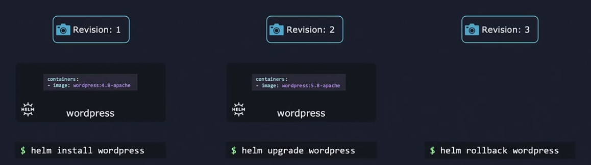

first install (revision number 1)
then upgrade command after updating value (rivision number 2)
then downgrade (go to revision number 1)

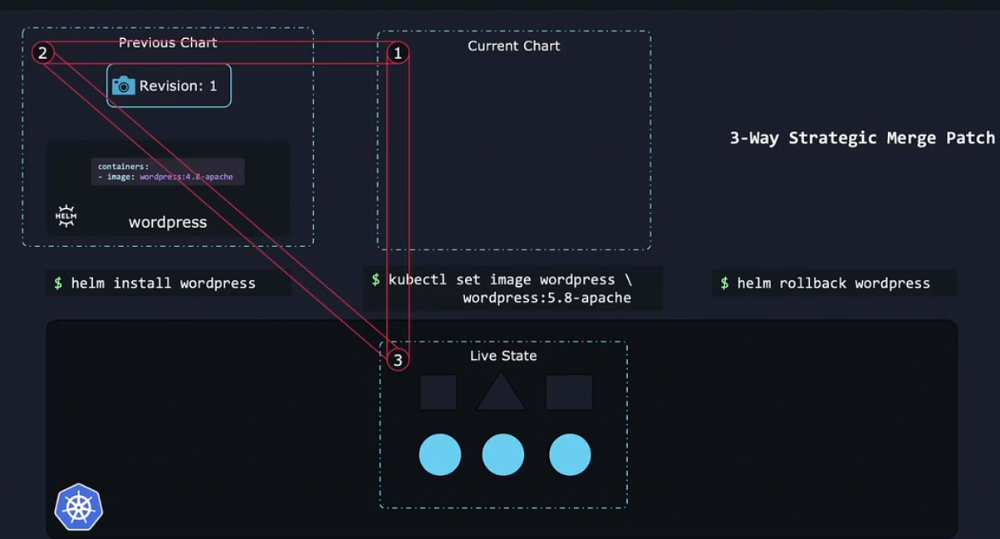

In Helm 3, we now use a three-way strategic merge patch. Helm considers the old manifest, its live state, and the new manifest when generating a patch.

Examples
Let’s go through a few common examples what this change impacts.

Rolling back where live state has changed
Your team just deployed their application to production on Kubernetes using Helm. The chart contains a Deployment object where the number of replicas is set to three:

$ helm install myapp ./myapp
A new developer joins the team. On their first day while observing the production cluster, a horrible coffee-spilling-on-the-keyboard accident happens and they kubectl scale the production deployment from three replicas down to zero.

$ kubectl scale --replicas=0 deployment/myapp
Another developer on your team notices that the production site is down and decides to rollback the release to its previous state:

$ helm rollback myapp
What happens?

In Helm 2, it would generate a patch, comparing the old manifest against the new manifest. Because this is a rollback, it’s the same manifest. Helm would determine that there is nothing to change because there is no difference between the old manifest and the new manifest. The replica count continues to stay at zero. Panic ensues.

In Helm 3, the patch is generated using the old manifest, the live state, and the new manifest. Helm recognizes that the old state was at three, the live state is at zero and the new manifest wishes to change it back to three, so it generates a patch to change the state back to three.

Upgrades where live state has changed
Many service meshes and other controller-based applications inject data into Kubernetes objects. This can be something like a sidecar, labels, or other information. Previously if you had the given manifest rendered from a Chart:

containers:
```yaml
- name: server
  image: nginx:2.0.0
```
And the live state was modified by another application to

containers:
```yaml
- name: server
  image: nginx:2.0.0
- name: my-injected-sidecar
  image: my-cool-mesh:1.0.0
```
Now, you want to upgrade the nginx image tag to 2.1.0. So, you upgrade to a chart with the given manifest:

containers:
```yaml
- name: server
  image: nginx:2.1.0
```
What happens?

In Helm 2, Helm generates a patch of the containers object between the old manifest and the new manifest. The cluster’s live state is not considered during the patch generation.

The cluster’s live state is modified to look like the following:

containers:
```yaml
- name: server
  image: nginx:2.1.0
```
The sidecar pod is removed from live state. More panic ensues.

In Helm 3, Helm generates a patch of the containers object between the old manifest, the live state, and the new manifest. It notices that the new manifest changes the image tag to 2.1.0, but live state contains a sidecar container.

The cluster’s live state is modified to look like the following:

containers:
```yaml
- name: server
  image: nginx:2.1.0
- name: my-injected-sidecar
  image: my-cool-mesh:1.0.0
```

## Helm Components

### helm cli (helm command line utility)
we use helm cli to perform actions like : installing chart ,  upgrading , rollback etc.

### chart :
Charts are collection of files , they contain all the instructions that helm needs to know to be able to create the  collection of objects that you need in your k8s cluster. 

by using charts and adding the objects according to the specific instructions in the charts, Helm in a way install applications into your cluster

### Release:
when a chart apply to your cluster , a release is created 

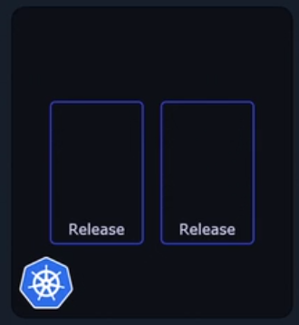

A release is a single installation of an application using a Helm chart.

### Revisions:
within each release you can have multiple revisions.

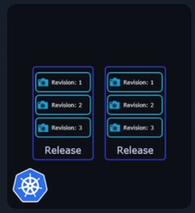

Each revision is like a snapshot of the application. Every time a change is made to the application such as an upgrade of the image or change replicas or configuration objects a new  revision is created.

### Helm repo:
Just like how we can find all kind of images in docker hub. We can find helm charts in a public repository . we can Easily download publicly avaiable charts for various applications , these are readily avialble , and we can use them to deploy applications on our cluster. 

### Metadata
To keep track of what it did in our cluster ,such as releases that it installed, the charts used , revision state and so on helm will need a place to save this data . This deta is known as metadata. That is data about data.
It wouldn't too useful if Helm would save this on our local computer . If another person would need to work with our releases through helm , they would need of copy of this data , instead Helm does the smart thing and saves the metadata directly in our k8s cluster as k8s secrets. 

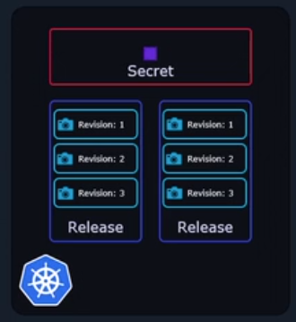

This way the data survives and as long as the kubernetes cluster survives. everyone from our team can access it .
Helm will always know about everything you did in the cluster and will be able keep track of every action every step of the way since it always has it's metadata available.


Thousand of charts are readily available at diffrent Helm repositories . there are diffrent providers who are hosting Helm repo . ex: 
- Appscode
- Community operators
- Trues charts
- Bitnami, etc

you don't have to go each of this repo to search for charts. all of these repo have listed their charts in a single location known as the 
<a> Artifacthub.io </a>

This is helm hub or artifact hub


## Let's talk about Helm chart a little bit lower level

Helm charts technically not programms. They can act like programms

Helm is rather an easy to use command line tool. you just tell it to install this, uninstall that, upgrade something , rollback to a previous state and so on.
and it proceed to do all the heavier lifting behind the scenes. 
It's basically an automation tool where we the human operators specify desired end result, the destination and then it doesn't matter if 5, 10, 20 or 50 actions are necessary to achive that end result to get that destination. 
Helm will go througn all the required steps without bothering  us with the details. Since in the command line, we don't give this tool. a lot of info,  except , "hey , I want this installed" . 
#### How does it know how to achive this goal?

Helm knows how to do it's job with the help of what are called  "Charts" 
Charts are like an instruction manual for it.  By reading and interpreting their contents, it then knows exactly what it has to do to fulfill a user's request.

```yaml
apiVersion: apps/v1
kind: Deployment
metadata:
  name: {{ include "my-deployment.fullname" . }}
  labels:
    app: {{ include "my-deployment.name" . }}
spec:
  replicas: {{ .Values.replicaCount }}
  selector:
    matchLabels:
      app: {{ include "my-deployment.name" . }}
  template:
    metadata:
      labels:
        app: {{ include "my-deployment.name" . }}
    spec:
      containers:
        - name: {{ .Chart.Name }}
          image: "{{ .Values.image.repository }}:{{ .Values.image.tag }}"
          imagePullPolicy: {{ .Values.image.pullPolicy }}

```

```yaml
#Values of the deployment
replicaCount: 1
image:
  repository: nginx
  tag: stable
  pullPolicy: IfNotPresent

```

you can see uncommon things like
`{{ .Chart.Name }}` , `{{ .Values.replicaCount }}` etc is called templating.


every chart uas `Chart.yaml` file. it contains info about the chart itself such as the Chart version, V1(Helm 2) , V2(Helm 3), App version which is used to specify the version of the application.  then we have the name of the chart , a description , type of chart etc.

```yaml 
    apiVersion: v2
    appVersion: 4.2.0 # version of the application inside helm
    name: my-deployment  # name of the chart 
    description: A Helm chart for a simple Kubernetes deployment
    version: 0.1.0 # version of chart itself this is independent version of the app that this chart will deploy. This helps in tracking changes to the chart itself. 
    types: application(default) # another one is library
    # library is the type of chart that provides utilities that help in building charts.
    dependencies:
        - condition: mariadb.enabled
          name: mariadb
          repo: http:/ssdf/sdf/s
          version: 9.xx
    # dependencies : before this this mariadb has it's own helm chart. it need install first. in this way we can add dependencies

    keyword: # this will help to search the chart
        - application
        - blog
    
    home : link
    icon : link

```

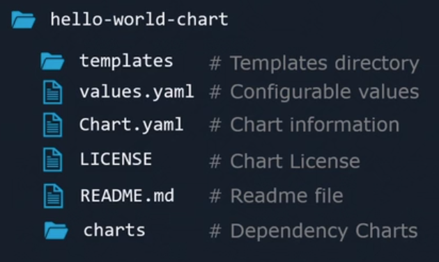


```shell
    helm --help  # helm something --help
    helm install release-name reponame/application
    helm search chart-name # search chart in cli
    helm search hub wordpress chart-name
    helm sdearch repo wordpress
    # deploy app 
    # first - add the repo
    helm repo add repo-name repo-link
    helm install repo-name/chart-name
    helm list #  Helm releases
    helm uninstall release-name # it will remove all the k8s object
    helm repo update # update the chart with respect to the repo

    helm pull bitnami/wordpress  # pull the chart in an compressed form
    helm pull --untar bitnami/wordpress # pull chart as file
    #then
    helm install release-name ./dir-name-of-chart
    helm upgrade nmy-release bitnami/nginx
    helm history release-name # see history of this release
    helm rollback release-name 1(release number)
    # it does not go to the prev revision. instead it's copy the prev revision and create a new revision
```

### Customizing chart parameters

when we install chart we install everything with it's default value.  we may not let do this all the time. Sometime we need customize the value. 

```shell
 helm install \
 --set abc="this is" \ # we can customize value by using  --set paramter for values.yaml file
 --set test="awes"
 --values custom-values.yaml # to pass bunch of valus in yaml file
 my-release \
 bitnami/wordpress 
```


## Writing a Helm chart

generate boilerplate of chart
- `helm create chart-name`
a dicreatory with some file created

```
chart-name/
├── Chart.yaml
├── values.yaml
├── charts/
├── templates/
│   ├── .helmignore
│   ├── _helpers.tpl
│   ├── NOTES.txt
│   ├── deployment.yaml
│   ├── service.yaml
│   ├── hpa.yaml
│   ├── ingress.yaml
│   └── tests/
│       └── test-connection.yaml
└── .helmignore
```

### helm buildin obj. 
Built in obj Uses Capital letter `Release.Name`, Here Name `N` is uppercase

user defined will be lowercase this is convention.
`Values.replicas` , `r` is lower

template directive for templatize

`.Values.images.repository`
- `.` -> root directive
- `Values` -> file name (values.yaml)
- `image` -> dictionary within values.yaml
- `repository` -> name of the repo inside values.yaml

be careful on indentation . here values.yaml file will be (give top).
```yaml 
    image:
        repository: this is repo
```

## Release
The `Release` object contains information about the current Helm release.
- `Release.Name`: The name of the release.
- `Release.Namespace`: The namespace to be used for the release.
- `Release.IsInstall`: True if the current operation is an install.
- `Release.IsUpgrade`: True if the current operation is an upgrade.
- `Release.Revision`: The revision number for this release.
- `Release.Service`: The service that created the release, usually `Helm`.

## Chart
The `Chart` object contains information about the chart being deployed.
- `Chart.Name`: The name of the chart.
- `Chart.Version`: The version of the chart.
- `Chart.AppVersion`: The version of the app contained in the chart.
- `Chart.Description`: The description of the chart.
- `Chart.Keywords`: The list of keywords associated with the chart.
- `Chart.Home`: The URL of the home page of the chart.
- `Chart.Sources`: The list of source URLs for the chart.
- `Chart.Maintainers`: The list of maintainers for the chart.

## Values
The `Values` object contains the values passed into the chart. These can be the default values defined in `values.yaml` or values provided by the user.
- `Values.<key>`: Accesses a value defined in the `values.yaml` file or provided by the user.

## Capabilities
The `Capabilities` object contains information about the Kubernetes capabilities available in the cluster.
- `Capabilities.APIVersions.Has`: Checks if a particular API version is available.
- `Capabilities.KubeVersion.Version`: The Kubernetes version.
- `Capabilities.KubeVersion.Major`: The Kubernetes major version.
- `Capabilities.KubeVersion.Minor`: The Kubernetes minor version.

## Files
The `Files` object allows you to access files in the chart.
- `Files.Get`: Returns the contents of a file as a string.
- `Files.GetBytes`: Returns the contents of a file as a byte array.
- `Files.Glob`: Returns a list of files that match a glob pattern.
- `Files.Lines`: Returns each line of a file as a list.
- `Files.AsSecrets`: Returns files as a map suitable for secrets.
- `Files.AsConfig`: Returns files as a map suitable for config maps.

## Templateing
The `Template` object contains information about the template being rendered.
- `Template.Name`: The name of the template.
- `Template.BasePath`: The base path of the template.

### Example:
```yaml
apiVersion: apps/v1
kind: Deployment
metadata:
  name: {{ .Release.Name }}-{{ .Chart.Name }}
  labels:
    app: {{ .Chart.Name }}
    chart: {{ .Chart.Name }}-{{ .Chart.Version }}
    release: {{ .Release.Name }}
    heritage: {{ .Release.Service }}
spec:
  replicas: {{ .Values.replicaCount }}
  selector:
    matchLabels:
      app: {{ .Chart.Name }}
      release: {{ .Release.Name }}
  template:
    metadata:
      labels:
        app: {{ .Chart.Name }}
        release: {{ .Release.Name }}
    spec:
      containers:
      - name: {{ .Chart.Name }}
        image: "{{ .Values.image.repository }}:{{ .Values.image.tag }}"
        ports:
        - name: http
          containerPort: {{ .Values.service.port }}
        env:
        - name: NODE_ENV
          value: {{ .Values.env.NODE_ENV }}
```

## Verify Helm charts before installing

### Linting
Linting helps us verify that the chart and the YAML format is correct

### Verify the Template
Verifying the template helps us make sure that templating part is working as expected

### Dry Run
It's helps us make sure that the charts works well with Kubernetes itself. 
( using dry we can verify it's working on k8s without deploying it )

#### how do we make sure that our chart is built correctly without any formatting errors or wrong values?
-> By using 

```shell
helm lint ./chart-dir
````

this will identify all the errors

<i> Best practice is add icon in `Chart.yaml` file</i>

#### helm teplate command renders a chart teplate locally and displays the output. you can verify the values are sitting as you exptected

if there was a error in one of the template files  for example it was malformed and there is an indentation error in one of the files the template command will fail with an error. 
```sh
helm template ./chart-dir
helm template release-name ./chart-dir #this will show the release name while displaying the output
helm template ./chart-dir --debug # error with file show(the file that has error)
```

#### Now still we might facing some error. some error only known by kubernetes.
ex:
```yaml
    spec:
        container: # it must be `containers` this error only can detec by k8s
            - name: hello-world
              image: {{.Values.image}}
```
To check this error we will  use `--dry-run`
```sh
    helm install release-name ./helm-chart --dry-run
```


## Functions in helm

We saw how a template and the `values.yaml` together create a valid manifest file. Now what if the `values.yaml` file didn't have a fieldset?
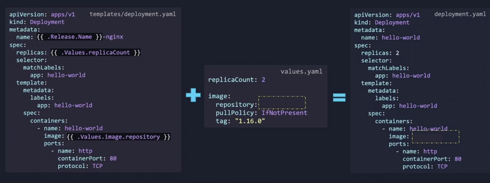

That will create a fle without that field. we can use default value by using `Helm Functions`.

 [Builtin Helm Functions](https://helm.sh/docs/chart_template_guide/function_list/)

Example:
 ```yaml
    trimAll "$" "$5.00" # removes the gives charaters from the front and back of a string
    default "nginx" .Valuesimage.repository # use default val if not present
 ```

## Pipelines in Helm

```yaml
    .Values.image.repository | upper | quote # pipe using `|`
```

## Conditionals in Helm

```shell
eq (Equal), 
ne (Not equal), 
lt (Less than), 
le (Less than or equal to), 
gt (Greater than), 
ge (Greater than or equal to), 
not (netation), 
empty (value is empty)
```

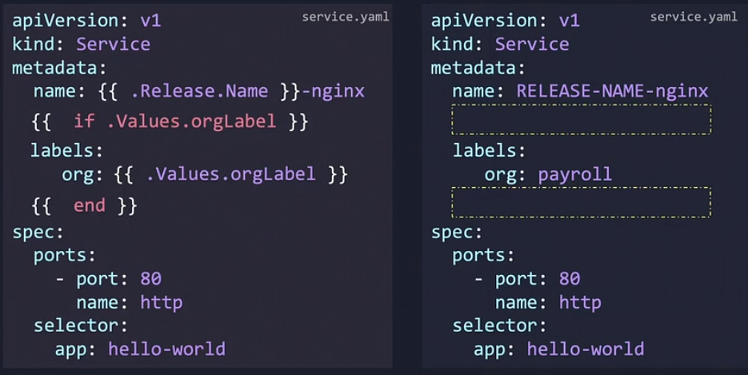

### Adding `-` before `if` will remove the empty line
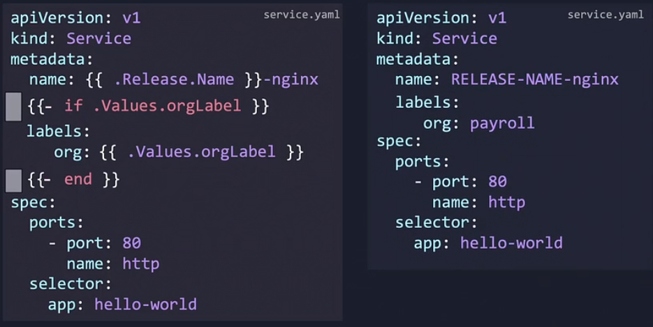

```
{{- if .Values.environment | eq "production" }}
Welcome to the production environment!
{{- else if .Values.environment | eq "staging" }}
This is the staging environment.
{{- else if .Values.environment | eq "development" }}
You are in the development environment.
{{- else }}
Environment not specified or unknown.
{{- end }}
```

### Conditionally we can deploy something.
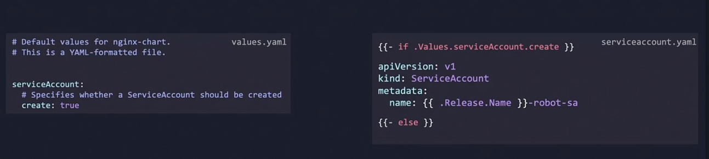


## Scopes in Helm

First see this image (given below)
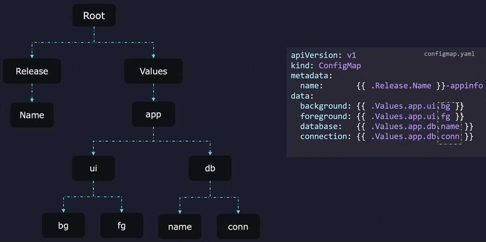

```
{{.Values.app.ui.bg}}
{{.Values.app.ui.fg}}
{{.Values.app.db.name}}
{{.Values.app.db.conn}}
```

`.` -> Root Scope

We can set Scope with `with` block

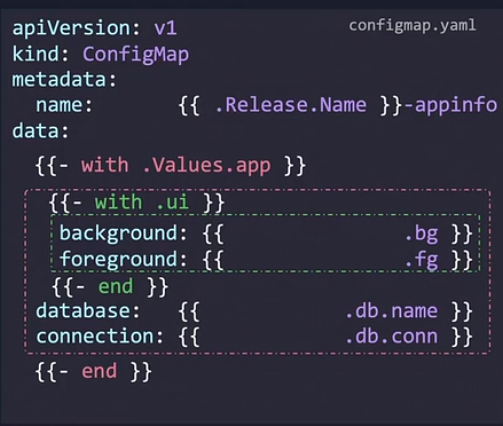

#### if we need that not in scope, that under the Root scope
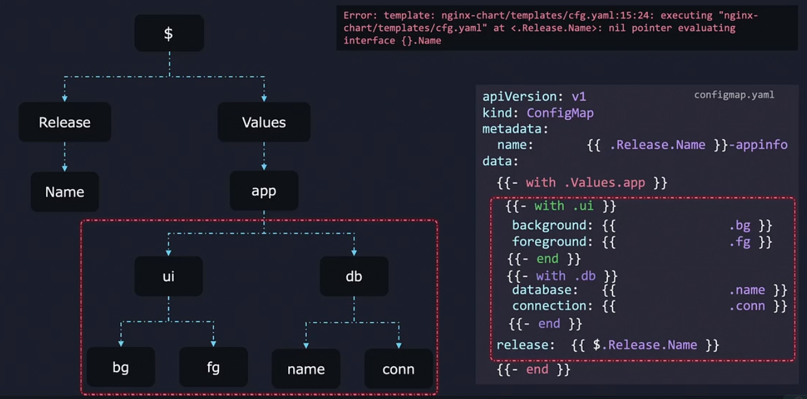

#### we will use using `$` (root is also represent as $)


## Loop in Helm

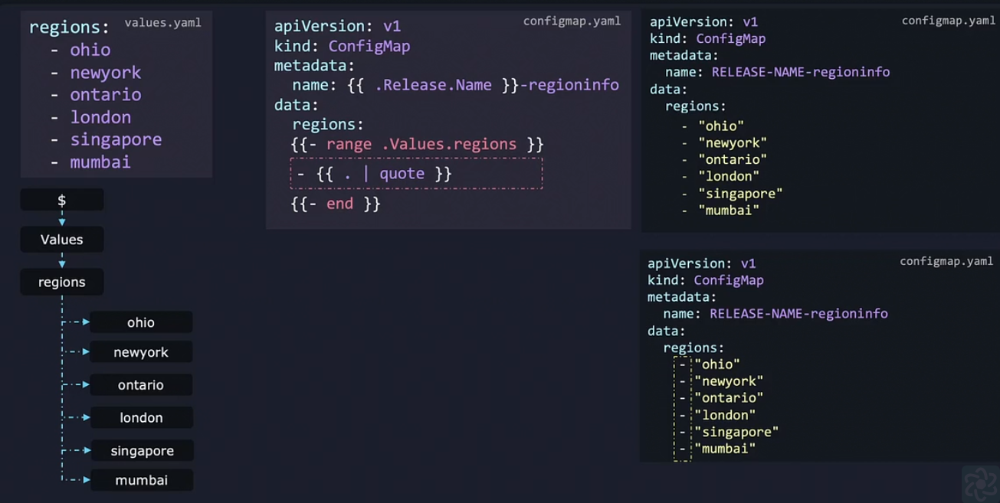

## Named Templates

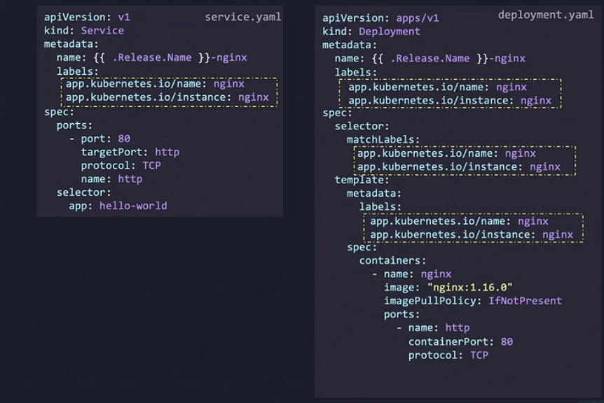

we can see in this templates

```yaml
app.kubernetes.io/name: nginx
app.kubernetes.io/instance: nginx
```

this yaml is everywhere. we need to remove duplication . instead we should use something than can be re use.

is called `Named Template`

we first move the file into `_helper.tpl` file . this `_helper.tpl` will stay in `template` directory (where deployment is present)

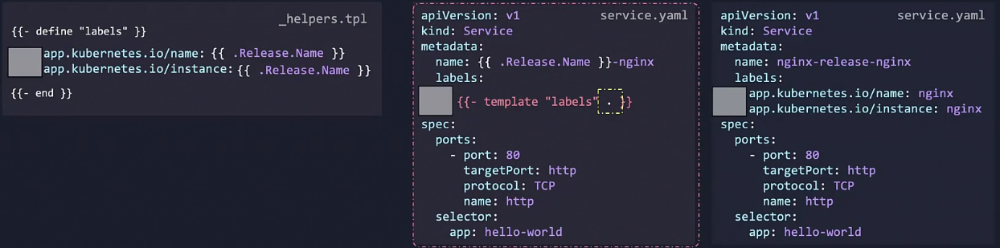

### be careful about indentation during name templating

Now there might  be a scnerio. where some have 3 space some have 2 space. in this scenrio we will be in a trouble. to resolve this use <b>Minimum space </b> in `Named Template` , then use `indent` with `|(pipe)` helm function to add extra space

but this will not work bcz we know
```
template  is a Action 
inclue is a Function
```

so we will use `include` instead of `template`

```
    prev 
        {{- template "labels" . | indent 2}}

    after 
        {{- include "labels" | indent 2 }}
```


## Chart Hooks Helm

Besides just installing various k8s objects to get our app up and running the y can do some extra stuff too. for example we can write the charts *in such a way that whenever we do a `helm upgrade wordpress-release bitnami/workpress` a database can be automatically backed up before the upgrade. so we have a way to restore from backup in case something goes wrong or it could be sending an email alert before an upgrade operation etc.

These extra actions are implemented with what is knows as <b>hooks</b>

Diffrent types of hooks

* Pre-upgrade hook
 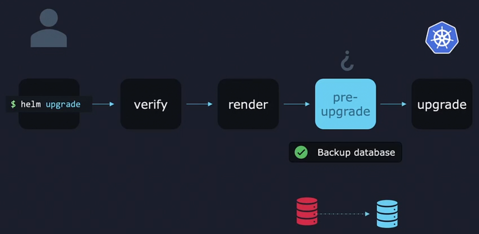

* Post-upgrade hook
 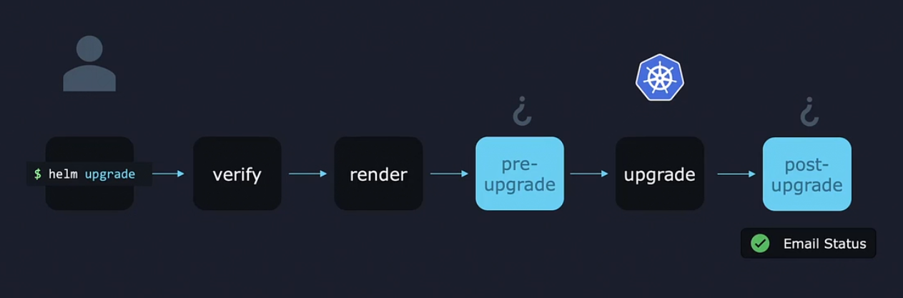

* Pre-install & Post-install
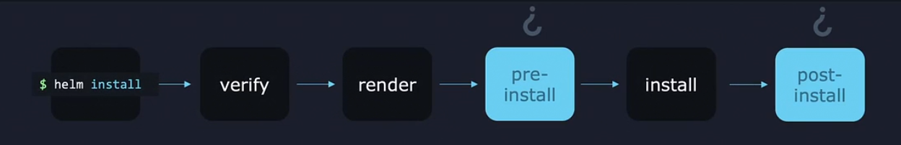

* Pre-delete & Post-delete
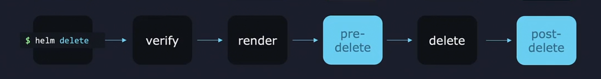

* Pre-rollback & Post-rollback
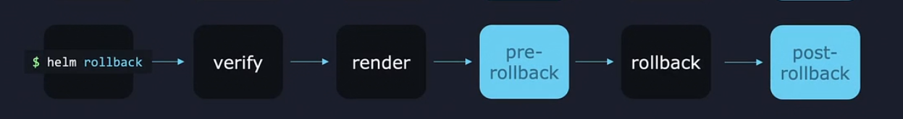


### Creating hooks

let's we have `backup.sh` file. that contain backup script that will run as k8s job. so we create a `backup-job.yaml` and move it to `template` directory

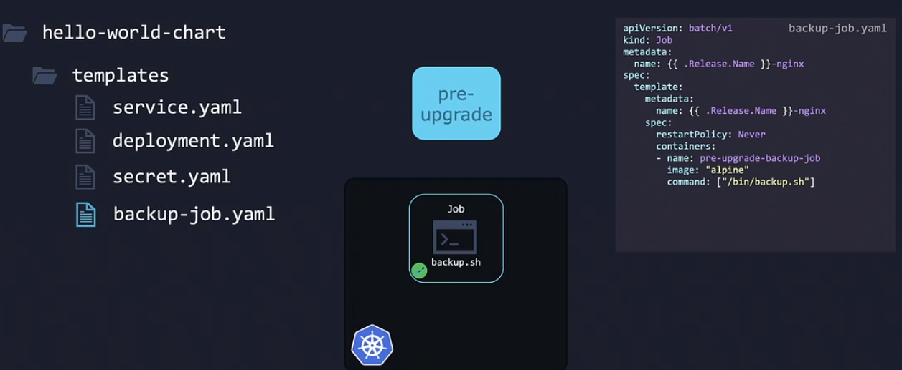


but this `backup-job.yaml` has to be run pre install. this job must not run as like others deployment inside `template` directory

now how do we diffrenciate this ?

add annotation inside `backup-job.yaml` under `metadata` 

```yaml
    annotations:
        "helm.sh/hook": pre-upgrade #whatever you want this use as like
```
now this job will known as hook.

there might be multiple `pre-upgrade` , `post-upgrade`, `pre-install` etc. we might want these will work first , then this will second by using `weight`
```yaml
    annotations:
        "helm.sh/hook": pre-upgrade #whatever you want this use as like
        "helm.sh/hook-weight": "5" # can be negative (first: negative, second : positive )
```
there might be same weight. in these case it's sort by

1. Resource kind
2. Name ascending order


after doing the job. the resource will stay. to clean up hook deletion policies.

```yaml
    annotations:
        "helm.sh/hook": pre-upgrade #whatever you want this use as like
        "helm.sh/hook-weight": "5" # can be negative (first: negative, second : positive )
        "helm.sh/hook-delete-policy": hook-succeeded 
```

three types of hook-delete-policy
```
    1. hook-succeeded  (delete the resource after success)
    2. hook-failed 
    3. before-hook-creation
```

## Packaging and Uploading Helm Charts

```sh
    helm package ./chart-dir
```

now we created a package 

now we have to sign this package 

generate key
```sh
    gpg --quick-generate-key "John Smith"
```

### more packaging and uploading (RND)
### To be continue ...
