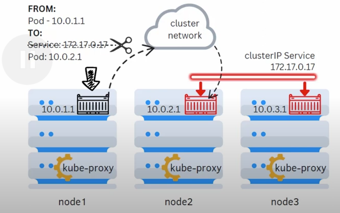
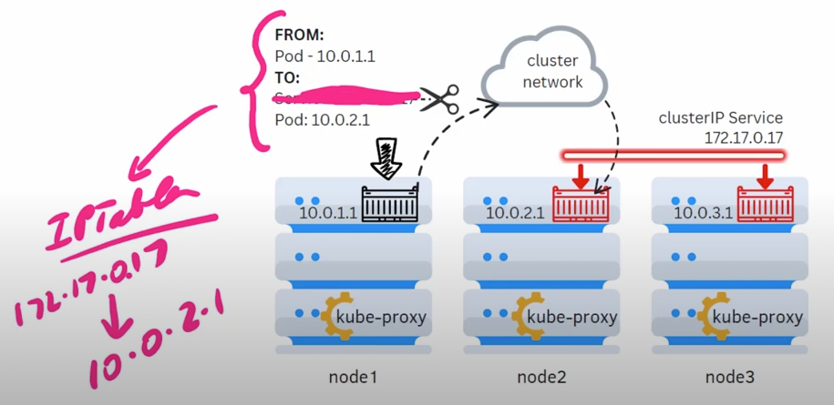
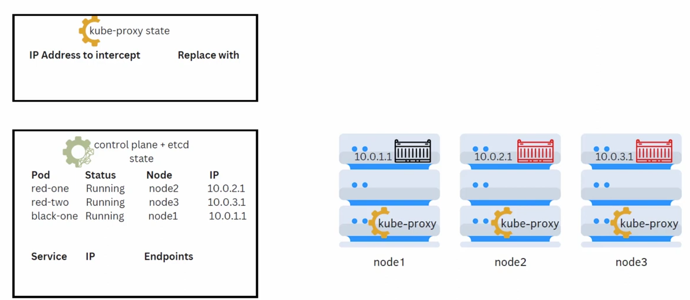
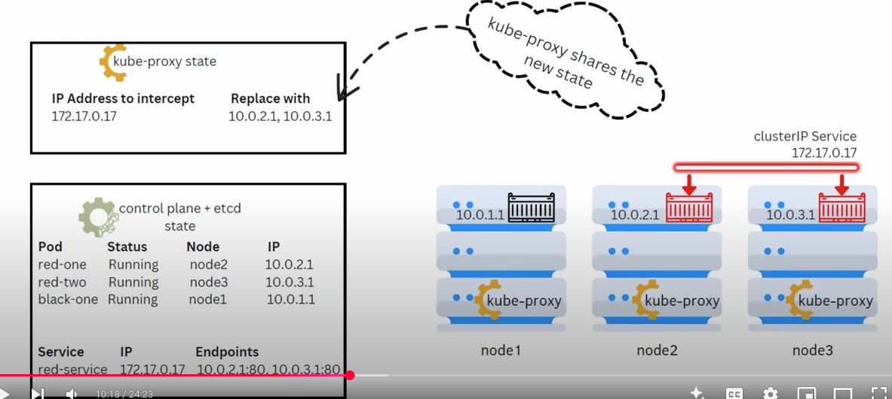
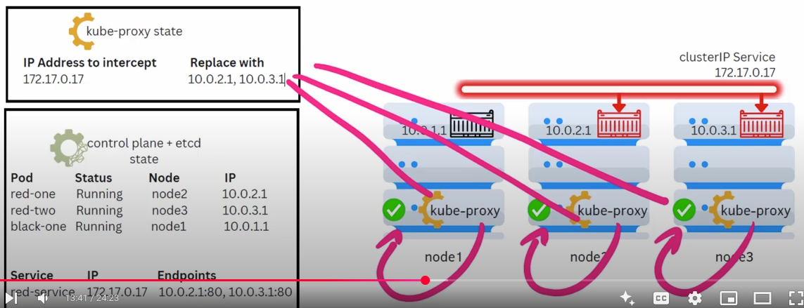
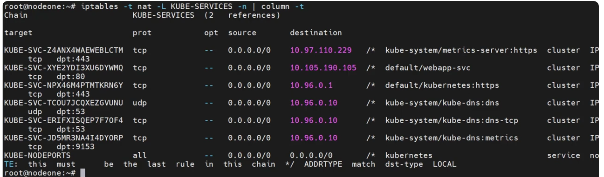

svc does not exist. it's only exist on etcd.
svc does not load balanced the pods. bacz it's not a process
when a pod tries to talkt to the service, before your req goes out the node, it refers it's ip table.
ip table does NATing , IP table removes the svc ip , refering the ip table it puts any of the pod ips.
now a pod then communicate with other pod through svc.





Note: in IP tables there is a reference , if someone hit's x.x.x.x that should be the NATted to any of the pod ips

now who you didn't manage the ip table . who manage the ip table ? who set the ip tables?

KubeProxy it's a deamon set. it does this job. 


Let's see the example: created three pod (for red-one, red-two) and does not create svc for it.




When svc created for pods. the  moment svc created Kube-Proxy get a notification. kube proxy deamon keeps on monitoring any change in the control plane.
now in our scnerio kube-proxy sees this svc gets two enpoints (pods ip) . now kube proxy add that entry into the kube proxy state. 




PIC: NATted corresponding entry

we can see that when this svc ip hit this should replace thos endpoints  (in our case red-one, red-two ip address ). this is the rule .

so kube proxy convert this rule into the ip table rule by modify os ip table. 



so every kube-proxy daemon updates i'ts ip table (each node which kube proxy stays) by refering it's nats table.

let's do the demo

```sh
# to see the ip  table on nodes:
iptables -t nat --list  # see the lines prefixed by KUBE
iptables -t nat -L KUBE-SERVICES -n | column -t  # by using filter 

# now count the lines before deploying a svc
iptables -t nat --list | wc -l

# again count after deploying svc
iptables -t nat --list | wc -l 

# now you can see the diff

```




people normally think svc does the load balancing . that's not true. this done by kube-proxy.
