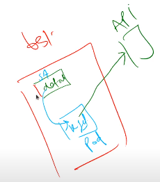
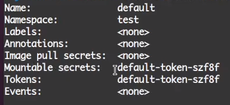
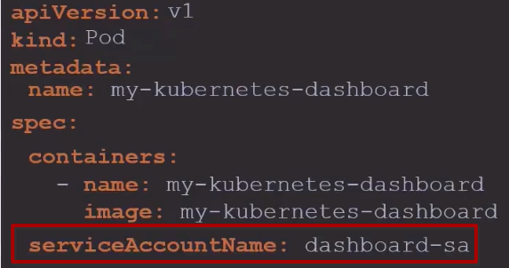

# Intro

We know two types of users can access the Kubernetes server.

1. Service account ( applications or processes running in pods within a Kubernetes cluster )
2. User (human)

<i>Note: Kubernetes cannot create user, but it can create `Service Account`</i>

## Service account

it is responsible for specifying which kind of privilege an Application/Process has.

## How Kubernetes create a service account?

there are some controllers running as part of k8s controller manager. those controller are responsible to create a default service account on every namespace of k8s cluster.

example: assume we create a namespace "test" , controller ( part of controller manager) make sure a `Service Account` name `default` is actually created in `test` namespace.
Now If we try to run a `Pod` in `test` namespace `default` Service account automatically going to use in perticular `Pod` ( if we don't spcify the Service account for this perticular pod) .



If we want to create `Service Account` ,we can do.

If we talk about a `Service Account` , This SA has details about the privilige of a Pod that is attached with.
Or we can say this SA would actually have the auth details and to have those auth details we know that in case of k8s we use `Secret` resource to store some confedential information. So the auth details will be in the `Secret` .
SA refers to one or many `Secret` . Those `Secret` Have auth details , priveiliges of perticular pod/s.

### Hands on

```sh
    k create ns test  # now a service account will be create
    # to test this run below command
    k get serviceaccounts -n test # (short sa) now we can see a SA name default.
    # now I we want to prove SA refert secret. let's try

    k describe sa -n test default # test-> namespace  name , default-> sa name
```



we can see a line ` Mountable secrets: default-token-szf8f` . so it's mount with a secret

if we run

```sh
    k get secrets -n test
```

we can see a secret name `default-token-szf8f`
You can see the details

```sh
    k get secrets -n test secrete_name -oyaml
```

if we want to add service account on pod we will define like that


Note: we cannot edit service account on pod. we must have to recreate the pod. bu you can do in in deployment level

If you don't wanna auto mount service account on you pod you can add

```yaml
autoMountServiceAccountToken: false
```

## In k8s version 1.24 ->

It no longer create secret when a service account has created.

```sh
kubectl create serviceaccount sa_name
```

you have to create toke for it.

```sh
    kubectl create token sa_name # it has expiry date by default. you can add expiry date by you own.

```

Note: You should only create a service account token `Secret` obj if you can't use the `TokenRequest` API to obtain a token.
