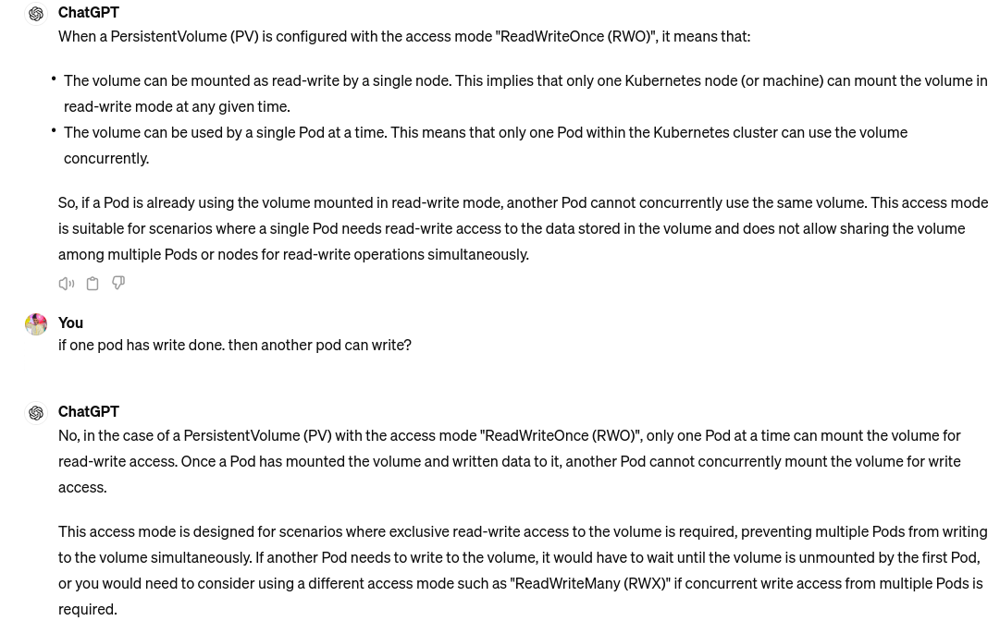

problem statement 1: there is three replicas running into 3 pods. now if a pod goes down
then a pod is restart. but previous data will be lost bcz. pod cannot reborn.

problem statement 2: again same replicas (same application on multiple pods) they cannot share data. by default data stored in container . and not accessible to the other pods. that means data is not shared across the pods.

to resolve these issues Volumes comes into the picture.

volume: volume is directory with some data in it. and the data is accessible to the pods.


## different types of volume

### emptyDir:

    we know from first problem statement data stored in container by default. if container die (let's try to kill the container (note: kill the container not the pod)) the data will be gone. container has ephimeral behavior.
    to resolve this issue store the data in pod level. to store the data in the pod level k8s gives us one type of volume name <b>emptyDir</b> . it is created when pod is assign to the node. it remains active till it's alive.

```yaml
apiVersion: v1
kind: Pod
metadata:
  name: emptydir-example
spec:
  containers:
    - name: app-container
      image: nginx
      volumeMounts:
        - name: shared-data #mounting the vol to the container
          mountPath: /data #where in container to be mount.
  volumes:
    - name: shared-data
      emptyDir: {}
```

now we resolve the first issue. but still have the second issue (cannot share the data)

### hostPath:

now all the pods in same node share the data. bcz hostPath stays in Node level.

```yaml
apiVersion: v1
kind: Pod
metadata:
  name: hostpath-example
spec:
  containers:
    - name: app-container
      image: nginx
      volumeMounts:
        - name: hostpath-volume
          mountPath: /mnt/data #where in container to be mount.
  volumes:
    - name: hostpath-volume
      hostPath:
        path: /path/on/host # where in node data will store
        type: DirectoryOrCreate
```

now still have some problems. if a pod stays in different node then data will be shared on others pod which run into another node.

solution is take out the storage from node and move it to the external storage like
aws ebs.

### that's why Persistent volumes comes into the picture.

the volume we discussed so far ephimeral volumes. meaning when a pod/nodes get deleted. data associated with volumes will get lost.

Persistent volumes don't depent on any individual nodes or pods that uses the persistent volumes.

k8s offer 3 components to persist the data irrespective of the pods restart or node failures.

- Persistent Volumes
- Persistent Volume Claims
- Storage Classes

Persistent Volumes: is a k8s resource and it's can be created using yaml just like any other k8s resource.

it's an abstract component and it must take storage from the actual physical storage like Aws EBS, NFS servers


```yaml
apiVersion: v1
kind: PersistentVolume
metadata:
  name: pv-example
spec:
  capacity:
    storage: 1Gi # storage capacity
  accessModes:
    - ReadWriteOnce # there are
  hostPath: # type of persistent volume. see docs. there are many persistent vol type
    path: /mnt/data
---
apiVersion: v1
kind: PersistentVolumeClaim #we created persistent volume. to use these we have to use Persistent volume claim resource
metadata:
  name: pvc-example
spec:
  accessModes:
    - ReadWriteOnce
  resources:
    requests:
      storage: 1Gi
---
apiVersion: v1
kind: Pod
metadata:
  name: pod-example
spec:
  containers:
    - name: app-container
      image: nginx
      volumeMounts:
        - name: pv-storage
          mountPath: /mnt/data
  volumes:
    - name: pv-storage
      persistentVolumeClaim:
        claimName: pvc-example #now we can use the volume using persistant volume name.
```

different types of accessMode:

- ReadWriteMany : read write by many nodes (best choice if pods running on diffrent nodes)
- RearWriteOnce: if pods running on same nodes - ReadOnlyOnce:The volume can be mounted as read-write by a single node and can be used by a single Pod at a time.
- ReadOnlyMany: The volume can be mounted as read-only by many nodes and can be used by multiple Pods simultaneously for reading. - ReadWRiteOncePod:

  

If a user deletes a PVC in active use by a Pod, the PVC is not removed immidiately . PVC removed when PVS is no longer used. see more doc (persistent volumes)

PV is created by admin
PVC is created by developer

no there is a situation we need PV we cannot ask the admin for PV. it's delay the works.
that's why Storage Class comes into the picture.

Storage class is another K8s resource. in which we specify how the pv should be created dynamically


In this picture you can see `provisioner` field. it specify how the PV should be porvisioned (how the PV should be created) this is like one time job

one the storage class is created as usual we created the pvc and we will use pvc in the pod as we specify `storageClassName:demo` . in the pvc `StorageClass` will create the appropiate PV for us based on the Access Mode and the capacity that specify inthe persistent volume claim

```yaml
apiVersion: storage.k8s.io/v1
kind: StorageClass
metadata:
  name: slow
provisioner: kubernetes.io/aws-ebs #see doc for more like reclaim policy
parameters:
  type: io1
  iopsPerGB: "10"
  zone: us-east-1a

---
apiVersion: v1
kind: PersistentVolumeClaim
metadata:
  name: my-pvc
spec:
  accessModes:
    - ReadWriteOnce
  storageClassName: slow
  resources:
    requests:
      storage: 1Gi

---
apiVersion: v1
kind: Pod
metadata:
  name: my-pod
spec:
  containers:
    - name: my-container
      image: nginx
      volumeMounts:
        - name: my-volume
          mountPath: /data
  volumes:
    - name: my-volume
      persistentVolumeClaim:
        claimName: my-pvc
```
