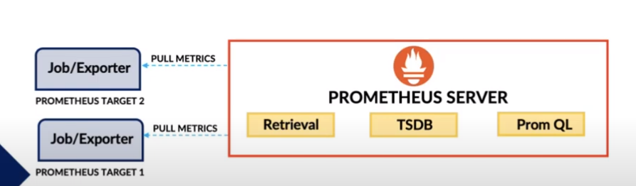
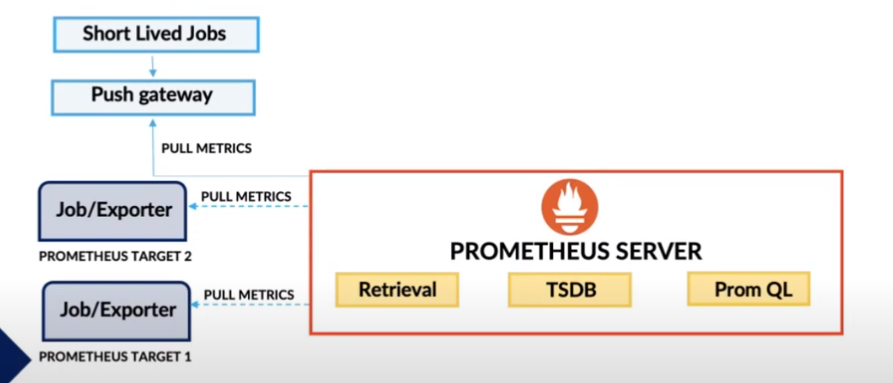
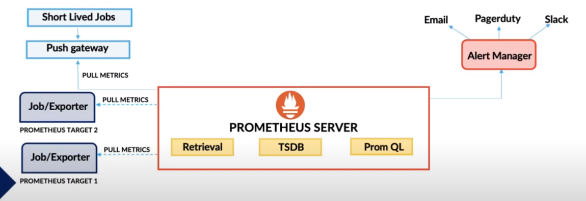
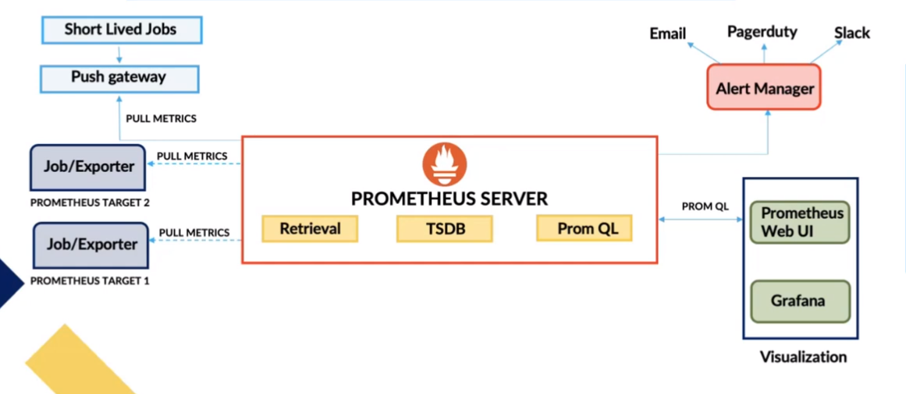
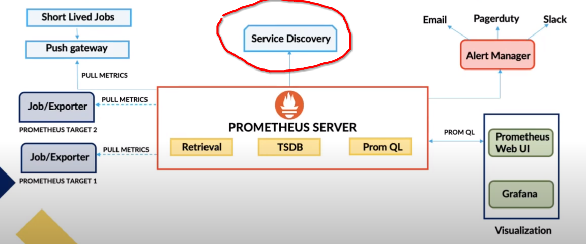
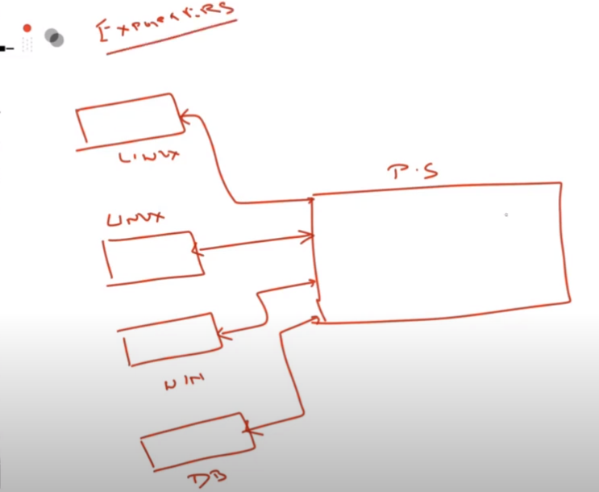
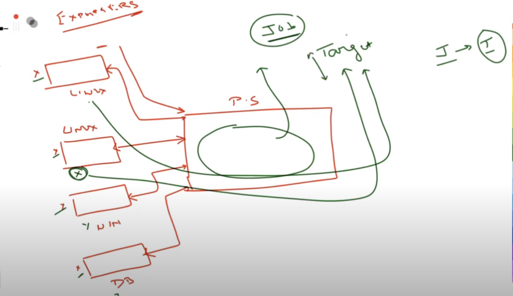
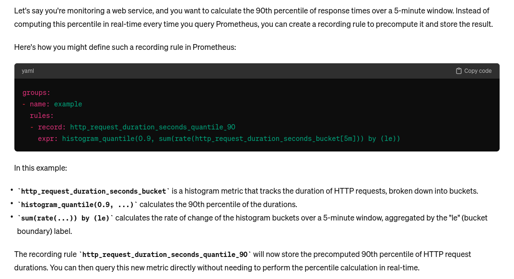
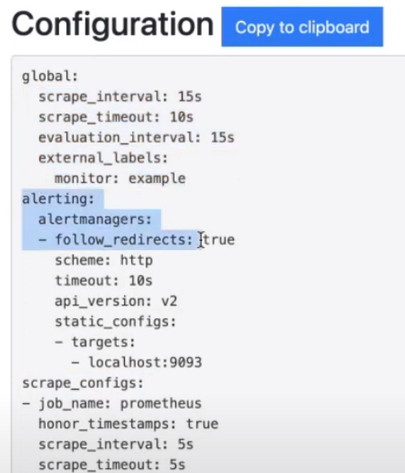

**_note: when you learn any technology, it's best to learn terminology first_**

prometheus is a system monotoring and alerting toolkit. it's a platform agnostic. means ()

# Promehtus architecture

6 major components

## prometheus server

(it's a brain of the system. it capture and store matrix from insntaces of nodes in the form of time series data. the process of collecting metrics is called scraping( means we are collecting the metrics which will be injested in tsdb) )

1.  Retrieval
2.  TSDB
3.  PromQl

## Job / exporter

from where we are going to take this entire metrics or information . ans: by job exporter come to the picture

When talk about exporter, you can think it as agent.

you need to install something in order to get something (metrics). ex: you are having a server or you are having a db , storage etc, you have to install something . this something is called **exporters** . exporter is an prometheus agent which we install on the systems. those exporter is going to fetch the metrics and metrics is being pulled by the prometheus server.

## Push gateway

There is another thing. what about the jobs or what about the metrics which we want to capture but they are having a short life .

prometheus by default take every 15sec to grab the metrics. how can we able to get those metrics (short lived metrics).

for this case prometheus uses **push gateway**

lets say a job is running for 5s. push gateway will going to take those metrics and will going to store it in a push gateway. as soon as 5s is over promethus not doing this stuff but push gateway will store it . when interval is come (prometheus will scrub the data) prometheus server is going to take those data from push gateway.

## Alert Manager

Alert manager do the send the alert to the email (ex: you memory exceeded, server down etc)

## Dashboard

Dashboard is for visualize the data. we can integrate third party dashboard like grafana

## Service discovery

when we talk about multiple targets which prometheus will going to scrub (prometheus will going to scrub the metrics) that all is discoverd with a process or component which is service discovery.

## Basic Terminology of Prometheus

- Target
- Job
- PromQL
- Functions
- ALerting rules and Alerts
- Exporters
- TSDB
- Data types
- Recording rules
- Client library

### Target

we know prometheus server is just responsible for taking the metrics (pull the metrics). these metrics will actually come from other system

we also know if you want to actullay sent the metrics to the prometheus server. you need install something thats called **Exporters**

there are multiple exporter for prometheus:
node exporter: you want node information
db exporters: db details
network exporters: net details

summery: what we want to capture you need to install perticular exporter. exporter is an agent which we are going to install on these nodes.

these agens will populate the information and that info we want are prometheus will scrub it (pull it)

Prometheus servar have multiple components. those multiple components will use multiple terminology first terminology is **Job**
_Job: Job is a logical collections of multiple targets_

now what is target:

every exporter will become target.
ex: we need node info so node exporter will become target.

these target means metrics

these all metrics is going to store is in DB.

### this is TSDB

now we have data in TSDB. what we want to do. We want to query the data.

### So promQL is coming to the picture

- PromQL supports 4 data types
- It has operators too (+,-, and , or etc)
- Functions (sum(), avg())

after querying result will be polulate.

### Result will visualize into Dashboard

Prometheus scrab some in build metrics.
let's say they are givin you
total memory
used memory
free memmory

you wnat to calculate % of free memory. what you can do. there is no in build metrics.
ANs: you can use these inbuild metrics (total memory, used memory, free memory) and you create you long expressoin (for getting % of memory) . and the give a logical name of this long expressoin.

that is actually called

### recording rules

now lets say you linux server gets down
now time series db will put these thing to 1-> 0
what we have to do. we need to actually create

### Alerting rules

as we see data is changin 1 -> 0
so we have to create alerting rule

and we will send the alert by using mail, slack etc.

let say I have developed my own application let's say eticket. now I don't have exporter for it.

I can write my own exporter librery by

### using client library.

client librery is a custom operators.

## Installing Processes

cmd: `sudo apt install prometheus`

when we run the command under the hood
it's actually install two things

- prometheus : created Prometheus Server
- prometheus-node-exporter: install Node exporter to monitor the prometheus server

so see prometheus is running or not.

`systemctl status prometheus`

`systemctl status prometheus-node-exporter`

these prometheus-node-exporter is scrap the metrics on port 9100

promehtheus is use port 9090. it is customizable

to edit command line flags:
status -> cammand line flags
/etc/default/prometheus/prometheus.yaml (brain of prometheus)

if you change this config file you can test by using
`poromtool check config /etc/prometheus/prometheus/yaml`

every change you must have to restart the server.
`systemctl restart prometheus`

to see the config
status -> configuration
etc/prometheus/prometheus.yaml

Ref video: https://www.youtube.com/watch?v=XXr8tMlUKfk&t=1212s
