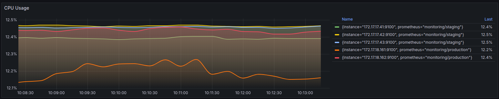
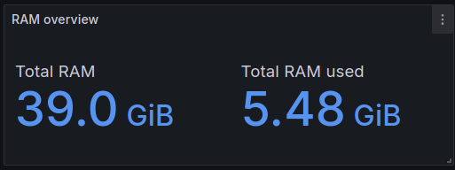
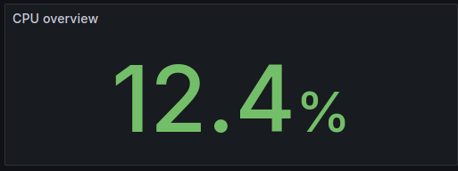
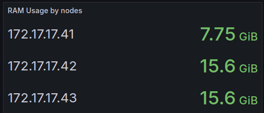
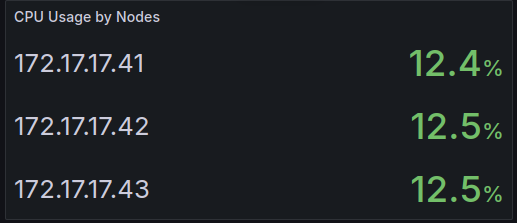

```promql
    // percentage 0 - 1
    sum by (instance,prometheus) (rate(node_cpu_seconds_total{mode!~"idle|iowait|steal"}[1m]))
    avg(rate(node_cpu_seconds_total[$__rate_interval]) * 100) by (prometheus,instance)
```

```promql
    label_replace(sum(node_memory_MemTotal_bytes{prometheus="monitoring/staging"}) by (prometheus), "prometheus", "$1", "prometheus", ".*/([^/]+)")
    sum(node_memory_MemTotal_bytes{prometheus="monitoring/staging"}) by (prometheus)- sum(node_memory_MemAvailable_bytes) by (prometheus)
```

```promql
    avg(sum by (cpu) (rate(node_cpu_seconds_total{mode!~"idle|iowait|steal",prometheus="monitoring/staging"}[1m])))
    avg(rate(node_cpu_seconds_total{prometheus="monitoring/staging"}[$__rate_interval]) * 100) by (prometheus)
```

```promql
     label_replace(sum(node_memory_MemTotal_bytes{prometheus="monitoring/staging"}) by (instance), "instance", "$1", "instance", "(.+):.+")
```

```promql
    label_replace(sum by (instance) (rate(node_cpu_seconds_total{mode!~"idle|iowait|steal",prometheus="monitoring/staging"}[1m])),"instance", "$1", "instance", "(.+):.+")
    label_replace(avg(rate(node_cpu_seconds_total{prometheus="monitoring/staging"}[$__rate_interval]) * 100) by (instance),"instance", "$1", "instance", "(.+):.+")
```