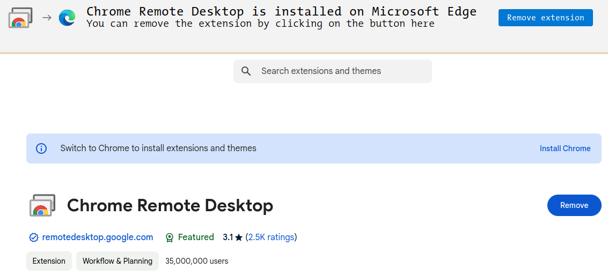
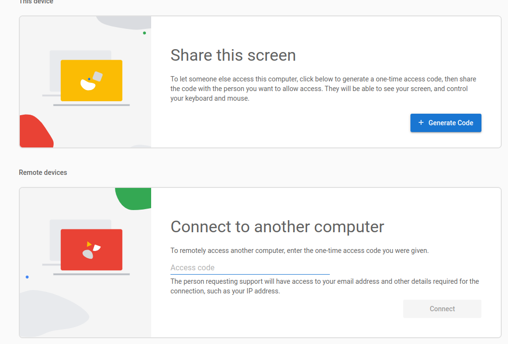
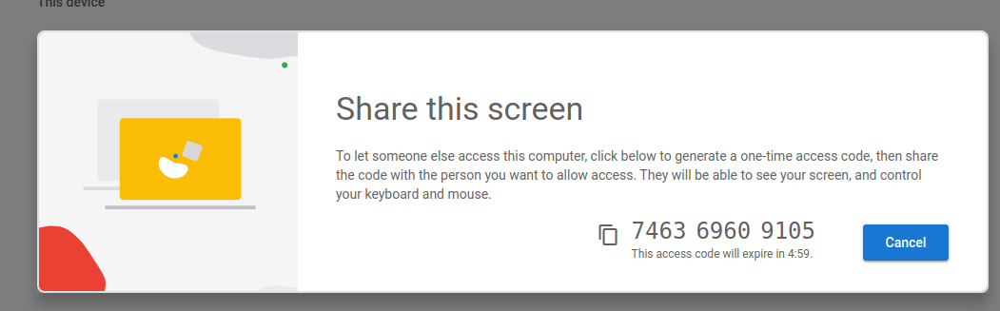

- #  First add extension on your Chrome/Edge(any browser that's support chrome extension)

- # Then go to:   https://remotedesktop.google.com/support/

- # Click Generate Code . And share this with your friend 

- # Then run the provided shell file `chrome-webcast-install.sh`